# OOP Concepts in Structured Text

Reference for procedural PLC programmers learning OOP via the OSCAT OOP example
catalog. Every example README links into specific sections here instead of
re-explaining the same concept in 27 different files.

Read top-to-bottom the first time. Bookmark it. After that, follow the links
from each example.

## Table of Contents

- [ST mechanics](#st-mechanics)
  - [Interface](#interface)
  - [IMPLEMENTS](#implements)
  - [Polymorphism](#polymorphism)
  - [Composition](#composition)
  - [Inheritance](#inheritance)
- [Patterns](#patterns)
  - [Factory](#factory)
  - [Strategy](#strategy)
  - [Mediator](#mediator)
  - [Observer](#observer)
  - [Composite](#composite)
  - [Decorator](#decorator)
  - [Facade](#facade)
  - [Chain of Responsibility](#chain-of-responsibility)
  - [State](#state)
  - [Command](#command)
  - [Memento](#memento)
  - [Adapter](#adapter)
  - [Proxy](#proxy)
  - [Template Method](#template-method)
  - [Builder](#builder)

---

## ST mechanics

### Interface

An **interface** is a contract that lists method and property *signatures*
without any code behind them. It declares what something must do, not how.

You don't instantiate an interface. You assign concrete function-block
instances to an interface-typed slot.

```st
INTERFACE IPump
    PROPERTY IsHealthy : BOOL
    GET END_GET
    END_PROPERTY

    METHOD Run
    VAR_INPUT
        SpeedHz : REAL;
    END_VAR
    END_METHOD
END_INTERFACE
```

The interface itself contains zero working code. It declares a shape.

**Procedural analogy.** An interface is the closest ST equivalent of a struct
of function pointers in C, with the compiler enforcing that every
implementation fills in every slot.

### IMPLEMENTS

A function block declaring `IMPLEMENTS IPump` is making a compiler-checked
promise: "I provide every method and property `IPump` requires." Forget one
and the project doesn't build.

```st
FUNCTION_BLOCK CentrifugalPump IMPLEMENTS IPump
    (* must provide IsHealthy and Run, or compile fails *)
END_FUNCTION_BLOCK
```

Many FBs can implement the same interface. They share a shape; their
internals differ.

### Polymorphism

**Concept.** One slot, many possible contents, same call site, different
behavior at runtime.

**Mechanism in ST.** A variable typed as an *interface* (not a concrete FB)
can hold any FB instance that implements that interface. When you call a
method on the variable, ST dispatches to whichever concrete FB is currently
assigned. Same line of code, different action.

```st
VAR
    Pump1 : CentrifugalPump;
    Pump2 : SubmersiblePump;     (* both IMPLEMENT IPump *)
    Active : IPump;              (* slot, not a concrete FB *)
END_VAR

Active := Pump1;
Active.Run(SpeedHz := REAL#50.0);   (* calls CentrifugalPump.Run *)

Active := Pump2;
Active.Run(SpeedHz := REAL#50.0);   (* same line — calls SubmersiblePump.Run *)
```

**Why it matters.** In procedural ST, behavior that depends on "what kind of
thing this is" turns into a CASE statement that grows with every new type.
Polymorphism replaces the CASE with a slot. Adding a new type means writing a
new FB that implements the interface — no existing CASE to edit.

**Procedural analogy.** Like a function pointer that you reassign — calling
through the pointer dispatches to whatever function it currently points at.
Polymorphism is the same idea, with the compiler ensuring every assigned FB
provides every required method.

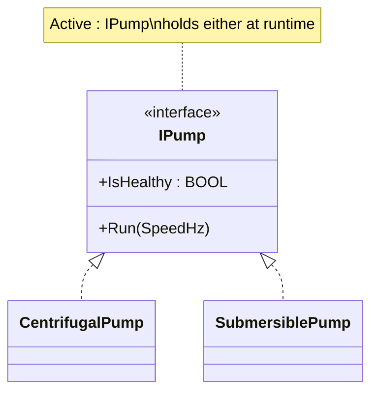

### Composition

A function block can own *other* function blocks as inner variables. The
outer FB exposes a clean surface; the inner FBs do the work. This is how
project objects like `BoilerStation` or `BaggageDiverter` are built.

Composition is preferred over inheritance in ST. Inheritance exists
(`EXTENDS`) but is used sparingly because it ties two FBs together at compile
time and makes each subclass depend on every implementation detail of its
parent.

### Inheritance

A function block declaring `EXTENDS BaseFb` automatically gets every method,
property, and variable of `BaseFb`. The subclass can add new methods, override
existing ones, and call the parent's version with `SUPER^.Method()`.

Used in OSCAT OOP for two cases:

- **Adapter base class** plus vendor-specific subclasses (`AbbAcs580Adapter`
  base, `DanfossFc302Adapter EXTENDS AbbAcs580Adapter`).
- **Template Method base class** that defines a workflow with overridable
  hooks.

For most other cases, prefer composition. Deep inheritance hierarchies are
hard to evolve.

---

## Patterns

Each pattern section answers four questions in the same order: what concept,
what shape in code, when does it earn its weight, when doesn't it.

### Factory

**Concept.** Hide the choice of concrete type behind a method that returns an
interface. The caller asks "give me a thing that does X" and gets back the
right implementation for the current configuration.

**Shape.** A factory FB with a `Build(...)` method returning an interface
type. Inside `Build`, a CASE statement (or table) picks one of several
concrete FBs and returns it.

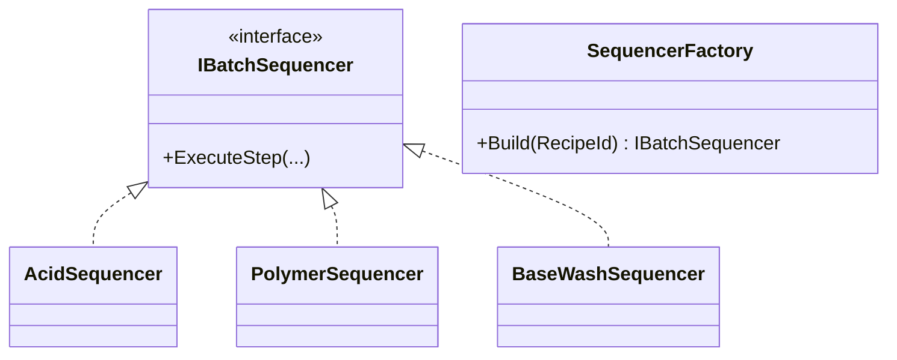

**Earns its weight when:**
- Choice depends on configuration that varies per project (recipe, vendor,
  mode).
- The caller doesn't need to know which type was chosen.
- Adding a new concrete type means adding one FB plus one CASE entry, with
  zero impact on callers.

**Doesn't earn it when:**
- Only one type ever exists.
- The caller needs to interact with the concrete type's specific features.

OSCAT OOP example: `multi_product_batch_reactor`.

### Strategy

**Concept.** The same algorithm slot, different implementations, swap at
runtime. The application code calling the algorithm is unchanged when modes
swap.

**Shape.** An interface for the algorithm, multiple FBs implementing it, and
an interface-typed variable in the application that gets reassigned based on
mode.

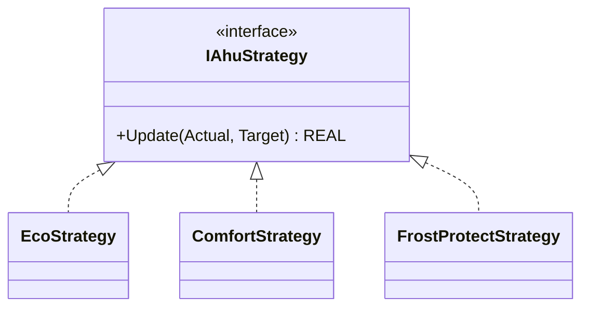

**Earns its weight when:**
- Modes have genuinely different behavior, not just different setpoints.
- Modes change at runtime (operator selects, schedule triggers).
- Adding a new mode shouldn't require editing every CASE branch.

**Doesn't earn it when:**
- Two modes that differ only in a constant — use a parameter, not a strategy.
- A fixed mode that never changes.

OSCAT OOP example: `hvac_air_handling_unit`.

### Mediator

**Concept.** A central coordinator decides what peer objects do. The peers
don't talk to each other; the mediator decides.

**Shape.** A mediator FB owns peer objects (typed as interface or concrete)
and a method that evaluates global state and tells peers what to do.

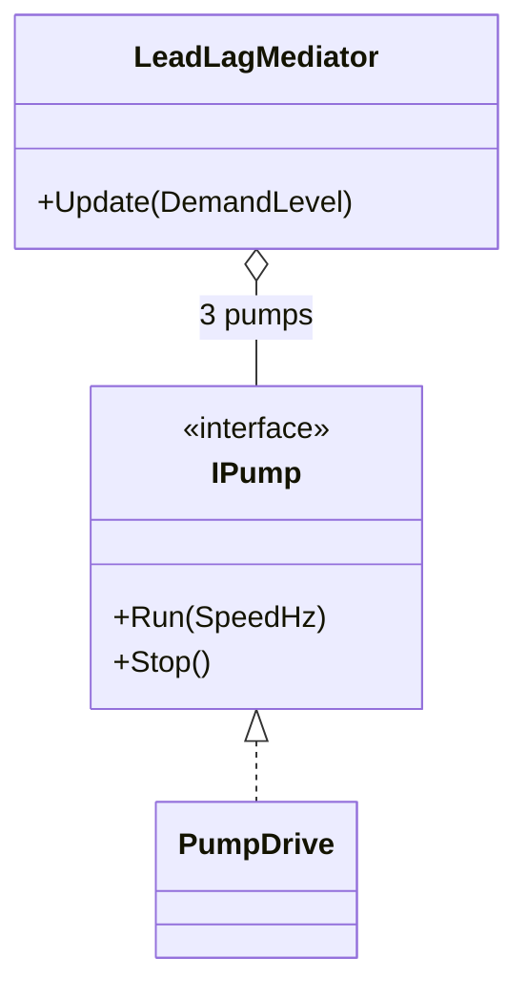

**Earns its weight when:**
- N peer objects need coordinated decisions (pump rotation, lane arbitration,
  resource allocation).
- The selection rules grow over time.
- Replacing N×N peer-to-peer logic with one centralized rulebook.

**Doesn't earn it when:**
- Only two peers — direct logic is shorter.
- Peers are independent and don't need coordination.

OSCAT OOP examples: `water_booster_pump_station`, `district_pump_network`,
`warehouse_conveyor_merge_mediator`.

### Observer

**Concept.** A producer broadcasts events to multiple consumers without
knowing who they are. Consumers register themselves; the producer calls
`Publish` once and the bus fans out to everyone registered.

**Shape.** A subscriber interface, multiple subscriber FBs implementing it,
and a bus FB that holds an array of subscribers and broadcasts.

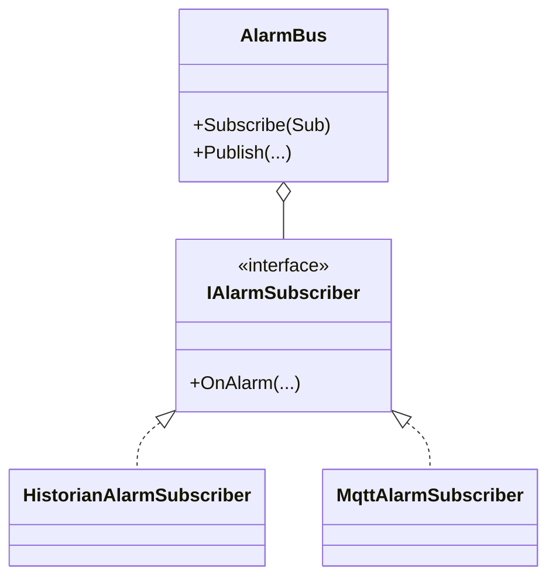

**Earns its weight when:**
- Three or more unrelated consumers want the same events.
- Consumers come and go independently.
- Producer shouldn't know whether anyone is listening.

**Doesn't earn it when:**
- One or two fixed consumers — call them directly.

OSCAT OOP examples: `water_booster_pump_station`, `boiler_room_heating_plant`,
`tunnel_oven_strategy_observer`, `airport_baggage_command_observer`.

### Composite

**Concept.** Tree-shaped equipment hierarchy where leaves and branches share
the same interface. Operations like "stop everything in this area" walk the
tree recursively.

**Shape.** A node interface, leaf FBs and branch FBs both implementing it. A
branch holds children (also typed as the interface) and forwards operations
to them.

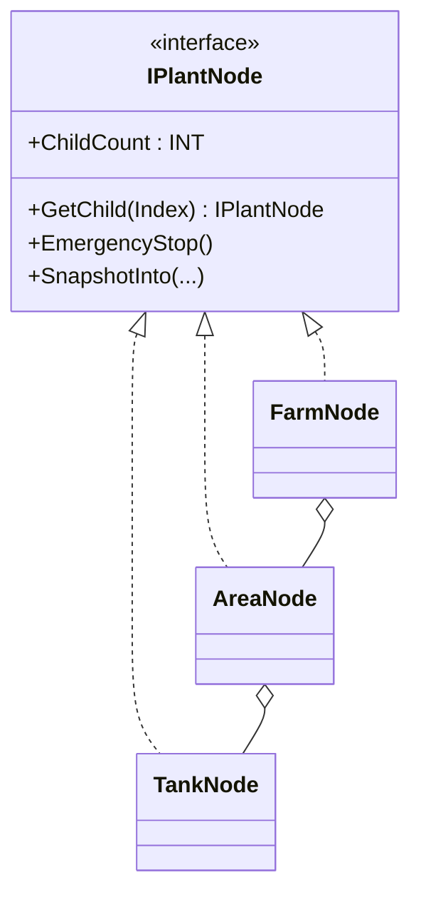

**Earns its weight when:**
- The plant has a real hierarchy (Plant → Area → Equipment).
- Operations need to operate on subtrees recursively.
- Hierarchy depth varies and the application can't hardcode it.

**Doesn't earn it when:**
- Flat list of equipment — array of FBs is simpler.
- Two-level hierarchy that never grows.

OSCAT OOP examples: `tank_farm_transfer_skid`, `cold_storage_plant`,
`silo_loading_composite_mediator`.

### Decorator

**Concept.** Wrap an object in another object that adds a behavior, while
both expose the same interface. Stack wrappers to combine behaviors.

**Shape.** A common interface for the thing being wrapped. The decorator FB
implements the same interface, holds an inner reference to the wrapped object
(also typed as the interface), and adds its behavior before or after
delegating to the inner.

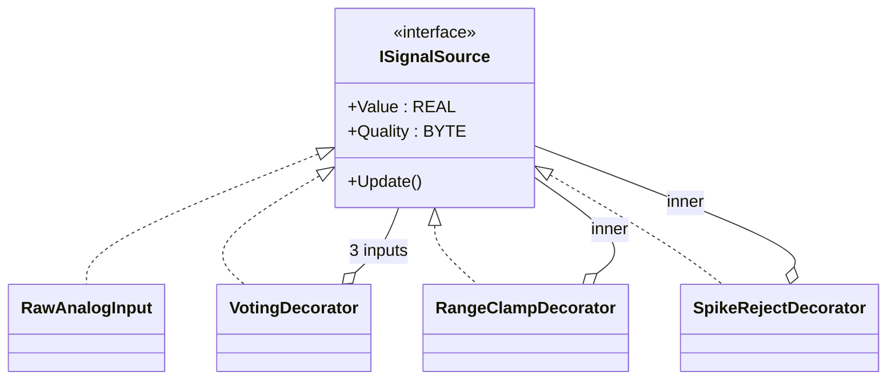

**Earns its weight when:**
- A signal pipeline can be reordered, enabled, or disabled per project.
- Multiple consumers need the same conditioned signal.
- A behavior (clamp, smooth, reject spikes) is reusable across signals.

**Doesn't earn it when:**
- Fixed pipeline that never changes — write it as a procedural sequence.
- One signal, one consumer.

OSCAT OOP examples: `refinery_temperature_conditioning`,
`booster_commissioning_decorator`, `kiln_dryer_decorator_strategy`.

### Facade

**Concept.** A single FB exposes a clean public interface that hides a
complex internal subsystem of many FBs.

**Shape.** A project FB owns many internal FBs and exposes a small public
surface (`Start`, `Stop`, `Update`, `Snapshot`). The internals are private to
the facade.

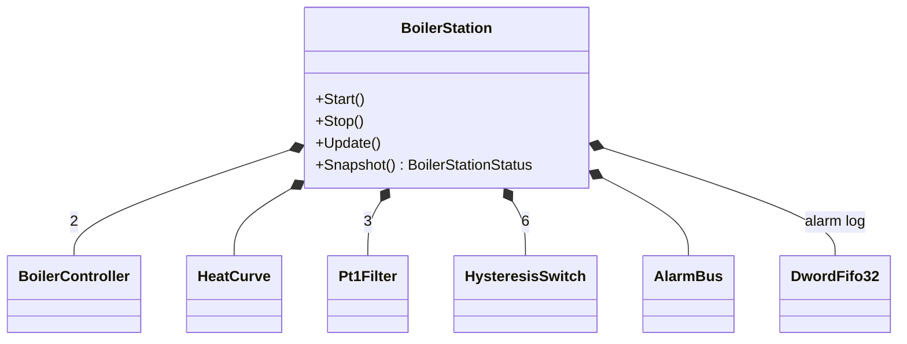

**Earns its weight when:**
- A project has many internal components that should look like one thing to
  callers (HMI, SCADA, supervisor program).
- The internal wiring may change without breaking callers.

**Doesn't earn it when:**
- One internal component — no facade needed.

OSCAT OOP examples: `boiler_room_heating_plant`,
`battery_energy_storage_facade`, `cooling_tower_facade_template`.

### Chain of Responsibility

**Concept.** An event flows through an ordered chain of handlers. Each
handler decides whether to handle the event or pass it to the next.

**Shape.** A handler interface with a `Handle` method (returns BOOL) and a
`Next` reference to another handler. Handlers wired into a chain at startup;
the application calls `Handle` on the chain head.

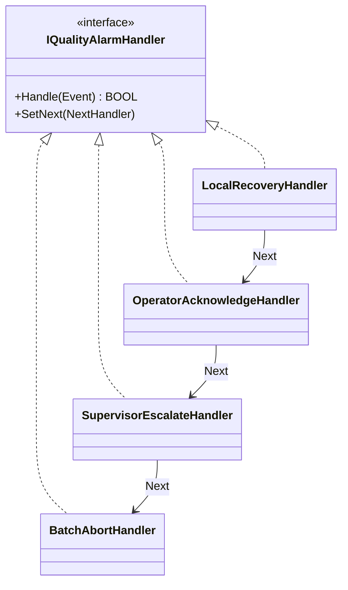

**Earns its weight when:**
- Escalation has multiple stages with different timeouts and side effects.
- The chain order may change between sites or installations.
- The last handler must always handle (safe fallback).

**Doesn't earn it when:**
- Single handler — just call it.
- Fixed two-step escalation — IF/ELSE is shorter.

OSCAT OOP examples: `pasteurizer_quality_chain`, `tunnel_washer_chain`.

### State

**Concept.** A state machine where each state is its own FB, owning its
entry, execute, and exit behavior. Transitions are decisions made by the
current state's `OnExecute`, returning the next state's id.

**Shape.** A state interface (`OnEnter`, `OnExecute`, `OnExit`), one FB per
state, a controller that holds the current state and resolves the next.

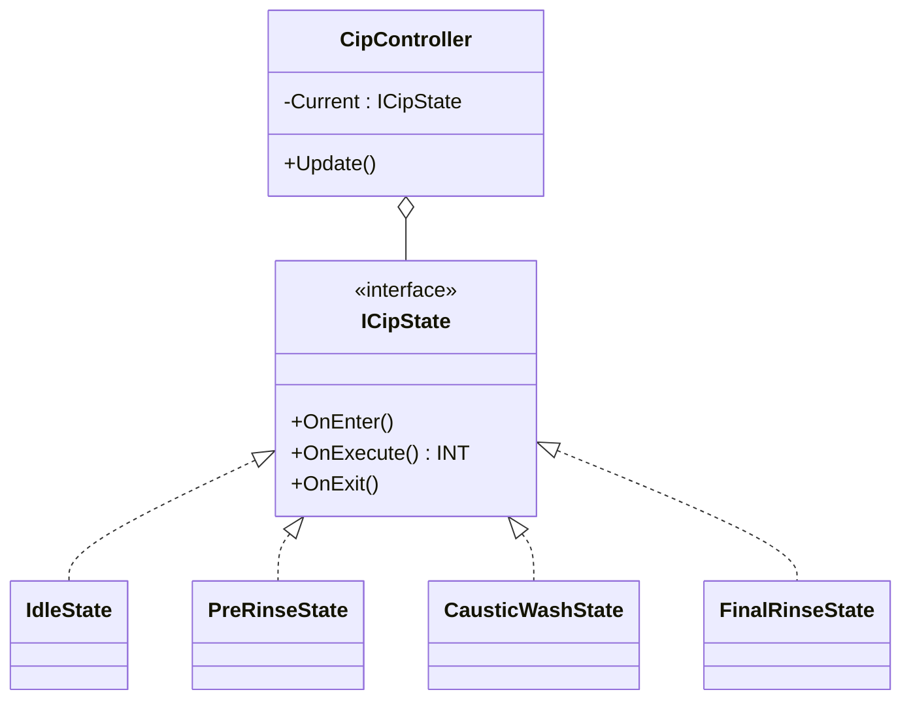

**Earns its weight when:**
- Each state has its own permissives, timeouts, and exit conditions.
- Adding a state shouldn't require editing every other state.
- The state machine is large enough that a CASE block becomes unreadable.

**Doesn't earn it when:**
- Three or four states with simple transitions — CASE OF is shorter.

OSCAT OOP examples: `cip_wash_state`, `dairy_separator_adapter_state`,
`crane_hoist_adapter_state`, `pharma_filling_builder_state`,
`robotic_palletizer_command_state`.

### Command

**Concept.** Package an action as an object. Once an action is an object you
can store, queue, log, replay, cancel, or pass it around as data.

**Shape.** A command interface with `Execute`, plus one FB per action type.
Optional: a queue that holds commands, an audit log that records executed
commands, a replay loop that walks the queue.

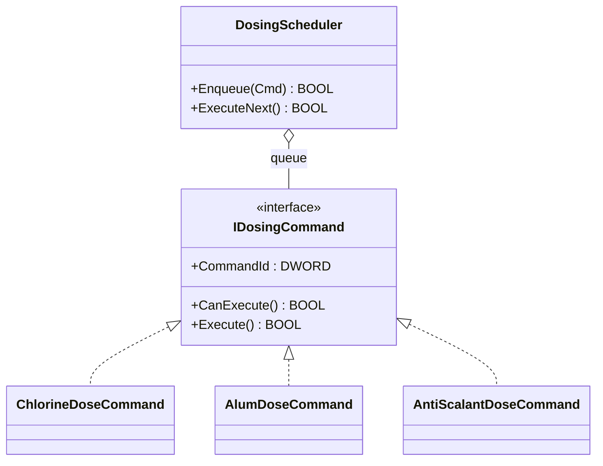

**Earns its weight when:**
- Decisions need audit trail or replay capability.
- The set of action types grows beyond a small CASE.
- Different actions take different parameters.

**Doesn't earn it when:**
- Single decision executed immediately, no replay needed.

OSCAT OOP examples: `chemical_dosing_command`,
`airport_baggage_command_observer`, `robotic_palletizer_command_state`.

### Memento

**Concept.** Capture an object's state into a snapshot record so it can be
restored or audited later. Usually paired with Command.

**Shape.** A memento struct holds the data needed to reconstruct or describe
state at the moment of capture. A `CaptureMemento` method on the producing
object.

**Earns its weight when:**
- Audit log needs before/after data per action.
- Recipes or batches need rollback.
- Diagnostic playback needs frozen-in-time state.

**Doesn't earn it when:**
- No audit, no rollback, no playback.

OSCAT OOP example: `chemical_dosing_command` (paired with Command).

### Adapter

**Concept.** A vendor-specific or legacy object exposes a common interface
that the rest of the application uses. The application is vendor-neutral.

**Shape.** A common interface (`IMotorDrive`, `IPump`, `IHoistDrive`). One
adapter FB per vendor, each implementing the interface and translating raw
vendor-specific data (status word bits, fault codes) into the normalized
contract.

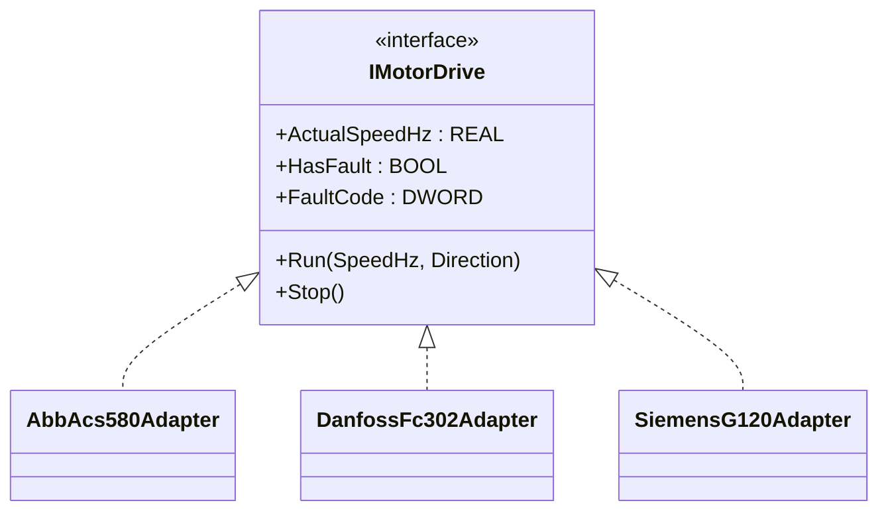

**Earns its weight when:**
- Multi-vendor sites where the application code shouldn't know the brand.
- Vendor replacement should not touch downstream logic.
- Cross-vendor fault codes need normalization.

**Doesn't earn it when:**
- Single vendor for the lifetime of the machine.

OSCAT OOP examples: `mixed_vendor_vfd_adapter`, `crane_hoist_adapter_state`,
`dairy_separator_adapter_state`.

### Proxy

**Concept.** Stand-in object that has the same interface as the real one but
adds remote-access, caching, or staleness detection.

**Shape.** A proxy FB implementing the same interface as the real subject.
Internally it accesses the real subject (over Modbus, MQTT, or another
boundary) and tracks freshness/timeouts.

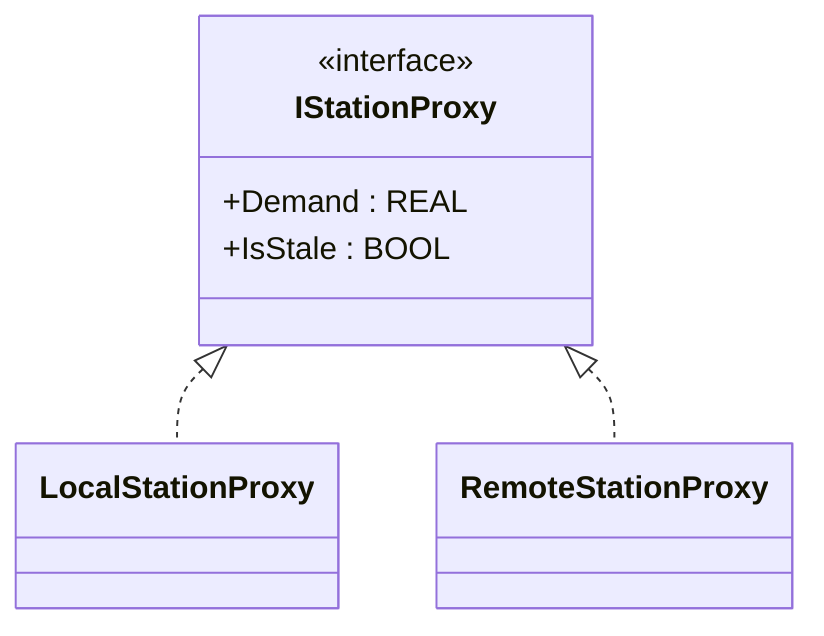

**Earns its weight when:**
- Distributed systems where some peers are remote.
- Stale data must be detected and demoted.
- The application code shouldn't care whether a peer is local or remote.

**Doesn't earn it when:**
- Single local station with no remote dependencies.

OSCAT OOP example: `district_pump_network_proxy_mediator`.

### Template Method

**Concept.** A base FB defines a workflow with overridable steps. Subclasses
override individual steps without rewriting the workflow.

**Shape.** A base FB with a `RunTemplate` method that calls protected hook
methods. Subclasses extend the base and override hooks.

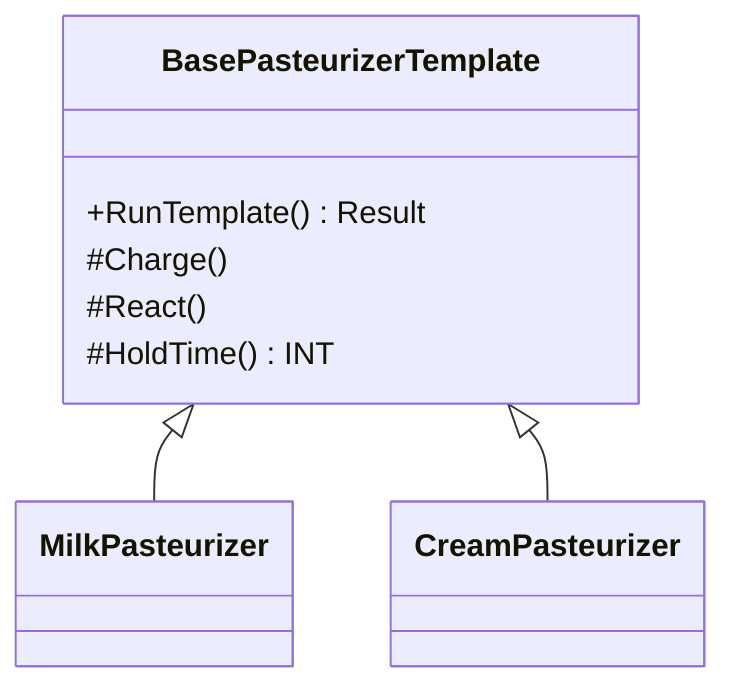

**Earns its weight when:**
- Multiple variants share the same overall workflow but differ in specific
  steps.
- The workflow itself is stable; the steps vary by product/recipe/season.

**Doesn't earn it when:**
- One variant — no inheritance needed.
- Variants differ in workflow shape, not just step internals — use Strategy.

OSCAT OOP examples: `pasteurizer_quality_chain`,
`filter_backwash_template`, `cooling_tower_facade_template`.

### Builder

**Concept.** Construct a complex configuration object step-by-step,
validating each step. Result is a complete record the application can use.

**Shape.** A builder FB with chainable setter methods (each returning the
builder) and a final `Build` method returning the configured record.

**Earns its weight when:**
- A recipe or configuration has many fields with cross-field constraints.
- Operator HMI builds the configuration over multiple screens.
- Validation needs to happen progressively, not all at once at the end.

**Doesn't earn it when:**
- Configuration fits in one struct passed once.

OSCAT OOP example: `pharma_filling_builder_state`.
