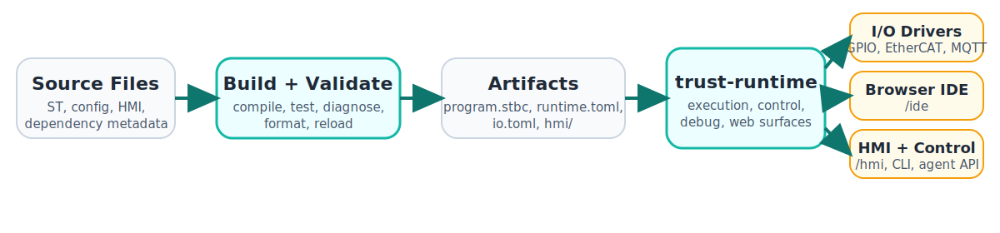

# Architecture

truST is one language/runtime/tooling stack, not a loose collection of
disconnected tools.

!!! note "Acronyms"
    `ST` = Structured Text.
    `LSP` = Language Server Protocol.
    `DAP` = Debug Adapter Protocol.
    `HIR` = High-level Intermediate Representation.
    `.stbc` = Structured Text Bytecode bundle.

*Figure:* Source files move through Build+Validate into artifacts
(`program.stbc`, `runtime.toml`, `io.toml`, `hmi/`), and the same runtime then
serves I/O drivers, the browser IDE at `/ide`, and HMI/control pages at
`/hmi`.

## The Main Architectural Rule

Editor, runtime, web UI, debugger, harness, and agent APIs should reuse the
same project semantics and execution model instead of inventing separate paths.

## Main Layers

### 1. Language and semantics

- `trust-syntax` parses IEC 61131-3 Structured Text
- `trust-hir` owns semantic analysis and typing
- `trust-ide` exposes diagnostics, symbols, navigation, formatting, and code actions

### 2. Runtime and control

- `trust-runtime` builds `program.stbc` and executes the bytecode VM
- runtime configuration comes from `runtime.toml`, `io.toml`, `simulation.toml`, and `hmi/`
- control, reload, status, and testing interfaces are exposed through CLI, web
  UI, and agent methods

### 3. Tooling interfaces

- `trust-lsp` serves standard LSP editor workflows
- `trust-debug` serves DAP over stdio for debugger integration
- `trust-harness` provides deterministic in-process cycle execution
- `trust-dev agent serve` exposes a stable automation contract outside VS Code

### 4. Browser-hosted interfaces

- `/ide` exposes the browser IDE for project editing
- `/hmi` exposes operator-facing HMI pages
- runtime-cloud APIs expose topology, preflight, and dispatch operations

## One Project, Many Interfaces

The same project should move through these interfaces without being rewritten
for each tool:

1. authoring in an editor or browser IDE
2. build and validation
3. runtime execution
4. deterministic harness or test execution
5. diagnostics and repair through agents
6. operator-facing HMI or runtime control APIs

If a feature only works in one interface because it depends on product-specific
glue, that is usually an architectural smell in truST.

## Shared Contracts

The main shared contracts are:

- the project layout (`src/`, config files, `hmi/`)
- semantic analysis from the compiler/language stack
- bytecode generation and runtime execution
- deterministic cycle stepping for tests and automation
- machine-readable control and agent APIs

That is why the docs repeatedly route readers back to the same config and
workflow pages instead of documenting separate "editor mode" and "runtime mode"
worlds.

## Non-goals

truST avoids the common PLC-tool split where:

- the editor uses one project model
- the runtime uses a different deployment model
- the browser UI is a third system
- automation or AI integrations only work by screen-scraping editor features

The platform is easier to maintain when agent tooling, runtime control, web UI,
and editor integrations all sit on top of the same project and execution model.

## Why this matters

The same project should behave consistently whether you:

- build it from the CLI
- edit it in VS Code
- run diagnostics from an agent
- drive it through the deterministic harness
- inspect it in the web UI

That shared execution contract is the main design rule in truST.

## Related

- [Project Model](project-model.md)
- [Runtime Model](runtime-model.md)
- [Communication Planes](communication-planes.md)
- [Visual Companion Model](visual-companion-model.md)
