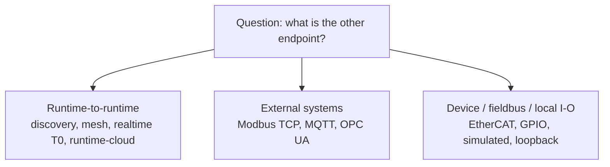

# Communication Planes

truST distinguishes three communication layers so users can answer the right
question first.

| Term | Meaning |
| --- | --- |
| Runtime-to-runtime | One truST runtime communicating with another. |
| MQTT / OPC UA / Modbus TCP | Plant or external-system protocols. |
| Fieldbus/local I/O | Direct device or driver wiring such as EtherCAT, GPIO, simulated, or loopback I/O. |

*Figure: Pick the communication plane by the endpoint you are talking to. That routing rule keeps runtime federation, external software, and direct hardware work in separate docs paths.*

## 1. Runtime-to-runtime

Use this plane when one truST runtime needs to find, pair with, or exchange
state with another runtime.

Current surfaces:

- discovery
- Zenoh-backed mesh
- realtime / T0 concepts
- runtime-cloud federation

## 2. External systems

Use this plane when truST is talking to other software or plant systems.

Current surfaces:

- Modbus TCP
- MQTT
- OPC UA

## 3. Device / fieldbus / local I/O

Use this plane when the question is about direct device access or driver wiring.

Current surfaces:

- EtherCAT
- GPIO
- simulated
- loopback

This split is why “connect two runtimes” and “use EtherCAT” belong in different
docs branches even though both are communication problems.

## How To Use This Model

If you are unsure where to look:

- start with [Protocol Matrix](../connect/protocol-matrix.md)
- if the other endpoint is another truST runtime, stay in [Runtime To Runtime](../connect/runtime-to-runtime/index.md)
- if the other endpoint is external software, stay in [External Systems](../connect/external-systems/index.md)
- if the question is hardware or local drivers, stay in [Devices And Fieldbus](../connect/devices-and-fieldbus/index.md)

That routing rule is the main reason the docs stay easier to navigate than
vendor portals that mix all connectivity into one undifferentiated tree.
