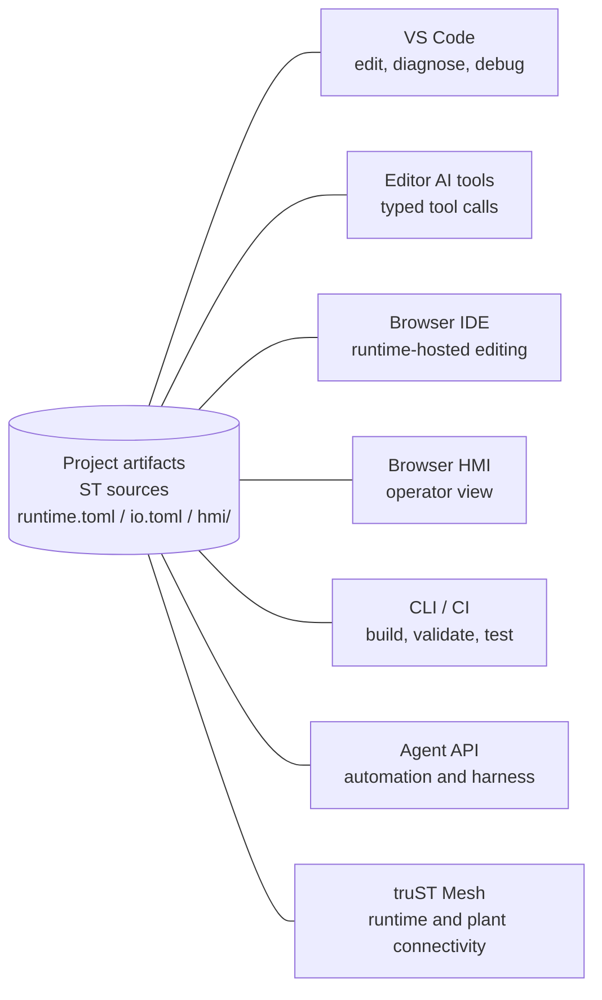

# One Project, Every Surface

> One project. Every surface. All live.
>
> truST keeps engineering, runtime, HMI, automation, and AI assistance tied to
> the same project instead of splitting them into disconnected toolchains.

| Term | Meaning |
| --- | --- |
| One project | The same source, config, HMI, and bundle artifacts reused across engineering, runtime, browser, automation, and AI surfaces. |
| Editor AI tools | Typed VS Code language-model tools contributed by the extension, not free-form screen scraping. |
| Agent API | External JSON-RPC automation for scripts, CI, and agent loops. |
| truST Mesh | Runtime/plant connectivity model with explicit local, remote, and operator communication planes. |
| Open artifacts | Reviewable files such as ST sources, `runtime.toml`, `io.toml`, `hmi/`, PLCopen XML, and generated bundles. |

*Figure: The same project is edited, executed, inspected, operated, scripted,
and AI-assisted through different surfaces. The surfaces do not become separate
project models.*

## Pillars

### One project, every surface, all live

The project files are the shared contract. VS Code, the runtime, Browser IDE,
Browser HMI, CLI/CI, Agent API, and truST Mesh all point back to the same
source, config, HMI, and bundle artifacts.

Use this mental model when a change crosses surfaces:

- edit and diagnose in [VS Code](../start/program-in-vscode.md)
- run, inspect, debug, and reload through runtime surfaces
- expose operator views through [Browser HMI](../operate/hmi-and-web-ui.md)
- automate repeatable work through [CLI/CI](../start/automate-with-cli.md) and
  the [Agent API](../reference/agent-api/overview.md)
- connect runtimes and plant systems through [truST Mesh](trust-mesh.md)

### AI with truST tools: typed, audited, policy-guarded

truST's editor AI integration is not just chat over source files. The VS Code
extension exposes typed language-model tools for ST diagnostics, navigation,
file reads and edits, HMI authoring, telemetry, settings, and debug actions.
Those tools are declared in the extension manifest, registered at activation,
and covered by a contract test that checks the manifest, activation events, and
registered tool names stay in sync.

Scope matters:

- Editor AI tools cover editor intelligence, file operations, HMI workflows,
  telemetry/settings, and debug actions.
- Build, validate, test, compile/reload, and deterministic harness
  orchestration are covered by the external [Agent API](../reference/agent-api/overview.md).
- HMI writes remain guarded by descriptor policy, allowlists, and runtime
  authorization; AI tooling does not bypass those controls.

Evidence:

- VS Code tool registrations:
  [editors/vscode/src/lm-tools.ts](https://github.com/boogy777-lgtm/Trust-platform/blob/main/editors/vscode/src/lm-tools.ts)
- VS Code language-model tool manifest:
  [editors/vscode/package.json](https://github.com/boogy777-lgtm/Trust-platform/blob/main/editors/vscode/package.json)
- Drift guard:
  [lm-tools-contract.test.ts](https://github.com/boogy777-lgtm/Trust-platform/blob/main/editors/vscode/src/test/suite/lm-tools-contract.test.ts)

### Open artifacts

truST keeps the important project state in files that can be reviewed, diffed,
generated, and scripted:

- ST source files
- `runtime.toml`
- `io.toml`
- `hmi/` descriptor files
- generated bundle artifacts such as `program.stbc`
- PLCopen XML when exchanging with other ecosystems

Visual editors still feed the same project model. Ladder, SFC, Blockly,
statecharts, and ST should be understood as authoring surfaces over open
artifacts, not separate execution engines.

### Measured behavior

The product story should stay tied to repeatable proof:

- [benchmarks](../reference/benchmarks.md) for runtime, T0, mesh, and dispatch
  behavior
- [conformance](../reference/conformance.md) for language and protocol
  expectations
- [examples](../examples/index.md) for runnable project workflows
- extension tests for VS Code behavior, including the AI tool contract
- public matrices that separate what is supported, partial, unavailable, or not
  applicable

## Choosing A Surface

Start in [VS Code](../start/program-in-vscode.md) when you are doing daily
engineering work: edit ST, inspect diagnostics, use visual editors, debug, and
watch runtime state in one place.

Use the [Agent API](../reference/agent-api/overview.md) when the work needs to
be automated by a script, CI job, or external agent. Use the
[Browser IDE](../start/program-in-browser.md) for runtime-hosted quick edits,
walkthroughs, and demos. Use [Browser HMI](../operate/hmi-and-web-ui.md) when
the user is operating or inspecting an already-running system.

## Surface Capability Matrix

Status key:

- `full`: this surface is a primary supported path for the capability
- `partial`: useful support exists, but the surface is not the full or primary path
- `no`: this surface does not currently provide the capability
- `n/a`: the capability does not fit the surface

| Capability | VS Code | Editor AI tools | Browser IDE | Browser HMI | CLI / CI | Agent API | LSP editors |
| --- | --- | --- | --- | --- | --- | --- | --- |
| Diagnostics | full | full | full | n/a | full | full | full |
| Navigation and symbols | full | full | full | n/a | no | no | full |
| Rename and refactor | full | partial | full | n/a | no | no | full |
| File editing | full | full | full | n/a | partial | full | full |
| Build, test, validate | full | no | full | n/a | full | full | no |
| Compile and reload | full | partial | partial | n/a | full | full | no |
| Runtime debug | full | partial | no | n/a | partial | no | no |
| Runtime I/O and state visibility | full | partial | partial | full | partial | partial | no |
| HMI authoring | full | full | partial | n/a | partial | no | no |
| HMI operation | partial | no | no | full | no | no | no |
| Visual editors | full | no | no | n/a | partial | no | no |
| PLCopen and interoperability | full | no | no | n/a | full | no | no |
| Deterministic harness | no | no | no | n/a | full | full | no |

## Honest Limits

- VS Code is the primary integrated engineering surface. Browser IDE is useful
  for runtime-hosted editing and demos, but it is not a replacement for every
  VS Code extension workflow.
- Editor AI tools do not currently expose direct build/test/validate or
  deterministic harness methods. Use the Agent API for those loops.
- Editor AI tools can read and edit visual-editor artifact files, but there is
  not yet a dedicated visual-editor AI tool surface.
- Agent API v1 intentionally omits code actions and attached-session
  source-aware reload workflows. It also does not mirror full symbol navigation
  or rename/refactor behavior yet. The current contract documents those
  boundaries explicitly.
- Browser HMI is an operator and technician surface. It is not an authoring
  surface and should not be marketed as a SCADA replacement.
- Visual editors are strongest when their generated companion artifacts are
  validated through the same build/runtime path as ST.

## Related

- [truST Mesh](trust-mesh.md)
- [Editors](../start/editors.md)
- [Program In VS Code](../start/program-in-vscode.md)
- [Program In Browser IDE](../start/program-in-browser.md)
- [Agent Quickstart](../start/agent-quickstart.md)
- [Agent API overview](../reference/agent-api/overview.md)
- [AI Assistance](../develop/ai-assistance.md)
- [HMI And Web UI](../operate/hmi-and-web-ui.md)
