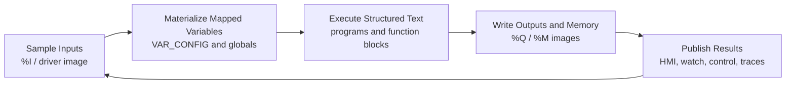

# Scan Cycle

Structured Text execution in truST is cycle-driven.

| Term | Meaning |
| --- | --- |
| `%I` | Input process image. |
| `%Q` | Output process image. |
| `%M` | Memory-marker process image. |
| `VAR_CONFIG` | Configuration-time mapping from ST variables to addresses. |
| Process image | Sampled I/O/memory state a cycle reads and writes. |

*Figure: One truST scan cycle. Inputs are sampled first, logic executes against that image, and observers see the committed post-cycle state.*

## One Cycle, In Order

1. inputs are sampled into the process image
2. mapped variables are materialized for the running program/task
3. Structured Text logic executes
4. updated outputs and memory images are written back
5. watchers, HMI, and control APIs observe the resulting state

## Common Bug Source

Many PLC bugs are really scan-order misunderstandings. The docs, runtime panel,
and deterministic harness all try to make that ordering visible instead of
hiding it.

## `%M` / memory-marker behavior

The memory-marker tutorial demonstrates the intended mental model:

1. cycle start: `%M` process image is read into bound variables
2. program logic mutates those variables
3. cycle end: updated values are written back to `%M`

That is why `memory_marker_counter` shows a value latched from cycle start while
the written-back `%M` value already reflects the increment for the next cycle.

## Tasking

`[resource]` defines the main cycle interval. Optional `[[resource.tasks]]`
entries let you override interval/priority/program groups for more explicit
scheduling.

## Why Determinism Matters

truST keeps this model visible so you can reason about:

- why a value changed one cycle later than you expected
- whether an input was sampled before or after a state transition
- how tests should assert outputs over time instead of only at one instant
- how a reload should preserve or reset state

When a tutorial or harness example steps cycle-by-cycle, it is teaching this
execution contract directly.

## Where You See The Scan Cycle

- the runtime executes it continuously
- the deterministic harness lets you step it manually
- tutorials use it to explain `%M` and I/O behavior
- HMI, traces, and watch surfaces expose the resulting state after each cycle

## Related

- [Deterministic Harness](deterministic-harness.md)
- [Runtime Model](runtime-model.md)
- [Memory Marker Counter example](../examples/test-and-debug.md)
