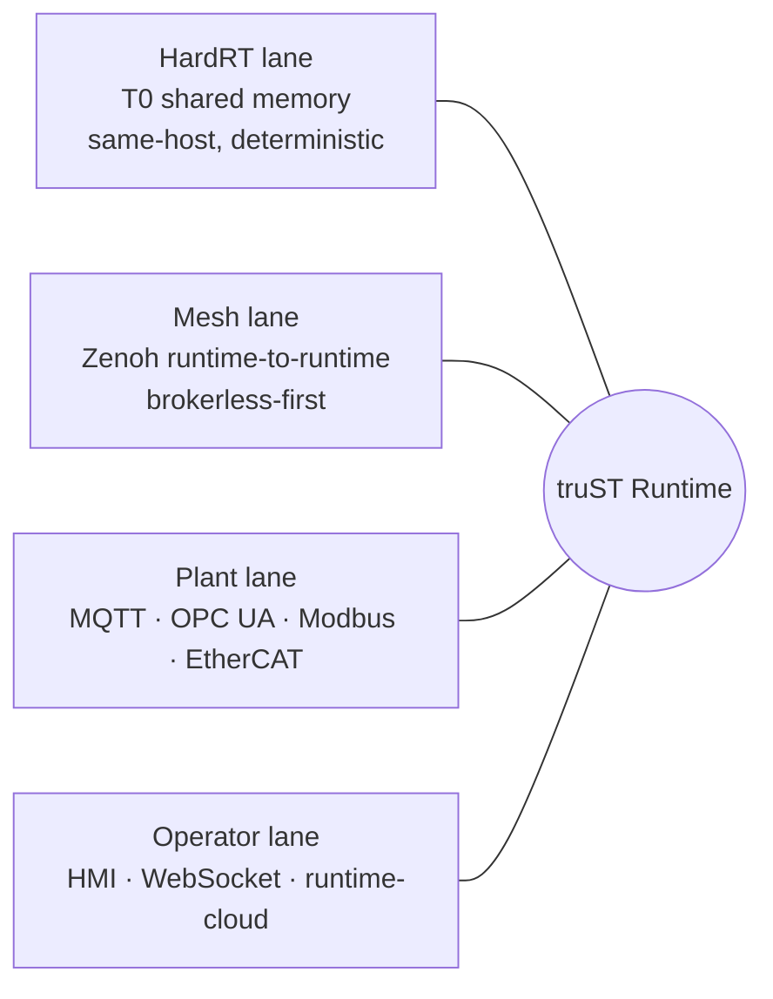

# truST Mesh

> One runtime. The right wire for each job.
>
> truST Mesh connects runtimes brokerless-first, keeps plant integrations native, and reserves deterministic claims for the paths that can actually prove them.

| Term | Meaning |
| --- | --- |
| `HardRT` | Same-host deterministic transport lane. |
| `T0` | Lowest-latency shared-memory transport path in truST docs. |
| `Zenoh` | Brokerless-first runtime-to-runtime mesh transport. |
| `mDNS` | Local-network discovery mechanism. |
| Broker | Server that relays messages between clients. |

*Figure: Unlike a one-bus architecture, truST does not force every control, plant, and operator workflow through the same protocol. The runtime chooses the communication surface that matches the job.*

## Pillars

### Brokerless first

Runtime-to-runtime sharing can run peer-to-peer through Zenoh instead of requiring a central message broker. No mandatory server between two paired runtimes, and no extra infrastructure to operate for a simple two-site federation. See [Mesh And Zenoh](../connect/runtime-to-runtime/mesh-zenoh.md).

### Broker-friendly when needed

Existing MQTT and OPC UA systems stay first-class plant boundaries, not second-class translations routed through a single internal bus. See [MQTT](../connect/external-systems/mqtt.md) and [OPC UA](../connect/external-systems/opc-ua.md).

### Pairing-first trust

> Discovery is visibility. Pairing is trust. Mapping is consent.

Discovery finds peers on the local LAN via mDNS. Pairing establishes trust through an explicit handshake. Publish/subscribe mappings declare what actually crosses the wire. Remote access is off by default. See [Discovery And Pairing](../connect/runtime-to-runtime/discovery-and-pairing.md).

### Measured, not implied

Communication latency is checked into the repo, not asserted in prose.

| Path | p95 | samples |
| --- | --- | --- |
| T0 shared memory round-trip | `1.167 us` | 256 |
| Mesh pub/sub (Zenoh) | `678.077 us` | 256 |
| Runtime-cloud dispatch end-to-end | `210.316 us` | 256 |

Source: `docs/internal/testing/evidence/trust-comms-v0.3.1/2026-02-20/artifacts/bench-summary.md`. Reproduce with [benchmarks](../reference/benchmarks.md).

## Lane map

| Lane | Best for | Where it lives |
| --- | --- | --- |
| HardRT | same-host deterministic transport | [Realtime T0](../connect/runtime-to-runtime/realtime-t0.md) |
| Mesh | runtime-to-runtime data sharing | [Mesh And Zenoh](../connect/runtime-to-runtime/mesh-zenoh.md) |
| Plant | external systems and fieldbus | [External Systems](../connect/external-systems/index.md), [Devices And Fieldbus](../connect/devices-and-fieldbus/index.md) |
| Operator | HMI, control, federation | [Runtime Cloud Federation](../connect/runtime-to-runtime/runtime-cloud-federation.md) |

Mesh is not the HardRT path. For same-host deterministic transport, stay in the HardRT lane.

## Related

- [One Project, Every Surface](one-project.md)
- [Protocol Matrix](../connect/protocol-matrix.md)
- [Communication Planes](communication-planes.md)
- [Runtime Model](runtime-model.md)
- [Benchmarks](../reference/benchmarks.md)
