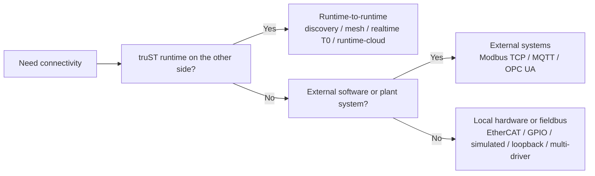

# Protocol Matrix

This is the first page to open when you want to know what communication
protocols and transport surfaces truST supports.

*Figure: Start with the endpoint class. Runtime federation, external software integration, and direct hardware wiring are different problem families and branch to different docs sections.*

## By problem type

| Question | Start here | Typical surfaces |
| --- | --- | --- |
| How do I connect two truST runtimes? | [Runtime-to-runtime](runtime-to-runtime/index.md) | discovery, mesh/Zenoh, realtime T0, runtime-cloud federation |
| How do I connect truST to another system? | [External systems](external-systems/index.md) | Modbus TCP, MQTT, OPC UA |
| How do I connect to local hardware or fieldbus? | [Devices and fieldbus](devices-and-fieldbus/index.md) | EtherCAT, GPIO, simulated, loopback, multi-driver |

## Runtime-to-runtime

| Surface | Best for | Go to |
| --- | --- | --- |
| discovery | finding peers and bootstrapping trust on a LAN | [Discovery And Pairing](runtime-to-runtime/discovery-and-pairing.md) |
| mesh / Zenoh | explicit runtime-to-runtime data sharing | [Mesh And Zenoh](runtime-to-runtime/mesh-zenoh.md) |
| realtime / T0 | same-host deterministic transport | [Realtime T0](runtime-to-runtime/realtime-t0.md) |
| runtime-cloud / web | federation, fleet, dispatch, browser control plane | [Runtime Cloud Federation](runtime-to-runtime/runtime-cloud-federation.md) |

## External systems

| Protocol | Best for | Go to |
| --- | --- | --- |
| Modbus TCP | register-oriented PLC/device integration | [Modbus TCP](external-systems/modbus-tcp.md) |
| MQTT | brokered event/message exchange | [MQTT](external-systems/mqtt.md) |
| OPC UA | runtime variable exposure to OPC UA clients | [OPC UA](external-systems/opc-ua.md) |

## Device and fieldbus drivers

| Driver | Best for | Go to |
| --- | --- | --- |
| EtherCAT | deterministic fieldbus I/O | [EtherCAT](devices-and-fieldbus/ethercat.md) |
| GPIO | direct edge/local pin mapping | [GPIO](devices-and-fieldbus/gpio.md) |
| simulated | fake process inputs without hardware | [Simulated And Loopback](devices-and-fieldbus/simulated-and-loopback.md) |
| loopback | fast local `%Q -> %I` sanity checks | [Simulated And Loopback](devices-and-fieldbus/simulated-and-loopback.md) |
| multi-driver | one runtime talking to more than one driver family | [Multi Driver](devices-and-fieldbus/multi-driver.md) |

## Next

- [Runtime To Runtime -> Transport Matrix](runtime-to-runtime/transport-matrix.md)
- [Devices And Fieldbus -> Driver Matrix](devices-and-fieldbus/driver-matrix.md)
