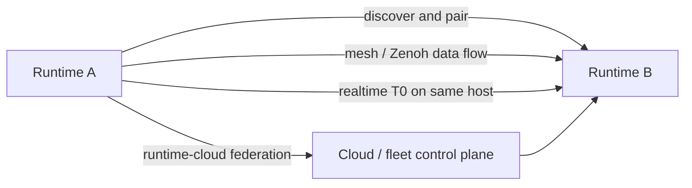

# Runtime To Runtime

*Figure: Runtime-to-runtime work spans local discovery, sustained mesh exchange, same-host realtime transport, and fleet/cloud coordination.*

## Start Here

- [Transport Matrix](transport-matrix.md): compare discovery, mesh, realtime, and runtime-cloud paths before you configure anything

## Choose By Goal

| Goal | Page |
| --- | --- |
| discover nearby runtimes and pair them | [Discovery And Pairing](discovery-and-pairing.md) |
| share data across a distributed runtime mesh | [Mesh And Zenoh](mesh-zenoh.md) |
| keep communication local and low-latency on one host | [Realtime T0](realtime-t0.md) |
| coordinate runtimes across sites or fleets | [Runtime Cloud Federation](runtime-cloud-federation.md) |
| understand exposure and hardening boundaries | [Security](security.md) |

## Rule Of Thumb

- Use discovery when you are still finding peers on a local network.
- Use mesh when runtimes need sustained data exchange.
- Use realtime T0 when the runtimes share a host and latency matters more than distribution.
- Use runtime-cloud federation when the system boundary is larger than one local network.

## Related

- [Protocol Matrix](../protocol-matrix.md)
- [Networking And Remote Access](../networking-and-remote-access.md)
