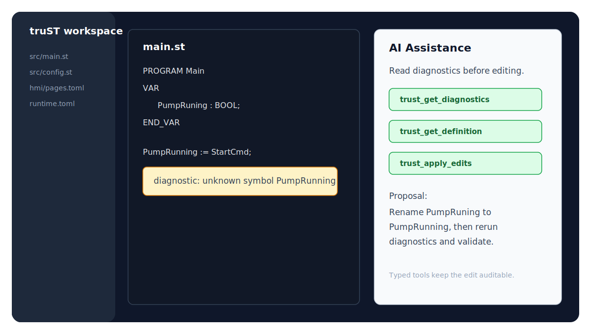
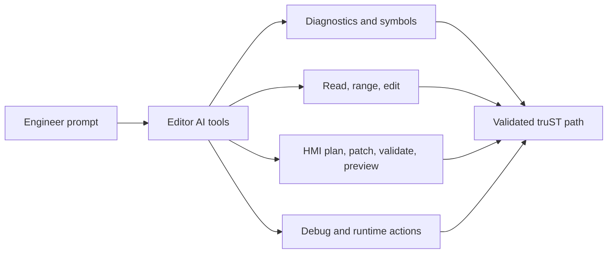

# AI Assistance

truST exposes project-aware AI tooling in the desktop extension and a separate external
Agent API for scripted automation. The boundary is tool scope: editor AI works
inside VS Code; Agent API serves external scripts, CI, and repair loops.

## Two AI Surfaces

| Surface | Best for | What it can use today |
| --- | --- | --- |
| Editor AI tools | VS Code-side assistance while you are working in the project | ST diagnostics, hover, symbols, definitions, references, completions, signature help, rename edits, formatting edits, code actions, file reads/writes, HMI bindings/layout/patch/validation/preview/journey tools, telemetry, settings, and debug actions |
| Agent API | non-editor automation, CI, repair loops, and harness execution | project info, workspace read/write, diagnostics, formatting, build, validate, test, compile/reload, runtime reload, and deterministic harness methods |

## Editor AI Tools

The VS Code extension contributes typed language-model tools instead of asking
an AI assistant to guess from free-form text alone.



*Figure:* A VS Code-side AI workflow should call typed truST tools, read
diagnostics, apply an auditable edit, and rerun validation instead of guessing
from chat context alone.



*Figure:* AI assistance routes through typed truST tools. The same diagnostics,
HMI validation, and runtime/debug paths remain visible to the engineer.

Use the editor AI tools when you want the assistant to:

- read diagnostics before editing
- inspect definitions, references, symbols, hover, completion, or signature
  help
- read a file or range before applying edits
- preview formatting or rename edits
- inspect HMI bindings and descriptor layout
- apply HMI descriptor patches through typed operations
- validate or preview HMI changes before accepting them
- start, attach, reload, or open the runtime I/O panel for debug-oriented work

Evidence:

- Tool registration lives in
  [editors/vscode/src/lm-tools.ts](https://github.com/boogy777-lgtm/Trust-platform/blob/main/editors/vscode/src/lm-tools.ts).
- Tool declarations live in
  [editors/vscode/package.json](https://github.com/boogy777-lgtm/Trust-platform/blob/main/editors/vscode/package.json).
- The desktop extension test suite includes a drift guard in
  [lm-tools-contract.test.ts](https://github.com/boogy777-lgtm/Trust-platform/blob/main/editors/vscode/src/test/suite/lm-tools-contract.test.ts).

## AI Capability Matrix

| Capability | Editor AI tools | Agent API |
| --- | --- | --- |
| read diagnostics | yes, through typed LSP tools | yes, through `lsp.diagnostics` |
| inspect symbols, definitions, references, hover, signature help | yes | partial; use editor/LSP surfaces for full navigation |
| edit files | yes, through file/range/edit tools | yes, through workspace read/write methods |
| build, validate, and test | no direct editor-AI tool; use CLI or Agent API | yes |
| compile and reload | partial debug/reload helpers | yes, through runtime methods |
| deterministic harness loops | no | yes |
| HMI descriptor planning and validation | yes | no direct v1 HMI authoring surface |
| HMI runtime writes | policy-controlled by runtime/HMI authorization | policy-controlled by runtime/HMI authorization |

## Agent API

Use `trust-dev agent serve` when the AI workflow should be scriptable
outside the editor:

```bash
trust-dev agent serve --project ./my-plc
```

The Agent API is the right path for:

- build, validate, and test loops
- compile/reload loops
- deterministic harness execution
- CI and hosted-worker automation
- repair workflows that need structured machine-readable results

Start here:

- [Agent Quickstart](../start/agent-quickstart.md)
- [Agent API overview](../reference/agent-api/overview.md)
- [Agent API v1](../reference/agent-api/v1.md)

## Guardrails

AI uses the same validated pathways as human engineers: diagnostics drive
edits, typed tool calls expose the available operation, runtime validation
confirms the result, and HMI authorization decides whether writes are allowed.

Editor AI tools and Agent API methods have different scopes. Use the
[One Project, Every Surface](../concepts/one-project.md) matrix when you need
the exact boundary.

## Useful Prompts

For editor work:

```text
Read the diagnostics for this ST file, inspect the referenced definitions, then propose the smallest edit.
```

For HMI work:

```text
Inspect the available HMI bindings and current layout, then dry-run a descriptor patch for a readonly status widget.
```

For automation:

```text
Use the Agent API loop: read project info, run diagnostics, build, validate, and only then propose a reload.
```

## Related

- [One Project, Every Surface](../concepts/one-project.md)
- [Program In VS Code](../start/program-in-vscode.md)
- [Automate With CLI / CI / agents](../start/automate-with-cli.md)
- [HMI Authoring](hmi-authoring.md)
