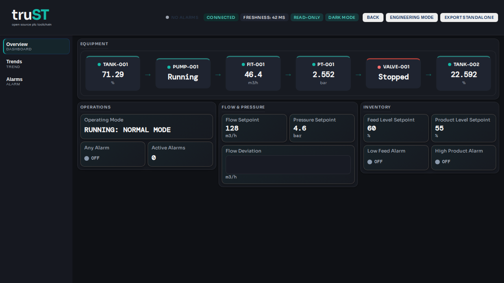

# HMI Authoring

Create or change the project-owned `hmi/` directory: descriptor files, process
SVG bindings, write policy, validation, preview, and AI-assisted HMI tooling.

For operating an already-running HMI, use [HMI And Web UI](../operate/hmi-and-web-ui.md).

## HMI Directory Workflow

*Figure:* A rendered HMI page from the shipped tutorial. Read the workflow
below while comparing the browser view with the `hmi/` files that define it.

--8<-- "docs/guides/HMI_DIRECTORY_WORKFLOW.md:3"

## What Success Looks Like

- `hmi/` exists in the project and contains the descriptors, assets, and policy
  files the runtime will serve.
- Preview shows the expected widgets with live values before any write-capable
  control is enabled.

## Related

- [HMI And Web UI](../operate/hmi-and-web-ui.md)
- [Program In Browser IDE](../start/program-in-browser.md)
- [HMI examples](../examples/hmi.md)
