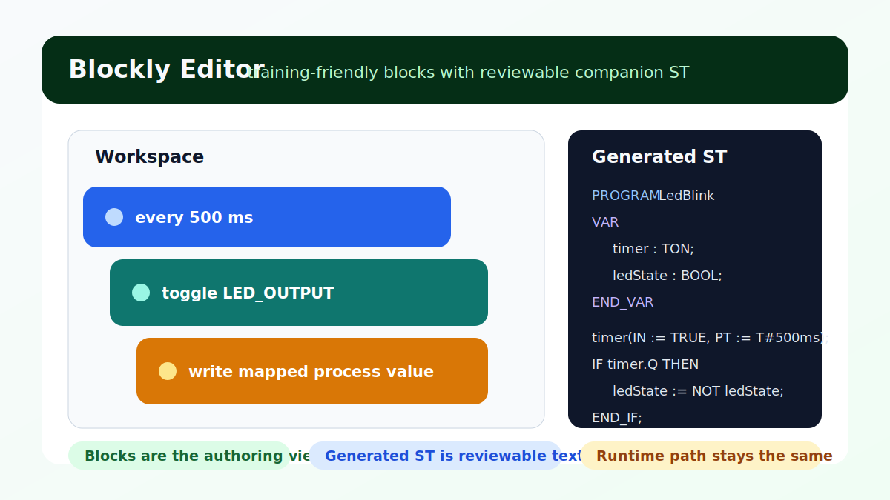

# Blockly

*Figure:* A block-based LED blink workflow next to the generated companion ST.
Blockly is an authoring surface over reviewable project text, not a separate
runtime model.

## What it gives you

- block-based authoring
- generated companion ST
- the same runtime, debug, and test loop as hand-written ST

## Five-step quickstart

1. Open `examples/blockly/simple-led-blink.blockly.json`.
2. Let truST open the Blockly editor automatically.
3. Drag or inspect blocks in the workspace.
4. Use the generated-code view to understand the ST companion.
5. Save, build, and run as a normal truST project.

## Best for

- training and onboarding
- quick demos and workshops
- simple logic where visual blocks are easier to discuss than ST

## When not to use Blockly

- when the team already thinks fluently in ST and the block view adds no clarity
- when large stateful or sequence-heavy logic would be better as Statechart or SFC
- when exact ST structure is the primary artifact you want reviewed

## Common mistakes

- treating generated ST as optional instead of part of the project output
- building very large workflows that become harder to scan than ST
- skipping address/mapping review when blocks read or write process values

## Example folder

- `examples/blockly`

## Related

- [Visual editor examples](../../examples/visual-editors.md)
- [Companion ST](companion-st.md)
