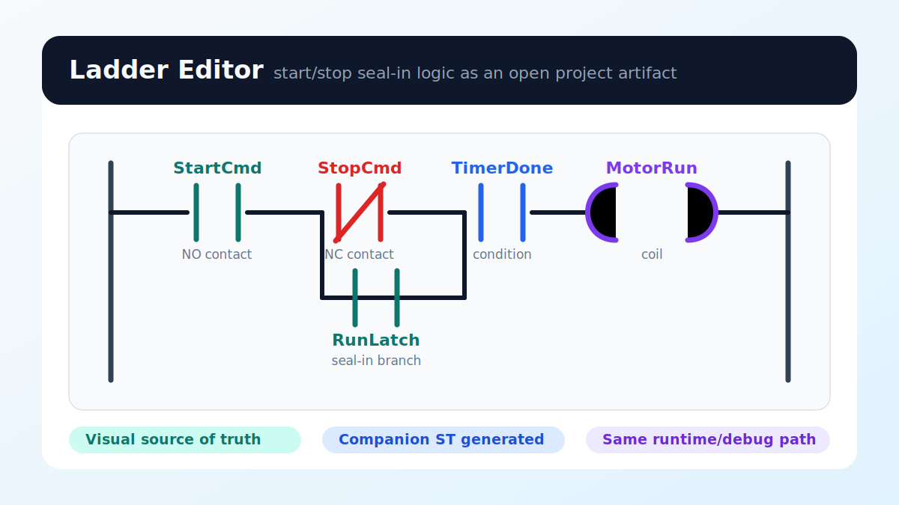

# Ladder Editor

Use the ladder editor for rung-based PLC logic that still compiles into the same
truST project, runtime, and debug workflow as Structured Text.

*Figure:* A start/stop seal-in rung with `StartCmd`, `StopCmd`, `TimerDone`,
`RunLatch`, and `MotorRun`. The ladder model is the visual source of truth; the
generated companion ST and runtime/debug path stay in the same truST project.

## What it gives you

- rung-based visual authoring
- deterministic companion ST output
- the same runtime/debug path as the rest of truST

## Five-step quickstart

1. Open `examples/ladder/simple-start-stop.ladder.json` in VS Code.
2. Let truST auto-open the custom editor or use `Reopen Editor With...`.
3. Add or inspect contacts/coils in the rung.
4. Save the file and inspect the generated companion ST.
5. Run the same project through build/validate/runtime as you would for ST.

## Best for

- start/stop and seal-in circuits
- timer/counter-heavy control
- teams that already maintain ladder in another PLC environment

## When not to use Ladder

- when the logic is mostly state-machine behavior
- when the control flow is primarily step/transition sequencing
- when a straight ST file is simpler than a visual graph

## Common mistakes

- treating the diagram as if it had a separate runtime
- editing the generated companion ST directly and expecting the visual model to stay authoritative
- using Ladder for a state machine that would be clearer as Statechart or SFC

## Example folder

- `examples/ladder`

## Related

- [Companion ST](companion-st.md)
- [PLCopen](../../migrate/plcopen.md)
- [Ladder specification](../../reference/specifications/15-ladder-diagram.md)
- [truST ladder profile](../../reference/specifications/16-ladder-profile-trust.md)
