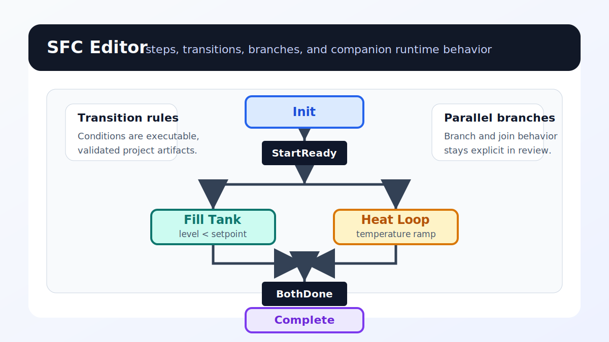

# SFC

*Figure:* An SFC sequence with an `Init` step, a `StartReady` transition,
parallel `Fill Tank` and `Heat Loop` branches, a `BothDone` join, and a
`Complete` step. The graph is reviewed as an open project artifact and then
validated through the same runtime loop.

## What it gives you

- step/transition visual authoring
- explicit phases and branching
- a shared ST/runtime toolchain instead of a separate execution engine

## Five-step quickstart

1. Open `examples/sfc/sfc_simple_parallel.sfc`.
2. Let truST open the SFC editor automatically.
3. Inspect the initial step, transition conditions, and any parallel branches.
4. Save and inspect the resulting companion ST/runtime behavior.
5. Validate the project and run it through the normal runtime loop.

## Best for

- procedural phase control
- sequences with clear step ownership
- flows that need explicit parallel branches or joins

## When not to use SFC

- when the logic is closer to rung-based circuit behavior
- when the system is better described as event-driven states
- when a simple ST sequence is easier to maintain than a graph

## Common mistakes

- treating transitions as vague comments instead of executable conditions
- overusing SFC for logic that has no real sequencing
- editing the companion ST directly and expecting the graph to remain source-of-truth

## Example folder

- `examples/sfc`

## Related

- [Companion ST](companion-st.md)
- [Visual editor examples](../../examples/visual-editors.md)
