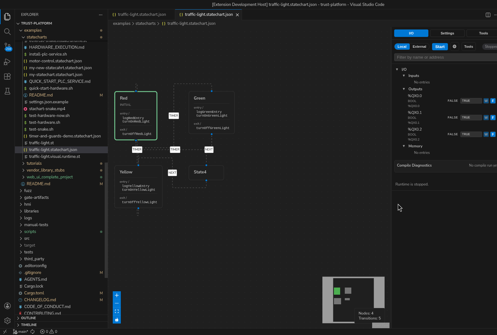

# Statechart

*Figure:* A traffic-light statechart with named states (`Red`, `Green`,
`Yellow`, and `Stand`) and explicit transitions visible on the editor canvas.

## What it gives you

- state-centric modeling
- action/event style authoring
- the same runtime, debug, and test surfaces as the rest of truST

## Five-step quickstart

1. Open `examples/statecharts/traffic-light.statechart.json`.
2. Let truST open the visual editor automatically.
3. Inspect states and transitions first before editing actions.
4. Save and review the companion ST/output behavior.
5. Run the project and drive events or inputs through the runtime/debug surfaces.

## Best for

- operating modes
- fault handling and recovery flows
- clear state ownership across larger behaviors

## When not to use Statechart

- when the logic is mostly rung logic or I/O seal-ins
- when the sequence is best represented as SFC steps and transitions
- when a simple ST `CASE` is easier to maintain than a graph

## Common mistakes

- adding too many side effects in transitions instead of using state entry/exit cleanly
- treating state names as documentation only instead of execution boundaries
- skipping runtime validation after visual edits

## Example folder

- `examples/statecharts`

## Related

- [Companion ST](companion-st.md)
- [What Is truST? / Visual Companion Model](../../concepts/visual-companion-model.md)
- [Visual editor examples](../../examples/visual-editors.md)
