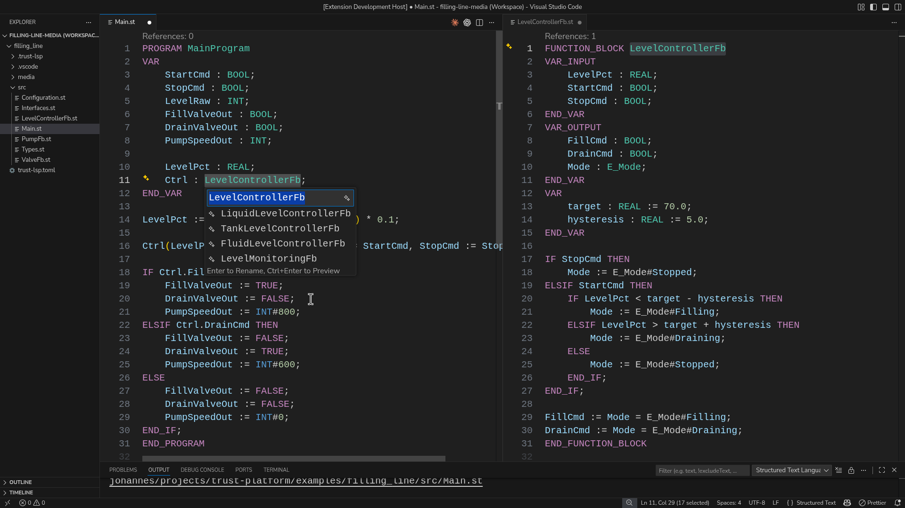

{ .brand-wordmark .brand-wordmark--light width="260" }
{ .brand-wordmark .brand-wordmark--dark width="260" }

# What Is truST?

truST is an open IEC 61131-3 programming and runtime workspace for PLC-style
control projects.

One project can be edited in VS Code or the Browser IDE, built and validated
from the CLI, run by `trust-runtime`, viewed through Browser HMI, automated
through the Agent API, and connected through runtime/plant communication
surfaces.

## Go To

| Need | Open |
| --- | --- |
| install the tools | [Install](start/index.md) |
| program a PLC project | [Program](develop/index.md) |
| run, deploy, or operate a system | [Run](operate/index.md) |
| check hardware and target support | [Hardware](hardware/index.md) |
| look up commands, config, diagnostics, APIs, or specs | [Reference](reference/index.md) |

## Product Model

| Part | Role |
| --- | --- |
| VS Code extension | ST diagnostics, navigation, formatting, visual editors, runtime panel, debugger, AI tools |
| Browser IDE | runtime-hosted editing surface at `/ide` |
| Browser HMI | operator/runtime pages at `/hmi` |
| `trust-runtime` | execution engine, CLI workflows, runtime control, web UI |
| Agent API | JSON-RPC automation for scripts, CI, and agent loops |
| truST Mesh / protocols | runtime-to-runtime and plant communication paths |

## Core Idea

truST keeps the important state in reviewable project files:

- ST source
- `runtime.toml`
- `io.toml`
- `hmi/`
- generated bundles such as `program.stbc`
- interchange artifacts such as PLCopen XML

That is the point of [One Project, Every Surface](concepts/one-project.md):
the editor, runtime, HMI, automation, AI tools, and communication surfaces do
not become separate project models.

## Proof

*A real-product tour of the same project across desktop VS Code, diagnostics,
debugging, Browser IDE, and Browser HMI.*

*Rename a Structured Text symbol across files and preview the affected
definition before applying the change.*

*Source files move through build and validation into runtime artifacts, then
into `trust-runtime`, `/ide`, and `/hmi`.*

## Project Links

- [About](about.md)
- [FAQ](faq.md)
- [Changelog](changelog.md)
