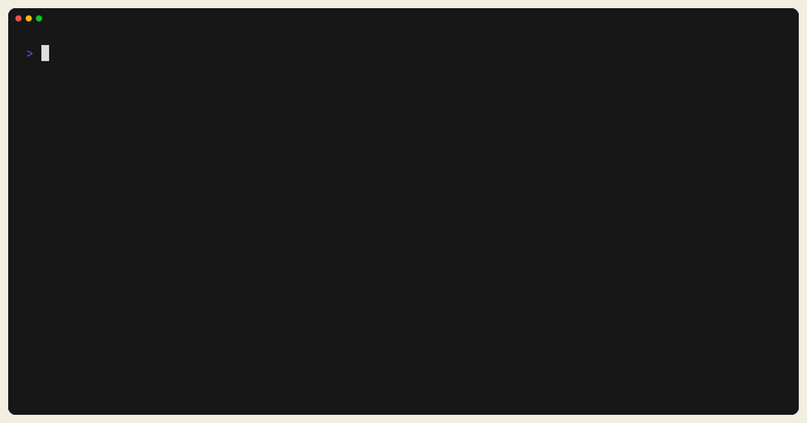
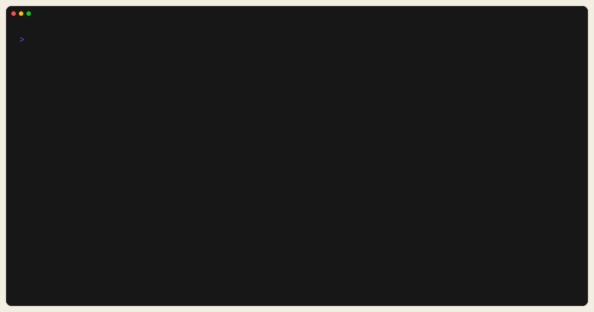

# Deploy And Rollback

## Core commands

```bash
trust-runtime deploy --project ./my-plc --root ./deploy-root
trust-runtime rollback --root ./deploy-root
```

`deploy` writes a versioned deployment entry. `rollback` moves the active
deployment pointer back to the previous version.



*Figure:* The `deploy` command surface and required flags. Use this to confirm
the exact CLI contract before you automate rollout on a target root.



*Figure:* The `rollback` command surface. Keep this close to the deployment root
you operate so you know which flag set the runtime expects.

## Pre-deploy checklist

- build succeeded
- validate succeeded
- the target config and safe-state policy were reviewed
- the rollback root has at least one known-good prior deployment

## Good rollback scenarios

- bad bytecode bundle
- correct logic but wrong runtime config
- rollout succeeded technically but operator behavior regressed

## Worked tutorial

--8<-- "examples/tutorials/14_deploy_and_rollback/README.md:3"
