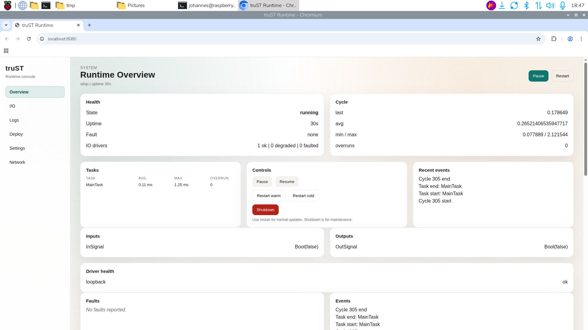

# Field Fault Procedures

Field fault work starts by comparing physical state with runtime evidence
before any recovery action.

*Figure:* Compare field evidence with runtime state before deciding whether a
fault is physical, mapping-related, or runtime-side.

## Safe Generic Sequence

| Step | Action | Do not skip |
| --- | --- | --- |
| 1. Identify the fault | record the alarm, bad signal, or equipment state | exact tag/alarm name and time |
| 2. Make the site safe | follow the local safe-state or lockout procedure | field confirmation |
| 3. Check whether the fault is still present | inspect the equipment, not just the HMI | physical condition |
| 4. Compare runtime evidence | review the HMI, trends, runtime panel, and I/O reads | whether the software view matches the field |
| 5. Recover only by procedure | clear, reset, or restart only when the site procedure says it is safe | recovery authorization |

## Important Boundary

This sequence does not replace:

- lockout/tagout
- local electrical/mechanical procedure
- machine-specific fault reset sequences

## Related

- [Technician I/O Diagnosis](technician-io-diagnosis.md)
- [Safety And Commissioning](safety-and-commissioning.md)
- [Runbooks](../examples/runbooks.md)
