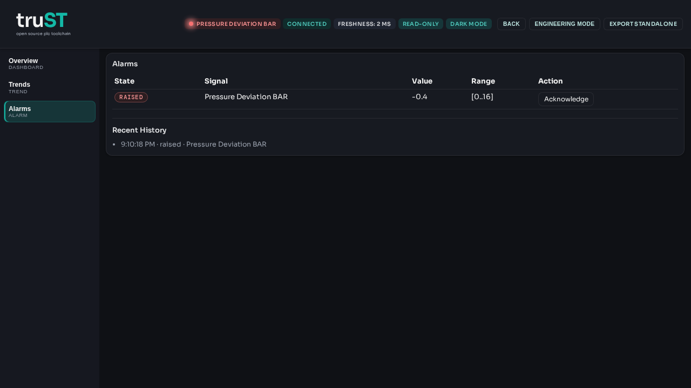

# Operator Alarm Handbook

Alarm work starts with process context, not the acknowledge button.
Site-specific alarm causes, reset conditions, and contacts belong in the local
runbook.

*Figure:* The Browser HMI alarm view gives operators the active alarm, process
context, acknowledgement action, and recent history in one place.

## Alarm Response Sequence

| Step | What to check | Record |
| --- | --- | --- |
| Open Alarms | Identify the active alarm, area, and timestamp | alarm text or code |
| Check process state | Compare the alarm against the HMI graphic, trend, or nearby equipment | observed equipment condition |
| Acknowledge only when seen | Confirm an operator has read and accepted responsibility for the next action | operator initials and time |
| Follow the site procedure | Silence, hold, or escalate according to the runbook | action taken |

## What Acknowledge Means

- Acknowledge records that an operator saw the alarm.
- Acknowledge does not prove the fault is cleared.
- The alarm remains active until the runtime condition returns to normal.

## Escalate Immediately When

- the alarm blocks a safety function
- the process condition is still present after acknowledge
- the same alarm reappears repeatedly in one shift
- the alarm text and the observed equipment state do not match

## Escalation Fields

Fill these with site-specific details before go-live.

| Role | Contact | Phone | Use when |
| --- | --- | --- | --- |
| Supervisor | fill in | fill in | production impact or unclear process state |
| Technician on call | fill in | fill in | alarm persists after acknowledge or field check |
| Safety contact | fill in | fill in | alarm affects a safety boundary or lockout condition |

## Shift Handover Record

Record at least:

- the alarm name or code
- when it started
- whether it was acknowledged
- whether the condition cleared
- what was handed over to the next operator or technician

## Related

- [Operate In Browser HMI](../start/operate-in-browser.md)
- [Field Fault Procedures](field-fault-procedures.md)
- [Operator Shift Handover](operator-shift-handover.md)
- [Runbooks](../examples/runbooks.md)
