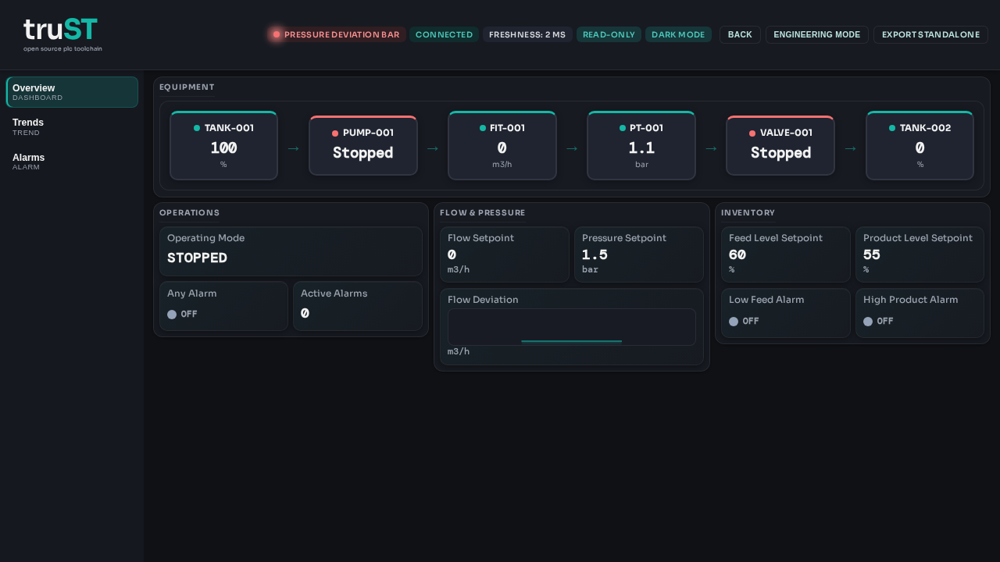

# Operator Daily Checks

Per-shift checks start from the running Browser HMI: connection, freshness,
read-only mode, alarm state, live values, and the shift record.

*Figure:* Daily checks start with the visible Browser HMI state: connection,
freshness, read-only mode, alarm state, and live process values.

## Per-Shift Checklist

| Check | Expected state | If not |
| --- | --- | --- |
| HMI loads | `/hmi` opens without browser or auth errors | Record the error text, check the URL, and call the local contact |
| Runtime connection | Connected/healthy indicator visible; freshness keeps updating | Escalate to the technician or runtime owner |
| Active alarms | No unexpected alarms, or alarms match known maintenance work | Open the alarm page, record the alarm, and follow the site procedure |
| Live values | Process values update and stay within the expected band for the current shift | Compare with field indications, then escalate if the mismatch persists |
| Shift record | Anything abnormal is written to the site runbook or handover log | Do not leave the condition undocumented |

## Escalation Fields

Fill these with site-specific details before using this page in production.

| Role | Contact | Phone | Use when |
| --- | --- | --- | --- |
| Supervisor | fill in | fill in | operator cannot confirm the correct operating state |
| Technician on call | fill in | fill in | runtime disconnected, stale values, or I/O mismatch |
| Maintenance lead | fill in | fill in | repeated equipment alarms or manual intervention required |

## Site-Specific Procedure

Pair this generic page with a local runbook:

- [Runbooks](../examples/runbooks.md)

## Related

- [Operate In Browser HMI](../start/operate-in-browser.md)
- [Operator Guide](operator-guide.md)
- [Operator Shift Handover](operator-shift-handover.md)
