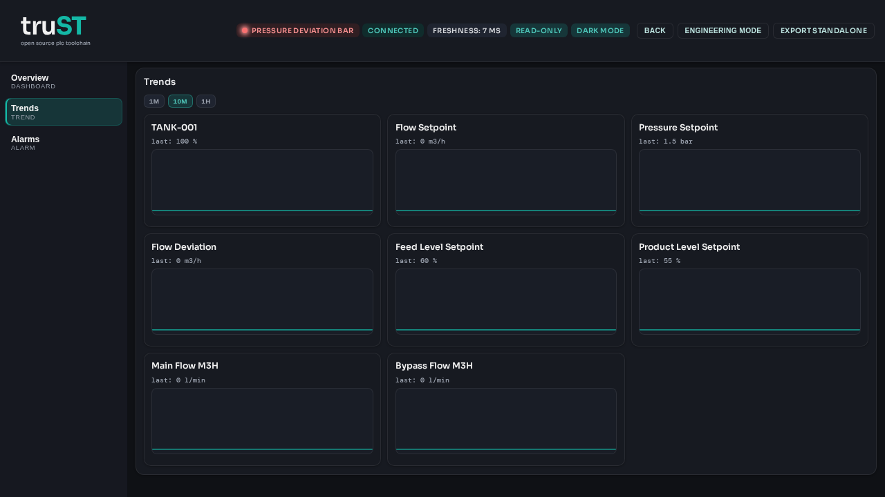

# Operator Shift Handover

Shift handover records active alarms, unusual values, temporary modes, manual
interventions, and open actions.

*Figure:* The Browser HMI Trends page at shift change. Review how values
moved during the shift before recording active alarms, unusual values, and
open actions in the handover log.

## Handover Checklist

| Item | What to record |
| --- | --- |
| Active alarms | alarm name/code, first seen time, whether it was acknowledged |
| Unusual values or trends | tag name, current value, expected range, last stable time |
| Temporary modes | bypasses, maintenance mode, manual output forcing, or blocked equipment |
| Manual interventions | what was changed, why, and whether it must be reversed |
| Open actions | who owns the next step and when it must happen |

## Contacts

| Role | Contact | Phone |
| --- | --- | --- |
| Outgoing operator | fill in | fill in |
| Incoming operator | fill in | fill in |
| Supervisor | fill in | fill in |

## Related

- [Operator Daily Checks](operator-daily-checks.md)
- [Operator Alarm Handbook](operator-alarm-handbook.md)
- [Runbooks](../examples/runbooks.md)
