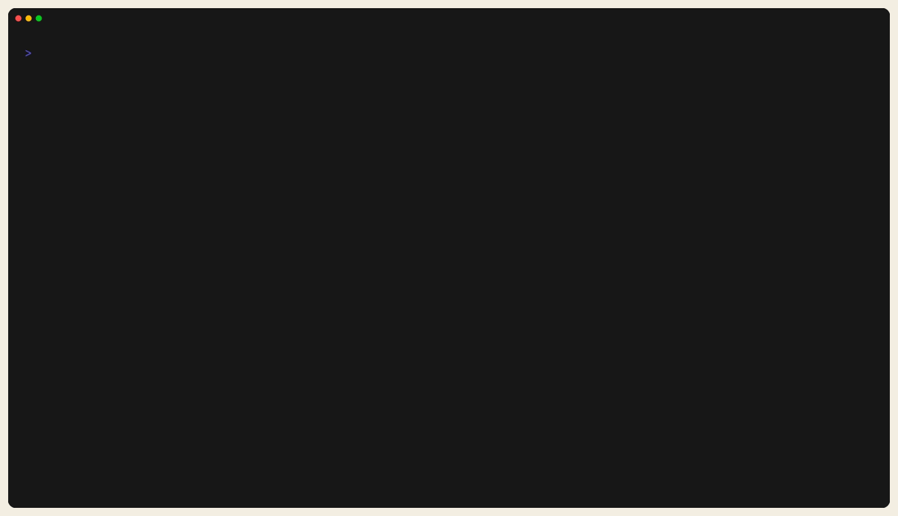

# Technician I/O Diagnosis

Use this sequence when a signal on the HMI does not match the field.

*Figure:* Use runtime evidence such as `io-read` or the runtime panel to
separate HMI refresh issues from mapping, runtime, or field wiring issues.

## Read The Chain In Order

| Step | Evidence | Next action |
| --- | --- | --- |
| 1. HMI value | tag state, timestamp, and whether the value is stale or fresh | if stale, check runtime status first |
| 2. Runtime evidence | runtime panel, `io-read`, or control API result | if runtime and HMI differ, inspect mapping and refresh path |
| 3. Mapping | `config.st`, `io.toml`, address, scaling, inversion, and task ownership | if mapping is wrong, fix the engineering config |
| 4. Field check | sensor, actuator, terminal, fuse, or networked device state | if field and runtime differ, troubleshoot wiring or hardware |

## Good First Pages

- [Runtime UI And Control](runtime-ui-and-control.md)
- [I/O Binding](../connect/devices-and-fieldbus/io-binding.md)
- [Simulated And Loopback](../connect/devices-and-fieldbus/simulated-and-loopback.md)

## Related

- [Field Fault Procedures](field-fault-procedures.md)
- [Operator Guide](operator-guide.md)
- [Troubleshooting](../troubleshooting.md)
