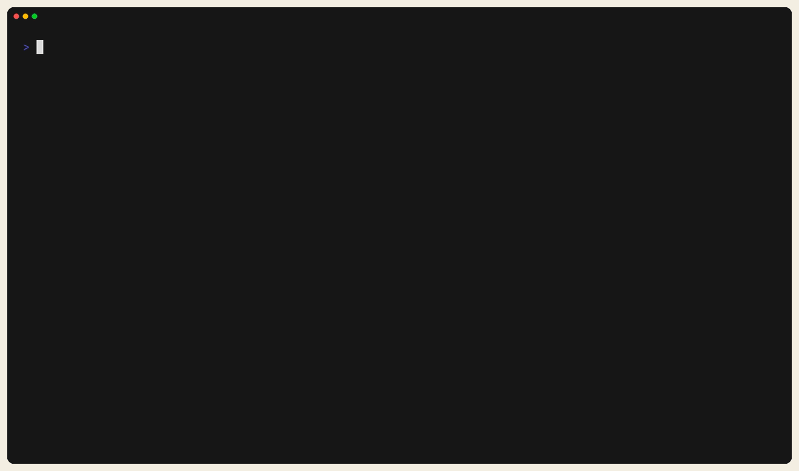

# Automate With CLI / CI / agents

## Quick start

Use a small shipped project first:

- `examples/memory_marker_counter`

Run:

```bash
trust-runtime build --project examples/memory_marker_counter --sources src
trust-runtime validate --project examples/memory_marker_counter
trust-dev test --project examples/memory_marker_counter --output human
```



*Figure:* A shipped project built, validated, and tested from the terminal
before you move to CI or `agent serve`.

## Describe the Agent API

`trust-dev agent serve` is the stdio JSON-RPC entry point for shell tools,
CI jobs, and automation.

Ask the runtime what the JSON-RPC API supports:

```bash
printf '%s\n' \
  '{"jsonrpc":"2.0","id":1,"method":"agent.describe","params":{}}' \
  | trust-dev agent serve --project ./examples/memory_marker_counter
```

Then inspect the project:

```bash
printf '%s\n' \
  '{"jsonrpc":"2.0","id":1,"method":"workspace.project_info","params":{}}' \
  | trust-dev agent serve --project ./examples/memory_marker_counter
```


*Figure:* `agent.describe` returning the live JSON-RPC contract. Use this first
when you need an agent or CI tool to discover the runtime API.


*Figure:* `workspace.project_info` returning project metadata from the same
bundle. This is the quickest shape check before running diagnostics or reloads.

## What Success Looks Like

- build produces bytecode without errors
- validate succeeds
- tests report pass/fail output
- `agent.describe` and `workspace.project_info` return JSON-RPC responses

## If It Fails

- build/validate/test issues: go to [Build, Validate, Test](../operate/build-validate-test.md)
- method/contract questions: go to [Agent Quickstart](agent-quickstart.md) or
  [Agent API v1](../reference/agent-api/v1.md)
- deterministic execution needs: go to
  [Harness Protocol](../reference/harness/protocol.md)

## Next

- [Agent Quickstart](agent-quickstart.md)
- [Agent API overview](../reference/agent-api/overview.md)
- [Harness Protocol](../reference/harness/protocol.md)
- [CI/CD](../operate/ci-cd.md)
