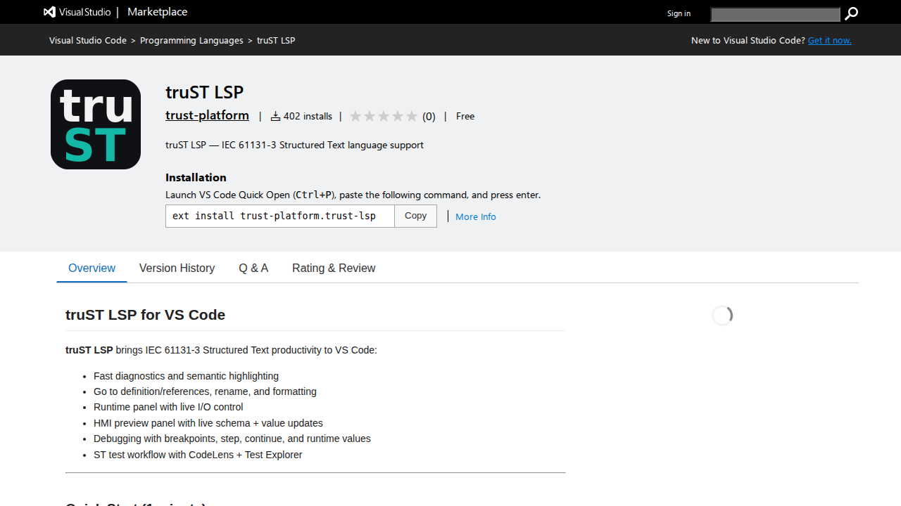
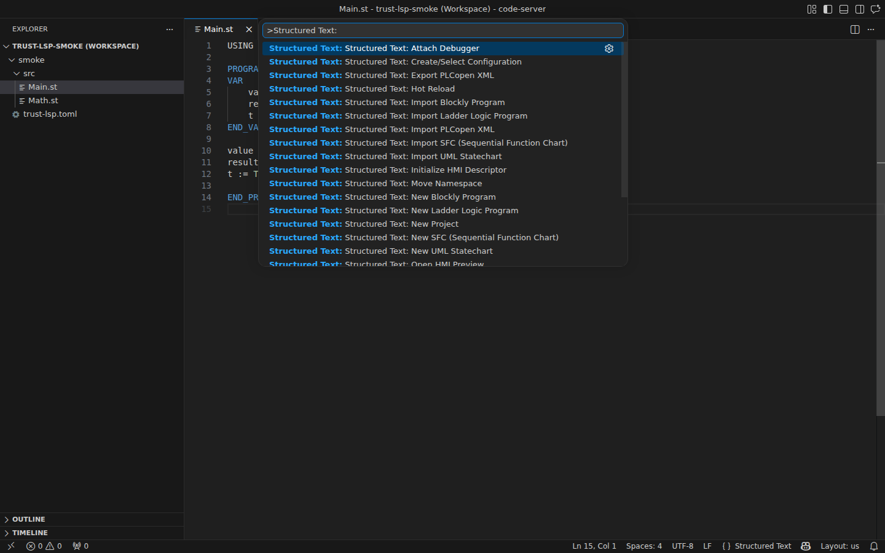
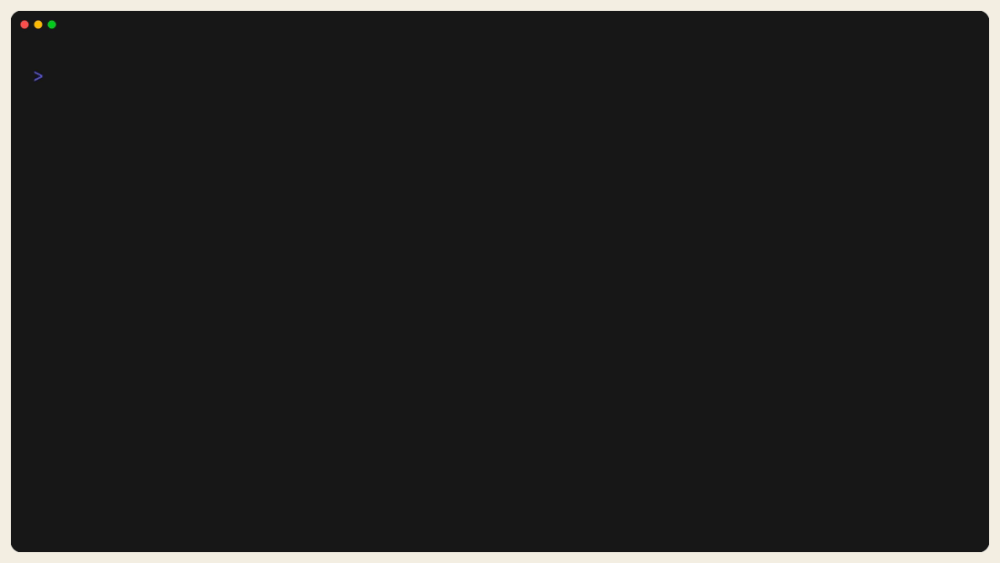

# Installation On Windows, macOS, And Linux

Install the truST editor extension and runtime bundle on Windows, macOS, or
Linux.

## Step 1: Install VS Code

Download VS Code from <https://code.visualstudio.com/> and install the stable
build for your operating system. If you already use VS Code for PLC or
industrial projects, keep that install and move to step 2.

## Step 2: Install truST LSP From The Marketplace

Open the Visual Studio Marketplace listing for truST LSP:

<https://marketplace.visualstudio.com/items?itemName=trust-platform.trust-lsp>

*Figure:* The Marketplace listing for `truST LSP`. Install the extension from
this page or directly from VS Code.

## Step 3: Verify The Extension In VS Code

Open VS Code, press `Ctrl/Cmd+Shift+P` (`Cmd+Shift+P` on macOS), and type
`Structured Text:`. If the extension is healthy, the truST commands appear
immediately in the Command Palette.

*Figure:* `Structured Text:` commands visible in the Command Palette. This is
the fastest proof that the editor-side install worked.

## Step 4: Download Runtime Binaries

Download the current runtime bundle from GitHub Releases:

<https://github.com/boogy777-lgtm/Trust-platform/releases/latest>

Choose the package that matches your machine:

- `trust-runtime-linux-x64.tar.gz`
- `trust-runtime-linux-arm64.tar.gz`
- `trust-runtime-darwin-x64.tar.gz`
- `trust-runtime-darwin-arm64.tar.gz`
- `trust-runtime-win32-x64.zip`

Use [Install On Target](../operate/install-on-target.md) when you need the
runtime to survive reboot on a Raspberry Pi or another Linux host.

*Figure:* After download and install, `trust-runtime --version` and
`trust-runtime --help` should respond locally. This is the fastest terminal
check that the runtime bundle landed on your machine correctly.

## If It Did Not Work

### No `Structured Text:` commands appear

- restart VS Code once
- confirm the extension is enabled for this workspace
- reinstall the extension from the Marketplace listing

### The runtime download is missing for your platform

- check the latest GitHub release again
- if you need an unreleased build, use [Install From Source](install-from-source.md)

## Next

- [Choose Your Workflow](choose-your-workflow.md)
- [Program In VS Code](program-in-vscode.md)
- [Program In Browser IDE](program-in-browser.md)
- [Install On Target](../operate/install-on-target.md)
