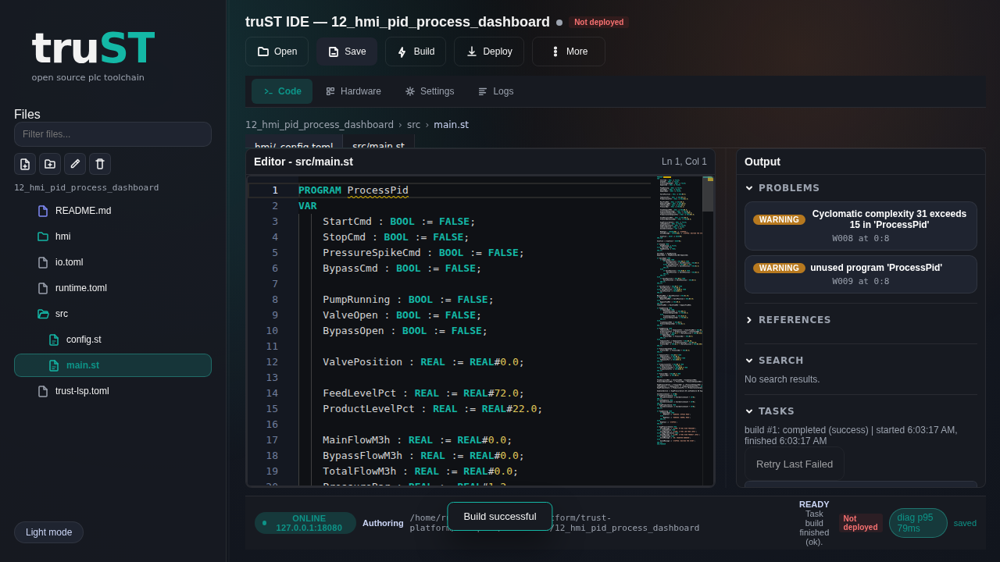

# Program In Browser IDE

## Truth First

- Browser IDE lives at `/ide`
- Browser HMI lives at `/hmi`
- Browser IDE is served by `trust-runtime ide serve`
- Browser HMI is served by a running project/runtime with web enabled
- default runtime web binding is often loopback-only
- if the URL must be reachable from another host, expose it safely:
  [Networking And Remote Access](../connect/networking-and-remote-access.md)

## For Administrators

Start the standalone Browser IDE:

```bash
trust-runtime ide serve --project examples/tutorials/12_hmi_pid_process_dashboard
```

Then start the shipped tutorial runtime for `/hmi`:

```bash
trust-runtime run --project examples/tutorials/12_hmi_pid_process_dashboard
```

Or from the repo root:

```bash
cargo run -p trust-runtime --bin trust-runtime -- ide serve \
  --project examples/tutorials/12_hmi_pid_process_dashboard
cargo run -p trust-runtime --bin trust-runtime -- \
  run --project examples/tutorials/12_hmi_pid_process_dashboard
```

This gives you:

- Browser IDE on `http://127.0.0.1:18080/ide`
- Browser HMI on `http://127.0.0.1:18082/hmi`

## For Browser Users

Open:

- `http://127.0.0.1:18080/ide`
- `http://127.0.0.1:18082/hmi`

Then:

1. open `src/main.st`
2. run build
3. run validate
4. inspect the project tree
5. jump to `/hmi` for operator-side confirmation

## What Success Looks Like

- `/ide` loads the project and lets you browse files
- build and validate complete without errors
- `/hmi` shows overview, process, trends, and alarms for the same project



*Figure:* The browser IDE with the shipped tutorial project already loaded.
Open the project tree from here, then open `src/main.st` before you build or
validate.


*Figure:* The matching browser HMI for the same project. Use it as the
operator-side confirmation after the build succeeds.

## If It Fails

- URL works on the host but not another machine: check loopback-only binding and
  [Networking And Remote Access](../connect/networking-and-remote-access.md)
- `/ide` loads but you cannot edit: confirm the runtime/session mode
- `/hmi` loads but values stay stale: go to
  [HMI And Web UI](../operate/hmi-and-web-ui.md) and
  [Runtime UI And Control](../operate/runtime-ui-and-control.md)

## Next

- [Operate In Browser HMI](operate-in-browser.md)
- [HMI And Web UI](../operate/hmi-and-web-ui.md)
- [Runtime UI And Control](../operate/runtime-ui-and-control.md)
- [Network And Remote Access](../connect/networking-and-remote-access.md)
