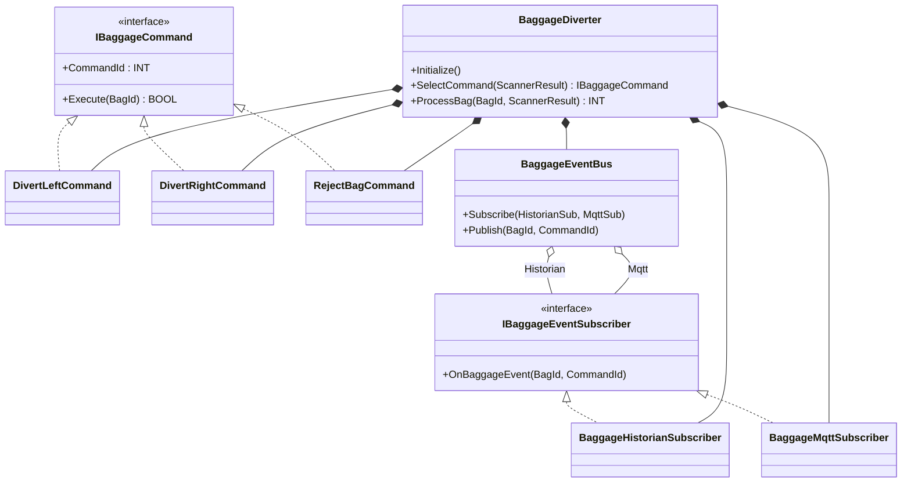
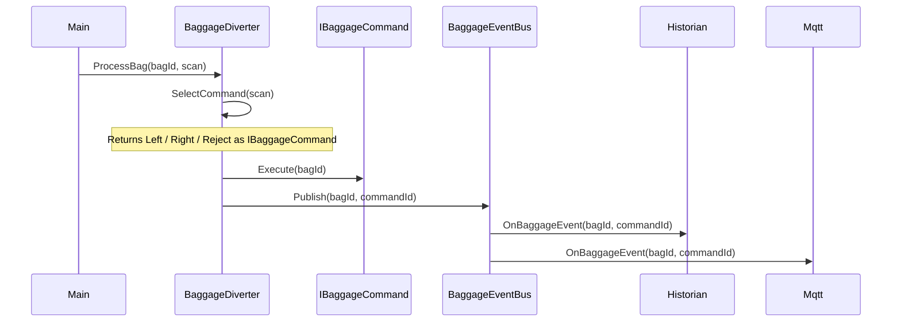

# Airport Baggage Diverter — Command + Observer

A barcode scanner reads each bag and the controller actuates one of three
solenoids: divert-left, divert-right, or reject. The OOP version separates
two things the procedural version mixes: **picking a decision** and **telling
everyone the decision happened**.

## When classic is the right answer

The procedural version is `non-oop/src/Main.st` (33 lines). Use it when:

- One fixed diverter, three lanes, no future expansion of decision types.
- Fewer than three downstream audit consumers.
- You never need to replay or queue past decisions for forensic audit.

The OOP version costs about 6× the lines. It earns that cost only when those
conditions break.

## Where classic strains

`ProcessBag` is fine while it just picks a lane. Then auditors ask for an
event log — you add a `Push` after the CASE. Then SCADA wants MQTT events —
you add a publish call inside each branch with a per-lane payload. Then the
historian wants a structured record with timestamp and bag id — each branch
sets three more fields. Then security asks for an email alert on rejects
only and a Modbus pulse on every divert. By that point the CASE is a
60-line wall where every audit consumer touches every branch. Then a
security incident hits and auditors want to replay the last hundred bag
decisions — and you discover there is no "decision" stored anywhere, only a
sequence of branches that ran. That last requirement is where Command +
Observer earns its weight.

## Structure



Read top-to-bottom in `oop/src/Main.st`: `IBaggageCommand` → its three
implementations → `IBaggageEventSubscriber` → its two implementations →
`BaggageEventBus` → `BaggageDiverter` (which composes everything).

## What happens at runtime



## The keystone

```st
(* SelectCommand picks the FB instance to return *)
IF ScannerResult = INT#1 THEN
    SelectCommand := Left;
ELSIF ScannerResult = INT#2 THEN
    SelectCommand := Right;
ELSE
    SelectCommand := Reject;
END_IF;

(* ProcessBag holds the picked command, dispatches to it, then publishes *)
CurrentCommand := SelectCommand(ScannerResult := ScannerResult);
CurrentCommand.Execute(BagId := BagId);
Bus.Publish(BagId := BagId, CommandId := CurrentCommand.CommandId);
```

The CASE only *picks*. Each command FB owns its `Execute` body; each
subscriber FB owns its `OnBaggageEvent` body. Adding a new lane is a new
command FB plus one new arm in `SelectCommand` — no edit to `ProcessBag`,
the bus, or any subscriber. Adding a new audit consumer beyond the two
slots in this demo would require editing `BaggageEventBus` (it does not
hold an array); that limit is flagged below.

**Output mapping convention.** Commands do not write `%QX` outputs
directly. After `Execute` returns, Main maps the diverter's `LastCommandId`
to `LeftOut`, `RightOut`, and `RejectOut` (`oop/src/Main.st` lines
204-208). This keeps each `Execute` body deterministic and unit-testable,
and concentrates output binding in one explicit place rather than
scattering it across three command FBs.

## Patterns used

This example combines:

- [Command](../../../docs/guides/oop-concepts-in-st.md#command)
- [Observer](../../../docs/guides/oop-concepts-in-st.md#observer)

ST mechanics used:

- [Interface](../../../docs/guides/oop-concepts-in-st.md#interface) and
  [IMPLEMENTS](../../../docs/guides/oop-concepts-in-st.md#implements)
- [Polymorphism](../../../docs/guides/oop-concepts-in-st.md#polymorphism)
- [Composition](../../../docs/guides/oop-concepts-in-st.md#composition)

## What this demo doesn't show

- **Decision replay.** The keystone payoff of Command — storing decisions
  in a queue and re-running them — needs an array of `IBaggageCommand` and
  a replay loop. This demo does not include one.
  `chemical_dosing_command/oop` goes further: it pushes executed command
  ids into a `DwordFifo32` audit log and exposes a `ReplayLast` method.
  Even that one is not a full replay loop — no example in the current
  catalog re-executes stored commands; the audit trail is read-only.
- **Dynamic subscribers.** `BaggageEventBus` declares two named subscriber
  slots (`Historian` and `Mqtt`) and wires both at `Initialize` time.
  `boiler_room_heating_plant/oop` uses a slightly more flexible
  `BoilerAlarmBus` with a `Subscribe(Sub)` method and a counter that
  supports one or two registered subscribers — but it is still capped at
  two slots, not an array. No example in the current catalog implements an
  array-based bus that allows runtime subscribe/unsubscribe.
- **Command parameters.** All three `Execute` methods take only `BagId`
  and return `TRUE`. Real diverter actions might carry per-command
  parameters (lane number, holding-time hint, alarm code). The shape
  supports it; this demo doesn't exercise it.

## When NOT to use this

- One diverter, three lanes, never grows: use `non-oop/`.
- Single audit consumer that is never going to multiply: procedural is
  shorter and clearer.
- No replay or queueing requirement: do not reach for Command — its full
  payoff requires storing decisions as data.

## Integration map

| Tag | Address | Direction |
| --- | --- | --- |
| `Diverter.BagIdRaw` | `%IW0` | IN |
| `Diverter.ScannerResultRaw` | `%IW2` | IN |
| `Diverter.LeftOut` | `%QX0.0` | OUT |
| `Diverter.RightOut` | `%QX0.1` | OUT |
| `Diverter.RejectOut` | `%QX0.2` | OUT |

Comms (from `oop/io.toml`): `modbus-tcp` (slave 190 on `127.0.0.1:1514`),
`mqtt` (broker `127.0.0.1:1883`, topics `airport/baggage/diverter/cmd` in,
`airport/baggage/diverter/event` out).

OPC UA exposed records (from `oop/runtime.toml`, namespace
`urn:trust:examples:airport-baggage-command-observer`):
`Diverter.LastBagId`, `Diverter.LastCommandId`, `Diverter.EventCount`.

## Run

```bash
trust-runtime test --project examples/OSCAT/airport_baggage_command_observer/non-oop
trust-runtime test --project examples/OSCAT/airport_baggage_command_observer/oop
```

---

## Folder Layout

This paired example contains:

- `non-oop/` — the classic Structured Text project.
- `oop/` — the OSCAT OOP Structured Text project.

## What This Example Teaches

OOP pattern: Command + Observer. The OOP version moves decisions behind named
function-block instances and an interface contract; the non-oop version
inlines those decisions in procedural ST.

## How The Pair Teaches OOP

The teaching content above walks through the same machine in both
projects: where classic strains, the structural diagram of the OOP
version, the keystone snippet, and the integration map. Run the pair
side-by-side and read `non-oop/src/Main.st` first.
