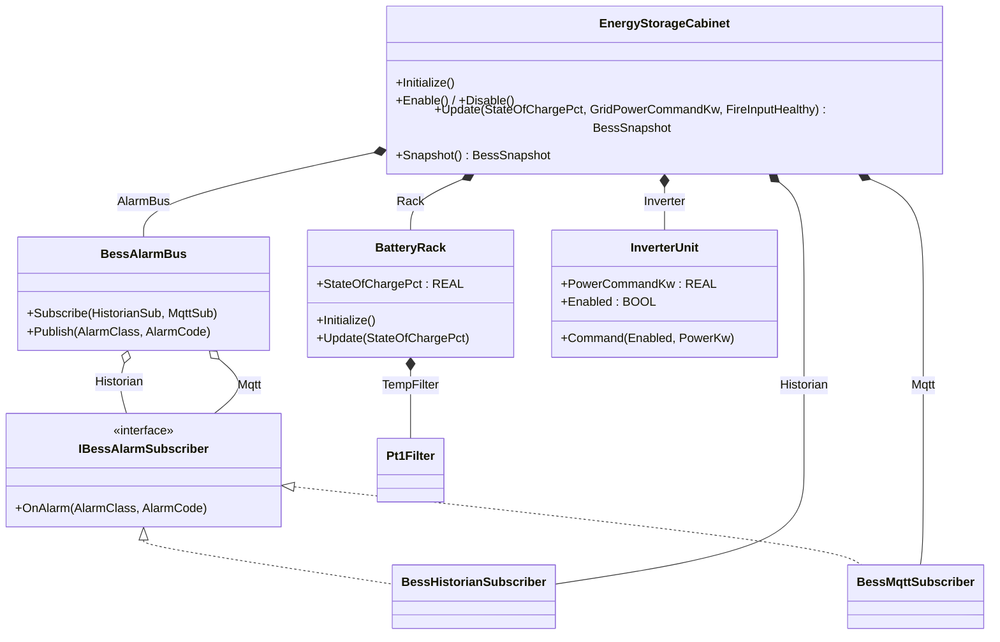
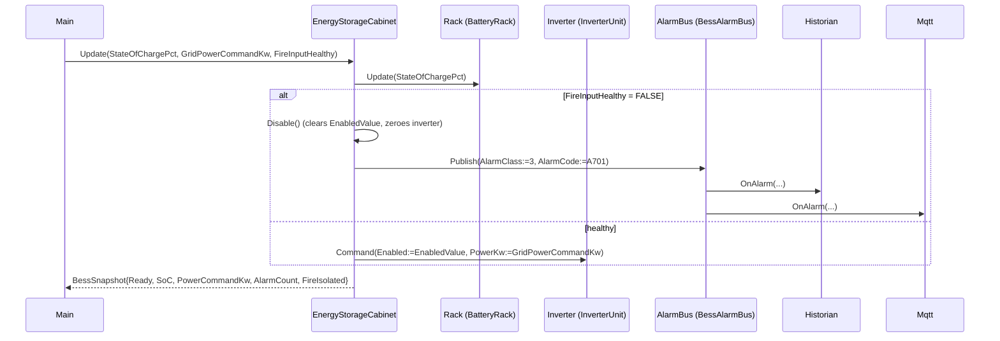

# Battery Energy Storage Cabinet — Facade + Observer

A grid-tied battery energy storage system (BESS) cabinet integrates a
battery rack, an inverter, an alarm bus, a fire-detection input, and an
MQTT/historian fan-out. SCADA wants one clean cabinet object — state of
charge, power command, ready, alarms — without seeing rack temperature
filters or which subscriber publishes which event. The OOP version puts
a `EnergyStorageCabinet` facade in front of the rack/inverter/alarm-bus
trio and routes alarms through `BessAlarmBus` to two observer
subscribers.

## When classic is the right answer

The procedural version is `non-oop/src/Main.st` (49 lines). Use it when:

- The cabinet integrates a single inverter and a single alarm channel
  for the lifetime of the project.
- There is no requirement to add new alarm consumers (no cloud
  historian, no second MQTT topic, no on-site annunciator).
- SCADA is happy reading individual flat fields and you do not need a
  stable cabinet API to hand to a third party.

The OOP version costs about 5× the lines. It earns that cost when new
alarm subscribers arrive (a cloud telemetry adapter, a regulator
reporter, a maintenance dashboard) and when the inverter or rack family
gets replaced — only the internal FB changes; the cabinet API and the
alarm subscribers do not move.

## Where classic strains

`ClassicBessCabinet.Update` (lines 12-29 of `non-oop/src/Main.st`) is
one ladder that owns four concerns at once: enable/disable, fire-trip
isolation, alarm-counter increment, and MQTT publish-flag set. Adding
a historian for regulator reporting means duplicating the
`AlarmCountValue := AlarmCountValue + 1; MqttPublishReadyValue := TRUE`
pair with a third field. Adding cloud telemetry means a fourth pair.
The cabinet's outward fields (`AlarmCount`, `FireIsolated`,
`PowerCommandKw`) live next to internal scratch fields with no
boundary, so renaming or hiding any of them ripples through callers.
Replacing the inverter family (different power limits) means editing
the same `LIMIT(...)` call inside the same `Update` body that handles
the alarm fan-out.

## Structure



`Pt1Filter` comes from the OSCAT OOP library. The `IBessAlarmSubscriber`
interface, `BessHistorianSubscriber`, `BessMqttSubscriber`,
`BessAlarmBus`, `BatteryRack`, `InverterUnit`, and the
`EnergyStorageCabinet` facade are defined in this example.

## What happens at runtime



## The keystone

```st
(* EnergyStorageCabinet.Update — the facade keeps internal collaborators
   off the call site. SCADA only sees BessSnapshot. *)
Rack.Update(StateOfChargePct := StateOfChargePct);
SnapshotValue.StateOfChargePct := Rack.StateOfChargePct;
IF NOT FireInputHealthy THEN
    Disable();
    SnapshotValue.FireIsolated := TRUE;
    AlarmBus.Publish(AlarmClass := BYTE#3, AlarmCode := WORD#16#A701);
ELSE
    SnapshotValue.FireIsolated := FALSE;
    Inverter.Command(Enabled := EnabledValue, PowerKw := GridPowerCommandKw);
END_IF;
SnapshotValue.Ready := EnabledValue AND FireInputHealthy;
SnapshotValue.PowerCommandKw := Inverter.PowerCommandKw;
SnapshotValue.AlarmCount := Historian.AlarmCount;
```

Adding a third subscriber (e.g., a cloud telemetry adapter) is a new FB
implementing `IBessAlarmSubscriber` plus one `Subscribe` parameter — the
cabinet body is unchanged. Replacing `InverterUnit` with a vendor-B
inverter is a new FB; `Update` continues to call `Inverter.Command(...)`.

## Patterns used

- [Facade](../../../docs/guides/oop-concepts-in-st.md#facade)
- [Observer](../../../docs/guides/oop-concepts-in-st.md#observer)

ST mechanics used:

- [Interface](../../../docs/guides/oop-concepts-in-st.md#interface) and
  [IMPLEMENTS](../../../docs/guides/oop-concepts-in-st.md#implements)
- [Polymorphism](../../../docs/guides/oop-concepts-in-st.md#polymorphism)
- [Composition](../../../docs/guides/oop-concepts-in-st.md#composition)

## What this demo doesn't show

- **HVAC and rack temperature.** `BatteryRack` declares a `Pt1Filter`
  for temperature smoothing but the cabinet does not consume it for
  derating, alarming, or HVAC control. The filter is a placeholder for
  telemetry only.
- **Per-rack alarm classes.** `BessAlarmBus.Publish` accepts an
  `AlarmClass` byte but the cabinet only ever publishes class 3 with
  code `A701` (fire). A real BESS would emit overcurrent, overvoltage,
  ground-fault, and isolation classes separately.
- **Subscriber acknowledgment.** `OnAlarm` is fire-and-forget. There is
  no acknowledgment, no retry, no per-subscriber failure isolation —
  if MQTT is down the historian still gets the call.
- **Inverter telemetry.** Only `PowerCommandKw` flows out; real
  inverters expose AC/DC voltages, currents, frequency, and
  temperatures the cabinet would surface in the snapshot.
- **State-of-charge limits feeding the command.** The inverter accepts
  any `GridPowerCommandKw` in `[-250, 250]` — there is no SoC-based
  charge/discharge clamp.

## When NOT to use this

- A single-inverter, single-alarm-channel storage demo with no plans
  to grow.
- A test rig where SCADA is happy reading flat fields directly.
- A pilot where the alarm path is one MQTT topic and will stay that
  way.

## Integration map

| Tag | Address | Direction |
| --- | --- | --- |
| `Cabinet.EnableCommand` | `%IX0.0` | IN |
| `Cabinet.FireInputHealthy` | `%IX0.1` | IN |
| `Cabinet.SocRaw` | `%IW0` | IN |
| `Cabinet.GridCommandRaw` | `%IW2` | IN |
| `Cabinet.InverterEnableOut` | `%QX0.0` | OUT |
| `Cabinet.FireIsolateOut` | `%QX0.1` | OUT |

Comms (from `oop/io.toml`): `modbus-tcp` (unit 140 on
`127.0.0.1:1509`, 500 ms timeout, `on_error = "warn"`), `mqtt` (broker
`127.0.0.1:1883`, topics `energy/bess/01/cmd` in,
`energy/bess/01/alarm` out).

OPC UA exposed records (from `oop/runtime.toml`, namespace
`urn:trust:examples:battery-energy-storage-facade`):
`Cabinet.StateOfChargePct`, `Cabinet.PowerCommandKw`,
`Cabinet.AlarmCount`, `Cabinet.FireIsolated`.

## Run

```bash
trust-runtime test --project examples/OSCAT/battery_energy_storage_facade/non-oop
trust-runtime test --project examples/OSCAT/battery_energy_storage_facade/oop
```

---

## Folder Layout

This paired example contains:

- `non-oop/` — the classic Structured Text project.
- `oop/` — the OSCAT OOP Structured Text project.

## What This Example Teaches

OOP pattern: Facade + Observer. The OOP version exposes one cabinet
object that hides racks, inverter, and alarm fan-out behind a stable
API; the non-oop version inlines fire-trip isolation and alarm-counter
increments in one ladder.

## How The Pair Teaches OOP

The teaching content above walks through the same machine in both
projects: where classic strains, the structural diagram of the OOP
version, the keystone snippet, and the integration map. Run the pair
side-by-side and read `non-oop/src/Main.st` first.
