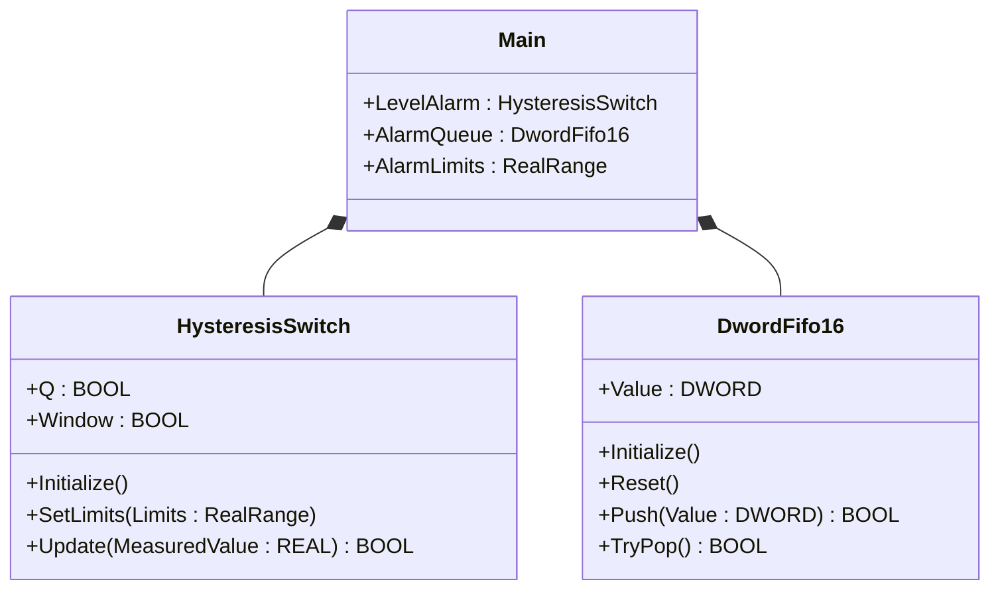
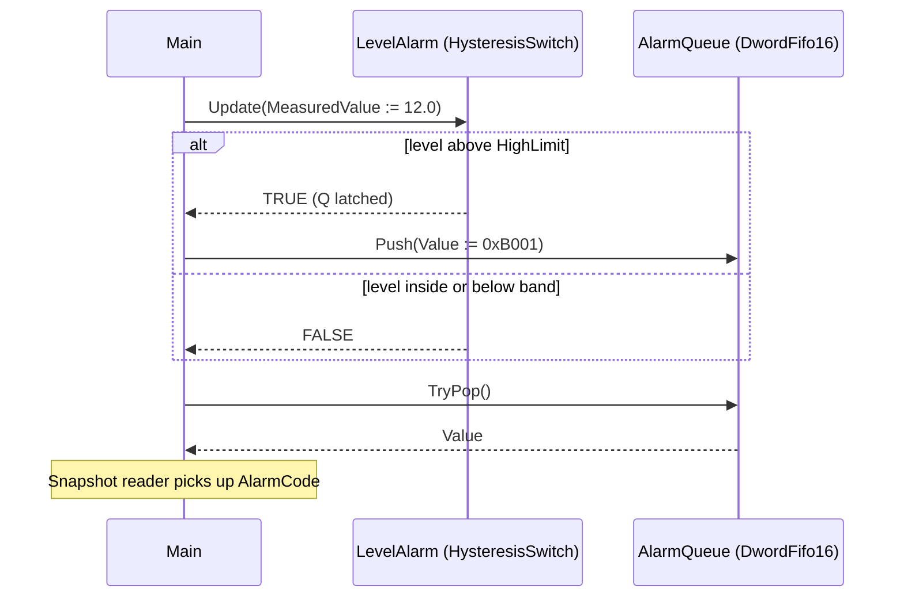

# Boiler Feedwater Alarm — Showcase

A boiler feedwater drum needs a low-level alarm: when the level falls
below a band, a non-blocking alarm code goes onto a FIFO so HMI and
historian can both consume it without one starving the other. This
showcase wires `HysteresisSwitch` and `DwordFifo16` from the OSCAT OOP
library directly in `Main` — no custom function blocks, just the call
sequence the ST tests verify.

## When classic is the right answer

The procedural version is `non-oop/src/Main.st` (13 lines). Use it when:

- The plant has one feedwater drum with one level threshold pair.
- Alarm consumers are local-only (no HMI, no historian, no MQTT).
- You will never reuse the trip + queue plumbing on another tag.

The OOP version uses the OSCAT library FBs without adding custom types
of its own. It earns its cost on the first reuse — when a second drum
needs the same trip + queue pattern, you instantiate two of each FB
instead of duplicating the body.

## Where classic strains

`non-oop/src/Main.st` (13 lines) inlines the deadband math and the
queue management into one straight-line program. Adding a high-level
trip means new `IF` arms, a second deadband, a second alarm code, and
extra queue plumbing — all in the same scan body. By the second tag the
program reads more like a transcribed schematic than a reusable block.

## Structure



`HysteresisSwitch`, `DwordFifo16`, and `RealRange` come from the OSCAT
OOP library. This example defines no FBs of its own — it shows the call
sequence and how the two FBs compose.

## What happens at runtime



## The keystone

```st
(* Trip the deadband, then enqueue a code without blocking the consumer. *)
IF LevelAlarm.Update(MeasuredValue := FeedwaterLevelPercent) THEN
    IF AlarmQueue.Push(Value := DWORD#16#B001) THEN
    END_IF;
END_IF;
IF AlarmQueue.TryPop() THEN
    AlarmCode := AlarmQueue.Value;
END_IF;
```

`LevelAlarm.Update` returns the latched `Q` of a hysteresis switch —
TRUE only after the high limit is crossed, then held until the low
limit is crossed. The push/pop pair lets producer and consumer run on
independent scans without dropping codes when both fire on the same
scan.

## Patterns used

- [Composition (the underlying mechanism)](../../../docs/guides/oop-concepts-in-st.md#composition)

ST mechanics used:

- [Composition](../../../docs/guides/oop-concepts-in-st.md#composition)

## Why this is a showcase, not a real machine

The compact showcase is intentionally minimal. There is no second drum,
no high-level trip, no alarm acknowledgement, no historian, no
multi-class alarm bus. Process values are local literals so the ST
tests exercise the deadband + queue behaviour without external devices.

For composition combined with patterns inside a real-world plant, see
`boiler_room_heating_plant/oop` (full alarm-bus model with classes
A/B/C and per-subscriber sinks) or `cold_storage_plant/oop` (multi-room
composite tree with maintenance + MQTT subscribers).

## When NOT to use this

- One drum with one threshold: a single `IF` is shorter than two FBs.
- Alarm consumer is a single coil that the controller drives directly —
  the FIFO buys nothing if there is no decoupled consumer.
- The plant has its own alarm bus library you must use; bringing in
  `DwordFifo16` would duplicate plumbing.

## Run

```bash
trust-runtime test --project examples/OSCAT/boiler_feedwater_alarm/non-oop
trust-runtime test --project examples/OSCAT/boiler_feedwater_alarm/oop
```

---

## Folder Layout

This paired example contains:

- `non-oop/` — the classic Structured Text project.
- `oop/` — the OSCAT OOP Structured Text project.

## What This Example Teaches

OOP pattern: Composition (compact showcase). The OOP version moves
decisions behind named function-block instances and a clean call
sequence; the non-oop version inlines those decisions in procedural ST.

## How The Pair Teaches OOP

The teaching content above walks through the same machine in both
projects: where classic strains, the structural diagram of the OOP
version, the keystone snippet, and the call sequence. Run the pair
side-by-side and read `non-oop/src/Main.st` first.
