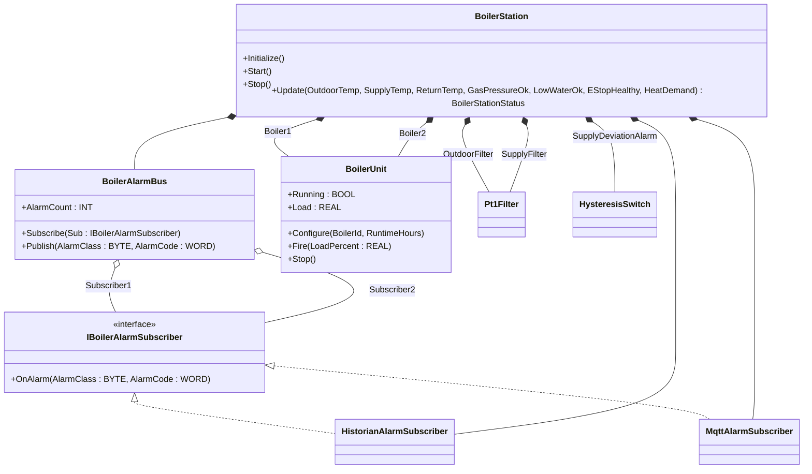
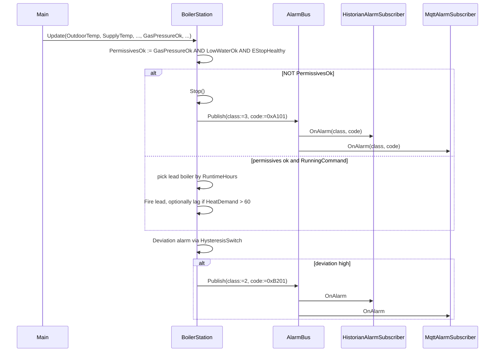

# Boiler Room Heating Plant — Facade + Observer

A district-heating boiler room runs two natural-gas boilers in lead/lag,
filters supply temperature, watches gas pressure / low water / E-stop /
fan health permissives, and fans alarm events out to a historian sink
and an MQTT publisher. The OOP version puts a `BoilerStation` facade
in front of the two boilers, the safety chain, and the alarm bus —
callers see one `Update`/`Snapshot` pair while the bus carries each
alarm to its own subscriber.

## When classic is the right answer

The procedural version is `non-oop/src/Main.st` (175 lines). Use it when:

- One boiler with no lead/lag arbitration.
- One alarm sink (e.g. a single PLC tag the SCADA polls) — no fan-out.
- Permissive chain is fixed and won't gain new sensors over time.

The OOP version costs roughly 3× the lines. It earns that cost when
alarms must reach multiple consumers (historian + MQTT + HMI) without
each subscriber having to poll, and when the boiler set might grow
(adding a third boiler is a new instance, not a new branch).

## Where classic strains

`non-oop/src/Main.st` (175 lines) inlines lead/lag selection,
permissive checks, deviation alarm, and the historian write/MQTT push
into one `Update` body. Adding an MQTT topic per alarm class means
threading a new tag through every `IF` arm. Adding a third boiler
means duplicating the lead/lag arithmetic. Adding a Class B alarm with
its own escalation policy means rewriting the publish branch in
multiple places.

## Structure



`Pt1Filter`, `HysteresisSwitch`, and the `IComponent` lifecycle
contract come from the OSCAT OOP library. `BoilerUnit`,
`IBoilerAlarmSubscriber`, the two subscribers, the alarm bus, and
`BoilerStation` are defined in this example.

## What happens at runtime



## The keystone

```st
(* Permissives gate fault publish; OverallReady gates "operationally ready". *)
PermissivesOk := GasPressureOk AND LowWaterOk AND EStopHealthy;
StatusValue.OverallReady := PermissivesOk AND RunningCommand;

IF NOT PermissivesOk THEN
    Stop();
    AlarmBus.Publish(AlarmClass := BYTE#3, AlarmCode := WORD#16#A101);
ELSE
    LeadIsBoiler1 := Boiler1.RuntimeHours <= Boiler2.RuntimeHours;
    IF RunningCommand THEN
        IF LeadIsBoiler1 THEN
            Boiler1.Fire(LoadPercent := DemandLoad);
            Boiler2.Stop();
            ...
```

`AlarmBus.Publish` reaches the historian and the MQTT publisher in one
call. Adding a third subscriber (e.g. an HMI panel) is one new
`Subscribe` call in `Initialize` and one extra `OnAlarm` invocation
inside `Publish` — no change to the boiler logic.

## Patterns used

- [Facade](../../../docs/guides/oop-concepts-in-st.md#facade)
- [Observer](../../../docs/guides/oop-concepts-in-st.md#observer)

ST mechanics used:

- [Interface](../../../docs/guides/oop-concepts-in-st.md#interface) and
  [IMPLEMENTS](../../../docs/guides/oop-concepts-in-st.md#implements)
- [Polymorphism](../../../docs/guides/oop-concepts-in-st.md#polymorphism)
- [Composition](../../../docs/guides/oop-concepts-in-st.md#composition)

## What this demo doesn't show

- **Three or more subscribers.** The bus is sized for two
  (`Subscriber1`, `Subscriber2`). A real plant would use a dynamic
  list; the shape supports it but the demo doesn't.
- **Acknowledgement / latching.** Every alarm fans out, but there is
  no acknowledgement protocol back from the consumer. Production
  alarms latch until acknowledged.
- **Burner ramping & weather compensation curves.** `Fire(LoadPercent)`
  is a single-step command; the real boilers ramp over a configurable
  rate.
- **Stack temperature & flue analysis.** The model has gas pressure,
  low water, E-stop, and supply temperature — combustion analytics are
  out of scope here.

## When NOT to use this

- One subscriber, one alarm class — a direct call from the controller is
  simpler than the bus.
- One boiler — lead/lag arithmetic is overkill.
- Greenfield with a fixed BMS that already runs the bus and the lead/
  lag — duplicate plumbing.

## Integration map

| Tag | Address | Direction |
| --- | --- | --- |
| `Plant.OutdoorTempRaw` | `%IW0` | IN |
| `Plant.SupplyTempRaw` | `%IW2` | IN |
| `Plant.GasPressureOk` | `%IX0.0` | IN |
| `Plant.LowWaterOk` | `%IX0.1` | IN |
| `Plant.EStopHealthy` | `%IX0.2` | IN |
| `Plant.StartCommand` | `%IX0.3` | IN |
| `Plant.StopCommand` | `%IX0.4` | IN |
| `Plant.SupplyValveOut` | `%QX0.0` | OUT |
| `Plant.AlarmRelayOut` | `%QX0.1` | OUT |

Comms (from `oop/io.toml`): `modbus-tcp` for boiler-controller
register exchange and `mqtt` for alarm fan-out to the historian/SCADA.
Safe-state forces the supply valve OUT and alarm relay OUT.

OPC UA exposed records (from `oop/runtime.toml`):
`Plant.OverallReady`, `Plant.LeadBoilerId`, `Plant.LeadBoilerLoad`,
`Plant.LagBoilerActive`, `Plant.ActiveAlarmCount`.

## Run

```bash
trust-runtime test --project examples/OSCAT/boiler_room_heating_plant/non-oop
trust-runtime test --project examples/OSCAT/boiler_room_heating_plant/oop
```

---

## Folder Layout

This paired example contains:

- `non-oop/` — the classic Structured Text project.
- `oop/` — the OSCAT OOP Structured Text project.

## What This Example Teaches

OOP pattern: Facade + Observer. The OOP version moves decisions behind
named function-block instances and an interface contract; the non-oop
version inlines those decisions in procedural ST.

## How The Pair Teaches OOP

The teaching content above walks through the same machine in both
projects: where classic strains, the structural diagram of the OOP
version, the keystone snippet, and the integration map. Run the pair
side-by-side and read `non-oop/src/Main.st` first.
