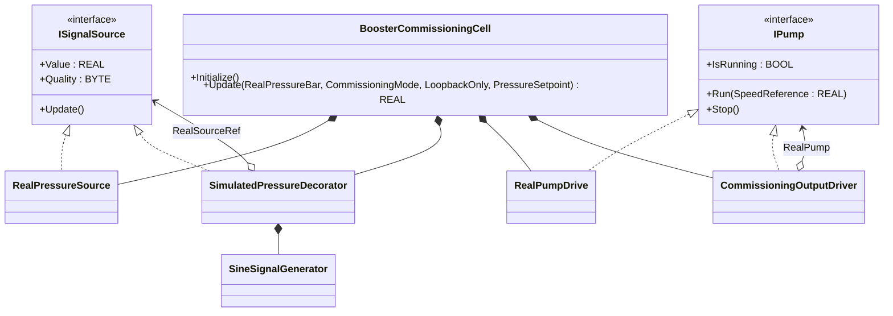
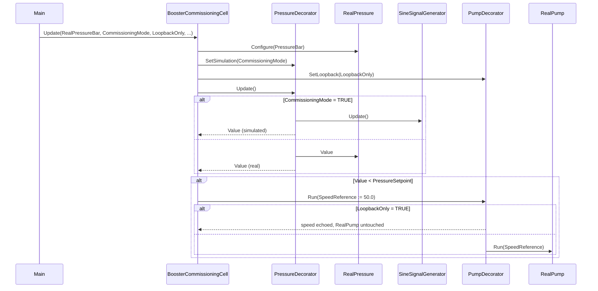

# Booster Commissioning Decorator — Decorator

A water booster pump skid is being commissioned: the engineer needs to
prove the controller logic *before* the real pressure transmitter is
piped in and *before* the VFD is wired up. The OOP version puts a
**simulation** decorator around the pressure signal source and a
**loopback** decorator around the pump driver. The application code
sees `ISignalSource` and `IPump` — it does not know whether it is
talking to the real plant or to the commissioning rig.

## When classic is the right answer

The procedural version is `non-oop/src/Main.st` (61 lines). Use it when:

- Commissioning is a one-time activity and the simulation paths can be
  deleted before deployment.
- The pump driver and pressure transmitter are simple enough to mock
  with a couple of `IF CommissioningMode` arms inline.
- No other booster cell will need to share the same simulation scaffolding.

The OOP version costs more lines but lets the same controller code run
unchanged against either the real plant or the simulation rig — no
`#ifdef`, no separate code paths, no risk of leaving simulation defaults
behind on a production controller.

## Where classic strains

`non-oop/src/Main.st` (61 lines) inlines the simulation toggle into the
control loop: every read of pressure has to consult `CommissioningMode`
and every write to the pump has to consult `LoopbackOnly`. Adding a
second simulated signal (e.g. a flow transmitter) means duplicating the
toggle in three more places; switching to a different simulation
generator (sine vs. ramp vs. recorded trace) means rewriting the
inlined math. The control logic and the rig logic share one body and
both grow together.

## Structure



`SineSignalGenerator` comes from the OSCAT OOP library. The two
interfaces, four concrete FBs, and `BoosterCommissioningCell` are
defined in this example.

## What happens at runtime



## The keystone

```st
(* The control loop only sees the interfaces. *)
RealPressure.Configure(PressureBar := RealPressureBar, QualityCode := BYTE#2);
PressureDecorator.SetSimulation(Enabled := CommissioningMode);
PumpDecorator.SetLoopback(Enabled := LoopbackOnly);
Pressure.Update();
IF Pressure.Value < PressureSetpoint THEN
    SpeedCommand := REAL#50.0;
    Pump.Run(SpeedReference := SpeedCommand);
ELSE
    Pump.Stop();
END_IF;
```

The `IF Pressure.Value < PressureSetpoint` line is the same on the
bench rig as it is in production. The decorators are configured once
in `Initialize`; the only commissioning-vs-production switch is a pair
of boolean inputs — no branches in the control path, no separate
versions of the loop.

## Patterns used

- [Decorator](../../../docs/guides/oop-concepts-in-st.md#decorator)

ST mechanics used:

- [Interface](../../../docs/guides/oop-concepts-in-st.md#interface) and
  [IMPLEMENTS](../../../docs/guides/oop-concepts-in-st.md#implements)
- [Polymorphism](../../../docs/guides/oop-concepts-in-st.md#polymorphism)
- [Composition](../../../docs/guides/oop-concepts-in-st.md#composition)

## What this demo doesn't show

- **Bumpless transfer.** Switching `CommissioningMode` mid-run will jump
  from the sine signal to the real reading instantly. A real
  commissioning rig fades from one to the other over a configurable
  ramp; this demo does not.
- **VFD command echo / readback.** `CommissioningOutputDriver` echoes
  the commanded speed back through `IsRunning`/`LastCommandedSpeed` but
  does not wire to a Modbus drive. Production would also read the drive's
  status word.
- **Multiple decorator stacks.** Only one decorator wraps each interface.
  Decorator chains (e.g. simulation → noise injection → real source) are
  supported by the shape but not exercised here.

## When NOT to use this

- Commissioning is performed via a separate test fixture project — the
  controller never needs to know about the simulation switch.
- The signal source is already a hardware abstraction (e.g. an OPC UA
  variable that the OPC UA server can stub) — the decorator duplicates
  what the layer below already provides.
- The plant is fully simulated for every site (digital twin first); real
  vs. simulated isn't a runtime decision and inlining the simulator is
  simpler.

## Integration map

| Tag | Address | Direction |
| --- | --- | --- |
| `Cell.RealPressureRaw` | `%IW0` | IN |
| `Cell.CommissioningMode` | `%IX0.0` | IN |
| `Cell.LoopbackOnly` | `%IX0.1` | IN |
| `Cell.PumpSpeedRaw` | `%QW0` | OUT |
| `Cell.TestLampOut` | `%QX0.0` | OUT |

Comms (from `oop/io.toml`): the showcase configures only the runtime
control plane; no Modbus, MQTT, or OPC UA endpoints are wired so the
test can run hermetic. Production would bind the real pressure source
to a Modbus tag and the pump driver to a VFD reference.

## Run

```bash
trust-runtime test --project examples/OSCAT/booster_commissioning_decorator/non-oop
trust-runtime test --project examples/OSCAT/booster_commissioning_decorator/oop
```

---

## Folder Layout

This paired example contains:

- `non-oop/` — the classic Structured Text project.
- `oop/` — the OSCAT OOP Structured Text project.

## What This Example Teaches

OOP pattern: Decorator. The OOP version moves decisions behind named
function-block instances and an interface contract; the non-oop version
inlines those decisions in procedural ST.

## How The Pair Teaches OOP

The teaching content above walks through the same machine in both
projects: where classic strains, the structural diagram of the OOP
version, the keystone snippet, and the integration map. Run the pair
side-by-side and read `non-oop/src/Main.st` first.
