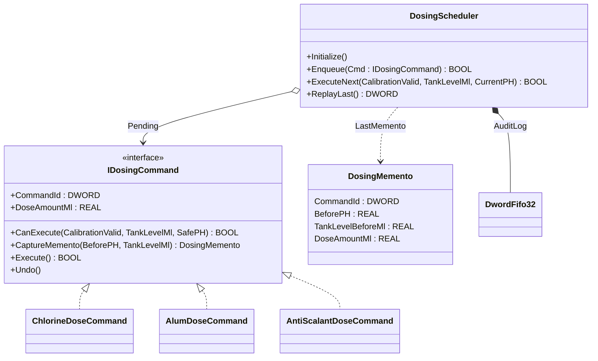
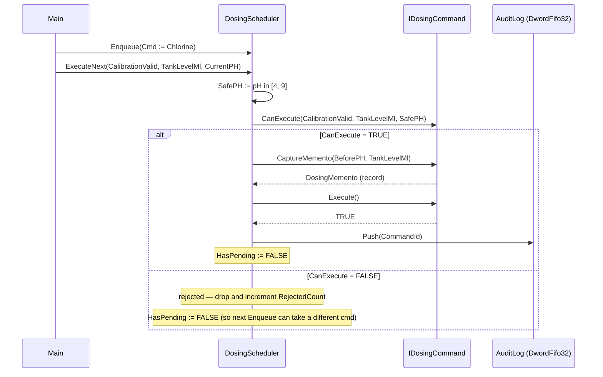

# Chemical Dosing Command — Command + Memento

A water-treatment plant doses chlorine, alum, and anti-scalant into the
header. Each chemical has its own flow ratio, pH window, and safety
permissive. The OOP version wraps each dose action as a `IDosingCommand`
object that knows its own safety check and its own audit record. The
scheduler executes one queued command per scan; a `Memento` record
captures the pre-dose pH/tank state so a rollback or post-mortem has
deterministic data.

## When classic is the right answer

The procedural version is `non-oop/src/Main.st` (66 lines). Use it when:

- Only one chemical is dosed at this site (one CanExecute, one Execute).
- No audit-trail requirement (no need to capture pre/post state).
- Fixed dosing schedule that never queues — direct trigger handling.

The OOP version costs about 4× the lines. It earns that cost when more
than one chemical shares the same command/audit infrastructure, and
when audit captures are required for batch tracing or rollback.

## Where classic strains

`non-oop/src/Main.st` (66 lines) inlines all three chemicals'
permissive checks into one ladder: chlorine's tank and pH window first,
alum's wider tank threshold next, anti-scalant's third. Adding a fourth
chemical (e.g. caustic for pH correction) means a new `ELSIF` arm with
its own constants, plus a new audit-write block. By the second variant
the scan body is the longest method in the program, the audit fields
are scattered, and rollback is impossible because the pre-dose pH was
never captured.

## Structure



`DwordFifo32` comes from the OSCAT OOP library. The interface, three
concrete commands, the memento record, and the scheduler are defined in
this example.

## What happens at runtime



## The keystone

```st
(* Queue a chlorine dose; safety + memento + execution happen behind one call *)
Scheduler.Enqueue(Cmd := Chlorine);
Scheduler.ExecuteNext(CalibrationValid := TRUE,
                      TankLevelMl := REAL#1000.0,
                      CurrentPH := REAL#7.2);

(* In ExecuteNext: short-circuit guard for the empty queue,
   then permissive check, capture pre-dose state, execute, audit. *)
IF NOT HasPending THEN
    LastCanExecuteValue := FALSE;
    LastExecuteResultValue := FALSE;
    ExecuteNext := FALSE;
    RETURN;
END_IF;
LastCanExecuteValue := Pending.CanExecute(CalibrationValid := CalibrationValid,
                                          TankLevelMl := TankLevelMl,
                                          SafePH := SafePH);
IF LastCanExecuteValue THEN
    LastMemento := Pending.CaptureMemento(BeforePH := CurrentPH,
                                          TankLevelMl := TankLevelMl);
    LastExecuteResultValue := Pending.Execute();
END_IF;
```

Adding a fourth chemical is a new `FUNCTION_BLOCK NewDoseCommand
IMPLEMENTS IDosingCommand`. The scheduler is unchanged. The audit log,
memento capture, and rejection counters all keep working.

## Patterns used

- [Command](../../../docs/guides/oop-concepts-in-st.md#command)
- [Memento](../../../docs/guides/oop-concepts-in-st.md#memento)

ST mechanics used:

- [Interface](../../../docs/guides/oop-concepts-in-st.md#interface) and
  [IMPLEMENTS](../../../docs/guides/oop-concepts-in-st.md#implements)
- [Polymorphism](../../../docs/guides/oop-concepts-in-st.md#polymorphism)
- [Composition](../../../docs/guides/oop-concepts-in-st.md#composition)

## What this demo doesn't show

- **Post-dose pH measurement.** The memento captures `BeforePH` only.
  A real plant captures both before and after to confirm the dose
  achieved its target — that requires a second scan latch.
- **Real pump dispatch.** Each command's `Execute` just sets a flag
  and returns TRUE. Production dispatches a metering pump command on
  Modbus or AS-i; this demo does not.
- **Undo over real plant state.** `Undo` clears `Executed` but does
  not reverse the dose (chemistry is irreversible). A real `Undo`
  would log the over-dose for the next scan to compensate.
- **Multi-stage queue.** `Pending` is a single slot, not a queue —
  only one command waits for execution. A real scheduler would have a
  priority queue per chemical class.

## When NOT to use this

- One dose action only — no audit, no permissives that vary per chemical.
- Recipe is pre-defined (no operator-driven enqueue) and the scan
  drives every dose unconditionally.
- The plant has its own batch sequencer (S88) that owns dose actions —
  reimplementing the Command pattern would duplicate state.

## Integration map

| Tag | Address | Direction |
| --- | --- | --- |
| `Dosing.EnqueueChlorine` | `%IX0.0` | IN |
| `Dosing.ExecuteCommand` | `%IX0.1` | IN |
| `Dosing.CalibrationValid` | `%IX0.2` | IN |
| `Dosing.PHRaw` | `%IW0` | IN |
| `Dosing.TankLevelRaw` | `%IW2` | IN |
| `Dosing.PumpStartOut` | `%QX0.0` | OUT |
| `Dosing.RejectOut` | `%QX0.1` | OUT |

Comms (from `oop/io.toml`): the showcase is configured for runtime
control + logging only; production binds the dose flag to a Modbus/AS-i
metering pump and the audit log to MQTT for the historian.

OPC UA exposed records (where present): `Dosing.LastCommandId`,
`Dosing.ExecutedCount`, `Dosing.RejectedCount`, `Dosing.LastBeforePH`.

## Run

```bash
trust-runtime test --project examples/OSCAT/chemical_dosing_command/non-oop
trust-runtime test --project examples/OSCAT/chemical_dosing_command/oop
```

---

## Folder Layout

This paired example contains:

- `non-oop/` — the classic Structured Text project.
- `oop/` — the OSCAT OOP Structured Text project.

## What This Example Teaches

OOP pattern: Command + Memento. The OOP version moves decisions behind
named function-block instances and an interface contract; the non-oop
version inlines those decisions in procedural ST.

## How The Pair Teaches OOP

The teaching content above walks through the same machine in both
projects: where classic strains, the structural diagram of the OOP
version, the keystone snippet, and the integration map. Run the pair
side-by-side and read `non-oop/src/Main.st` first.
