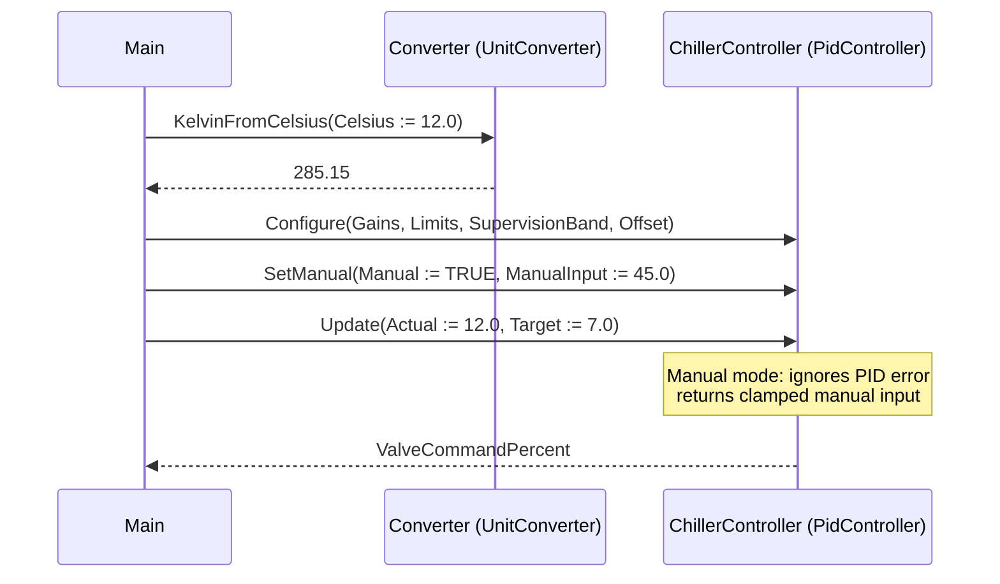

# Chiller Temperature PID — Component Composition

A chiller return-temperature loop reads field telemetry in Celsius, runs
it through a unit-conversion service, and drives a valve command through
a PID controller. The OOP version keeps the stateless conversion service
and the stateful control loop as two separate, named components — each
with its own public surface — instead of weaving both into one
procedural ladder.

## When classic is the right answer

The procedural version is `non-oop/src/Main.st` (27 lines). Use it when:

- One chiller, one loop, one fixed conversion direction.
- The conversion math is invoked exactly once per scan and the result is
  consumed immediately.
- Tuning gains, limits, supervision band, and offset are constants that
  you set once in source and never override at runtime.
- The team is comfortable reading the OSCAT classic FB call mechanics
  (`CTRL_PID(ACT := ..., SET_POINT := ..., KP := ..., LL := ..., ...)`).

The OOP version costs about the same in lines but reorganizes the
responsibilities behind named methods. It earns that cost when a second
chiller appears, when conversion is needed in more than one direction,
or when commissioning needs `SetManual`/`Configure` calls separated from
the per-scan `Update`.

## Where classic strains

`non-oop/src/Main.st` (27 lines) calls `TEMPERATURE` and `CTRL_PID` as
classic OSCAT FBs with positional-style named arguments — a flat
sequence where every tuning parameter, every limit, and the per-scan
inputs all show up at the same call site. Adding a second chiller means
duplicating the entire `ChillerController(...)` arg list with a fresh
instance name. Switching the loop to closed-loop after a manual warm-up
phase means editing the `MAN := TRUE` literal inside the same call site
where `ACT` and `SET_POINT` live. Adding a Fahrenheit reading from a
backup probe means a second `TEMPERATURE` instance and a second `YK`
hand-off. The classic call site grows wider with every requirement.

## Structure

```mermaid
classDiagram
    class IUnitConverter {
        <<interface>>
        +Initialize()
        +KelvinFromCelsius(Celsius : REAL) REAL
        +FahrenheitFromCelsius(Celsius : REAL) REAL
        +CelsiusFromKelvin(Kelvin : REAL) REAL
    }
    class IPidController {
        <<interface>>
        +Initialize()
        +Configure(Gains, Limits, SupervisionBand, Offset)
        +SetManual(Manual : BOOL, ManualInput : REAL)
        +Update(Actual : REAL, Target : REAL) REAL
    }
    IComponent <|-- IUnitConverter
    IComponent <|-- IPidController
    IUnitConverter <|.. UnitConverter
    IPidController <|.. PidController

    class Main {
        +Converter : UnitConverter
        +ChillerController : PidController
        +Limits : RealRange
        +Gains : PidGains
    }
    Main *-- UnitConverter
    Main *-- PidController
```



`UnitConverter`, `PidController`, `RealRange`, `PidGains`, and the
`IComponent` lifecycle contract come from the OSCAT OOP library. This
example defines no FBs of its own — it shows how the two components
compose at the call site.

## What happens at runtime



## The keystone

```st
ChillerController.Initialize();
ChillerController.Configure(
    Gains := Gains, Limits := Limits,
    SupervisionBand := REAL#0.0, Offset := REAL#0.0
);
ChillerController.SetManual(Manual := TRUE, ManualInput := REAL#45.0);
ValveCommandPercent := ChillerController.Update(
    Actual := ReturnTemperatureCelsius,
    Target := REAL#7.0
);
```

`Configure` and `SetManual` are commissioning-time calls; `Update` is
the per-scan call. The split lets unit tests configure once and pump
many `Update`s, and lets HMI commands flip `SetManual` without rebuilding
the whole arg list.

## Patterns used

- [Composition (the underlying mechanism)](../../../docs/guides/oop-concepts-in-st.md#composition)

ST mechanics used:

- [Interface](../../../docs/guides/oop-concepts-in-st.md#interface) and
  [IMPLEMENTS](../../../docs/guides/oop-concepts-in-st.md#implements)
- [Composition](../../../docs/guides/oop-concepts-in-st.md#composition)

## What this demo doesn't show

- **Auto/manual transfer.** The example pins `Manual := TRUE` for
  deterministic testing. A real loop would hand the bumpless transfer to
  HMI commands and exercise both the `M_I` ramp and the integrator
  pre-load.
- **Ramped setpoint.** `Target` is a literal `REAL#7.0`. A real chiller
  loop would feed a setpoint generator (slewing on operator changes) and
  read it from a recipe block.
- **Limit-status alarming.** `PidController.Limited` is exposed as a
  property but the demo does not push it onto an alarm bus. See
  `boiler_room_heating_plant/oop` for an alarm-class model.
- **Multiple tags.** One chiller, one loop. Multi-loop reuse is the next
  step but not exercised here.

## When NOT to use this

- A single static loop with no manual mode and no second probe — the
  classic `CTRL_PID(...)` call is shorter.
- Pure conversion math without retained state — a function (not a FB)
  is the right shape.
- One-shot ladder logic where the conversion result is used in exactly
  one place; objects are over-structuring.

## Why this is a showcase

The compact showcase is intentionally minimal. Process values are
literals (`REAL#12.0`, `REAL#7.0`) so the ST tests exercise the
component contract — that conversions are stateless across calls and
that manual mode returns its input clamped to limits — without external
devices. There is no Modbus, no MQTT, no historian, no second loop. For
component composition with full I/O and alarm fan-out see
`boiler_room_heating_plant/oop` (alarm bus) or
`cold_storage_plant/oop` (composite plant tree).

## Run

```bash
trust-runtime test --project examples/OSCAT/chiller_temperature_pid/non-oop
trust-runtime test --project examples/OSCAT/chiller_temperature_pid/oop
```

---

## Folder Layout

This paired example contains:

- `non-oop/` — the classic Structured Text project.
- `oop/` — the OSCAT OOP Structured Text project.

## What This Example Teaches

OOP pattern: Component Composition (compact showcase). The OOP version
moves decisions behind named function-block instances and a clean call
sequence; the non-oop version inlines those decisions in procedural ST.

## How The Pair Teaches OOP

The teaching content above walks through the same machine in both
projects: where classic strains, the structural diagram of the OOP
version, the keystone snippet, and the call sequence. Run the pair
side-by-side and read `non-oop/src/Main.st` first.
