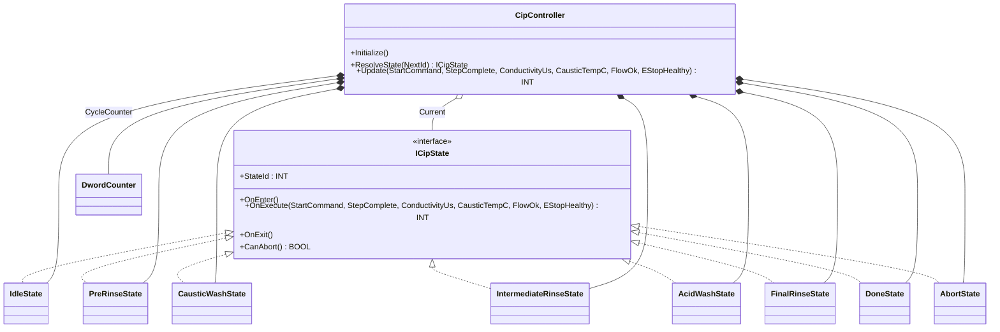
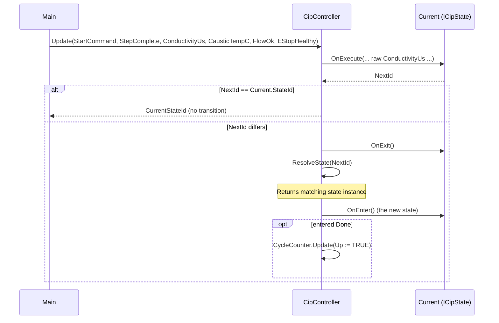

# CIP Wash Skid — State

A dairy cleaning-in-place skid runs a fixed sequence: pre-rinse → caustic
wash → intermediate rinse → acid wash → final rinse → done. Each step
has its own permissives, completion criteria, and abort triggers. The
OOP version moves each step into its own state FB; the controller owns
only transition mechanics.

## When classic is the right answer

The procedural version is `non-oop/src/Main.st` (110 lines). Use it when:

- The wash sequence is fixed and small (3-4 steps that never change).
- Every step has the same simple "step complete → next" transition rule.
- No per-step entry actions (no "open caustic valve" hook on entering
  caustic wash).
- Recipe variants are not expected (one product, one wash cycle).

The OOP version costs about 4× the lines. It earns that cost when CIP
recipes evolve — a soak step gets inserted, the abort rule changes for a
specific phase, or a step needs an entry action that the others don't.

## Where classic strains

`ClassicCipController.Update` (lines 30-78 of `non-oop/src/Main.st`) is a
single `CASE OF CurrentStateValue` covering all six wash steps inline.
Adding a soak step between caustic and intermediate rinse means
renumbering states from `INT#30` upward, editing the CASE branches that
currently transition to those numbers, and re-checking transition arrows
across the whole block. Adding a per-step entry action (e.g., "purge air
from acid line on entering acid wash") means inserting an `IF
CurrentStateValue <> NextId` guard inside the CASE — and remembering to
do that for every step that needs it. Adding a step-specific abort rule
("only this state can be force-aborted; the others must complete") means
yet another flag tested at the top of every CASE arm. By the third or
fourth recipe revision the CASE is the most-edited and most-error-prone
block in the project.

## Structure



`DwordCounter` comes from the OSCAT OOP library. The `ICipState`
interface, the eight state FBs, and `CipController` are defined in this
example.

The controller also declares a `Pt1Filter` for conductivity telemetry,
but the current state decisions consume the raw `ConductivityUs` input
(see "What this demo doesn't show" below).

State id numbering: `0=Idle, 10=PreRinse, 20=Caustic, 30=Intermediate,
40=Acid, 50=FinalRinse, 90=Abort, 100=Done`. The numbering is
deliberately gapped to allow inserting steps (e.g., a soak at `25`)
without renumbering existing states.

## What happens at runtime



## The keystone

```st
(* CipController.Update — owns only the transition mechanics *)
NextId := Current.OnExecute(StartCommand := StartCommand, ...);
IF NextId <> Current.StateId THEN
    Current.OnExit();
    Current := ResolveState(NextId := NextId);
    Current.OnEnter();
    TransitionCountValue := TransitionCountValue + INT#1;
END_IF;
```

The controller calls `OnExecute` polymorphically; each state decides for
itself what its next id is based on the current inputs. `CausticWashState`
checks `CausticTempC < REAL#70.0` (caustic must reach temperature before
moving on); `FinalRinseState` checks `ConductivityUs < REAL#50.0`
(conductivity must drop below 50 µS/cm to confirm rinse complete). Those
step-specific rules live inside the relevant state FB, not in a central
CASE.

## Patterns used

- [State](../../../docs/guides/oop-concepts-in-st.md#state)

ST mechanics used:

- [Interface](../../../docs/guides/oop-concepts-in-st.md#interface) and
  [IMPLEMENTS](../../../docs/guides/oop-concepts-in-st.md#implements)
- [Polymorphism](../../../docs/guides/oop-concepts-in-st.md#polymorphism)
- [Composition](../../../docs/guides/oop-concepts-in-st.md#composition)

## What this demo doesn't show

- **Per-state entry/exit actions.** `OnEnter` and `OnExit` are empty in
  every state except `IdleState` (which only sets a flag). A real CIP
  controller would open caustic-supply valves on entering
  `CausticWashState` and close them on exit, drive the heater on entry,
  and so on. The shape supports this; the demo doesn't exercise it.
- **Step timeouts.** Real CIP steps have maximum durations; if a step
  doesn't complete in time the system aborts. This demo relies on a
  `StepComplete` boolean fed by the caller, with no timer in the state
  itself. Adding step timers would mean each state owning its own
  `OntimeMeter` or `TON`.
- **Output mapping per state.** `Main` derives `PumpEnableOut`,
  `DrainValveOut`, and `AlarmOut` from the controller's `CurrentStateId`
  using a numeric range check. A more complete version would let each
  state own a `PumpEnabled : BOOL` property and read that polymorphically.
- **Recipe variants.** This demo is one fixed sequence (caustic followed
  by acid). A real plant has product-specific recipes (some skip the
  acid wash, others run two caustic cycles). For recipe-driven sequencing
  see `pharma_filling_builder_state/oop` (Builder + State combined).
- **Filtered conductivity for state decisions.** `ConductivityFilter` is
  declared and updated, but `FinalRinseState` compares against the raw
  `ConductivityUs` value. Switching the state to read the filtered value
  would require widening the rinse step's minimum-time gate so the PT1
  lag does not delay completion. The filter is currently exposed as a
  smoothing channel for HMI/telemetry only.

## When NOT to use this

- A two-step start/stop machine (Idle → Run → Idle) — `IF` and `CASE`
  are shorter.
- A fixed cycle of three or four steps that has not changed in years.
- Steps without per-state permissives or completion rules — if every
  step has the same "next on signal" semantics, the procedural CASE is
  clearer.

## Integration map

| Tag | Address | Direction |
| --- | --- | --- |
| `Cip.StartCommand` | `%IX0.0` | IN |
| `Cip.StepComplete` | `%IX0.1` | IN |
| `Cip.EStopHealthy` | `%IX0.2` | IN |
| `Cip.FlowOk` | `%IX0.3` | IN |
| `Cip.ConductivityRaw` | `%IW0` | IN |
| `Cip.CausticTempRaw` | `%IW2` | IN |
| `Cip.PumpEnableOut` | `%QX0.0` | OUT |
| `Cip.DrainValveOut` | `%QX0.1` | OUT |
| `Cip.AlarmOut` | `%QX0.2` | OUT |

Comms (from `oop/io.toml`): `modbus-rtu` (slave 41 on
`loop://cip-conductivity-meter`, 19200/even), `mqtt` (broker
`127.0.0.1:1883`, topics `dairy/cip/01/cmd` in,
`dairy/cip/01/step_transition` out). Safe-state forces
`Cip.PumpEnableOut := FALSE` on driver fault.

OPC UA exposed records (from `oop/runtime.toml`, namespace
`urn:trust:examples:cip-wash-state`): `Cip.CurrentStateId`,
`Cip.TransitionCount`, `Cip.CycleCount`, `Cip.Aborted`.

## Run

```bash
trust-runtime test --project examples/OSCAT/cip_wash_state/non-oop
trust-runtime test --project examples/OSCAT/cip_wash_state/oop
```

---

## Folder Layout

This paired example contains:

- `non-oop/` — the classic Structured Text project.
- `oop/` — the OSCAT OOP Structured Text project.

## What This Example Teaches

OOP pattern: State. The OOP version moves decisions behind named
function-block instances and an interface contract; the non-oop version
inlines those decisions in procedural ST.

## How The Pair Teaches OOP

The teaching content above walks through the same machine in both
projects: where classic strains, the structural diagram of the OOP
version, the keystone snippet, and the integration map. Run the pair
side-by-side and read `non-oop/src/Main.st` first.
