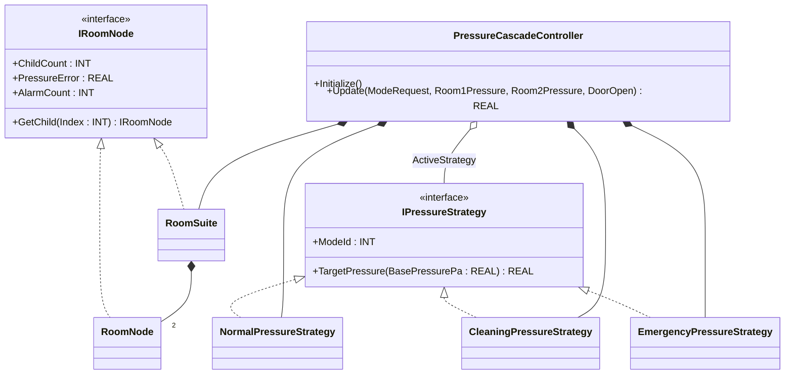
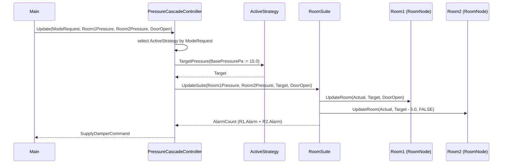

# Cleanroom Pressure Cascade — Strategy + Composite

A pharma cleanroom suite is a hierarchy: a `RoomSuite` contains two
`RoomNode` rooms (gowning + production), each with its own door, sensor,
and alarm. The supply-damper command is calibrated against three modes —
Normal (positive bias), Cleaning (over-pressurised for fogging),
Emergency (vent to neutral). The OOP version puts mode tuning behind a
`IPressureStrategy` interface and the room hierarchy behind a
`IRoomNode` composite, so the controller calls one strategy and one
composite without knowing the room count or the mode logic.

## When classic is the right answer

The procedural version is `non-oop/src/Main.st` (50 lines). Use it when:

- The suite has exactly the rooms it has today and will never grow.
- One Normal mode and one Emergency mode at most — Cleaning is decorative.
- Alarm aggregation is "OR these two booleans", not a tree walk.
- Per-room target offsets, door rules, or hysteresis bands are uniform
  across the suite.

The OOP version costs about 4× the lines. It earns that cost when a
third room appears, when modes acquire per-room overrides (Cleaning
mode in the gowning room only), or when alarm counts must roll up
through nested nodes for HMI display.

## Where classic strains

`ClassicCleanroomCascade.Update` (lines 6-32 of `non-oop/src/Main.st`)
inlines mode arbitration, two hard-coded room-pressure checks, alarm
counting, and damper math in one method. Adding a third room means
editing the alarm-count `IF` block AND the `ErrorSum` accumulator AND
the mode-target table — three places, every time. Adding a Cleaning
mode that over-pressurises the gowning room only means an inner CASE
inside the existing IF/ELSIF. By the third revision the method is the
single most-edited file in the project.

## Structure



The strategies, the room-node interface, the two composite types, and
`PressureCascadeController` are all defined in this example. No OSCAT
library FBs are pulled in — the example is a pure pattern composition.

## What happens at runtime



## The keystone

```st
(* Mode arbitration is one screen tall and only picks. *)
IF ModeRequest = INT#3 THEN ActiveStrategy := Emergency;
ELSIF ModeRequest = INT#2 THEN ActiveStrategy := Cleaning;
ELSE ActiveStrategy := Normal;
END_IF;
ActiveModeIdValue := ActiveStrategy.ModeId;
Target := ActiveStrategy.TargetPressure(BasePressurePa := REAL#15.0);
Suite.UpdateSuite(Room1Pressure := Room1Pressure, Room2Pressure := Room2Pressure,
    TargetPressure := Target, DoorOpen := DoorOpen);
SupplyDamperCommandValue := LIMIT(REAL#0.0, Suite.PressureError * REAL#2.0, REAL#100.0);
```

The cascade does not know how the strategy computed the target, nor how
many rooms the composite walked. Adding a fourth strategy is one new
FB plus one ELSIF arm. Adding a third room is editing only `RoomSuite`.

## Patterns used

- [Strategy](../../../docs/guides/oop-concepts-in-st.md#strategy)
- [Composite](../../../docs/guides/oop-concepts-in-st.md#composite)

ST mechanics used:

- [Interface](../../../docs/guides/oop-concepts-in-st.md#interface) and
  [IMPLEMENTS](../../../docs/guides/oop-concepts-in-st.md#implements)
- [Polymorphism](../../../docs/guides/oop-concepts-in-st.md#polymorphism)
- [Composition](../../../docs/guides/oop-concepts-in-st.md#composition)

## What this demo doesn't show

- **Per-room strategy variants.** Both rooms see the same target offset
  (Room2 is always Target − 5 Pa). A real cleanroom has gowning- and
  production-specific offsets that vary by mode.
- **Door-open hysteresis.** `DoorOpen` is a hard alarm trigger. A real
  pharma SOP debounces door events and only alarms after a configurable
  open-time elapses (`OntimeMeter`).
- **Recipe sequencing.** Modes are selected by an external integer
  request. A real plant runs a Normal → Cleaning → Decontamination →
  Normal recipe via Builder + State (see `pharma_filling_builder_state/oop`).
- **Tree depth > 2.** The composite is two levels (Suite → Room). A
  multi-suite plant would put `RoomSuite` inside `BuildingSuite`.
- **Damper saturation alarm.** `SupplyDamperCommand` is clamped to
  0..100 silently; saturation should drive a separate alarm class.

## When NOT to use this

- A single room with one fixed mode — `IF/ELSIF` and inline math is
  shorter than four FBs.
- An exclusively additive process with no hierarchy — Composite buys
  nothing if there is only one level.
- One mode with one tuning knob — pass the knob as a parameter, not a
  Strategy.

## Integration map

| Tag | Address | Direction |
| --- | --- | --- |
| `Cascade.ModeRequest` | `%IW0` | IN |
| `Cascade.Room1PressureRaw` | `%IW2` | IN |
| `Cascade.Room2PressureRaw` | `%IW4` | IN |
| `Cascade.DoorOpen` | `%IX0.0` | IN |
| `Cascade.SupplyDamperRaw` | `%QW0` | OUT |
| `Cascade.AlarmOut` | `%QX0.0` | OUT |

Comms (from `oop/io.toml`): `modbus-tcp` (slave 160 on
`127.0.0.1:1511`), `mqtt` (broker `127.0.0.1:1883`, topics
`cleanroom/cascade/cmd` in, `cleanroom/cascade/snapshot` out).

OPC UA exposed records (from `oop/runtime.toml`, namespace
`urn:trust:examples:cleanroom-pressure-strategy-composite`):
`Cascade.ActiveModeId`, `Cascade.SupplyDamperCommand`,
`Cascade.AlarmCount`.

## Run

```bash
trust-runtime test --project examples/OSCAT/cleanroom_pressure_strategy_composite/non-oop
trust-runtime test --project examples/OSCAT/cleanroom_pressure_strategy_composite/oop
```

---

## Folder Layout

This paired example contains:

- `non-oop/` — the classic Structured Text project.
- `oop/` — the OSCAT OOP Structured Text project.

## What This Example Teaches

OOP pattern: Strategy + Composite. The OOP version moves decisions
behind named function-block instances and an interface contract; the
non-oop version inlines those decisions in procedural ST.

## How The Pair Teaches OOP

The teaching content above walks through the same machine in both
projects: where classic strains, the structural diagram of the OOP
version, the keystone snippet, and the integration map. Run the pair
side-by-side and read `non-oop/src/Main.st` first.
