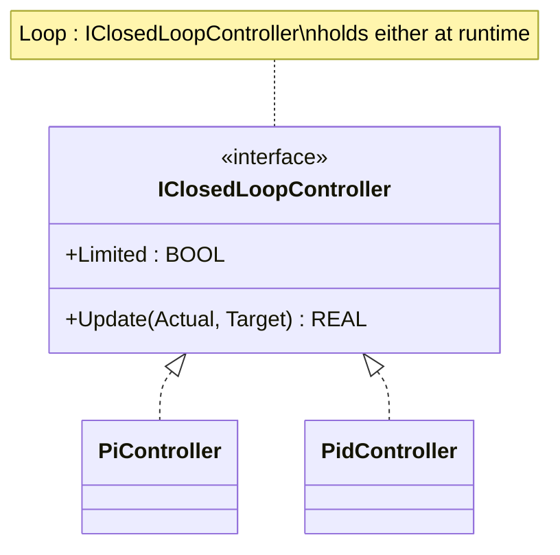

# Closed-Loop Polymorphism — Showcase

This is a compact showcase, not a real machine. It demonstrates one thing:
the same caller code drives either a PI or a PID control loop through the
shared `IClosedLoopController` interface. The procedural version is in
`non-oop/src/Main.st` (46 lines) and uses an `IF UsePid` branch with two
full FB-call blocks. The OOP version in `oop/src/Main.st` is **shorter
than classic** (40 lines) because polymorphism collapses the two branches
into one `Loop.Update(...)` call.

If you want the same mechanism applied to a real industrial machine, see
`hvac_air_handling_unit/oop` (three `IAhuStrategy` implementations
selectable at runtime).

## Structure



`IClosedLoopController`, `PiController`, and `PidController` are defined by
the OSCAT OOP library. This showcase only wires them up at the call site —
no new FBs are introduced.

## The keystone

```st
(* Both controllers configured up-front *)
PiLoop.Configure(Gains := PiGainsValue, Limits := Limits, ...);
PidLoop.Configure(Gains := PidGainsValue, Limits := Limits, ...);

(* One slot, one of two controllers, picked once *)
IF UsePid THEN
    Loop := PidLoop;
ELSE
    Loop := PiLoop;
END_IF;

(* One unified call site; dispatch is polymorphic *)
ValveCommand := Loop.Update(Actual := ActualPressure, Target := TargetPressure);
```

In the procedural version the `IF UsePid` branch contains two complete FB
calls — one with 11 parameters for `CTRL_PID`, one with 10 parameters for
`CTRL_PI` — plus separate output reads from `PidLoop.Y`/`PiLoop.Y`. The
OOP version assigns the slot once and reads the result once. Adding a new
controller type would mean a new FB implementing `IClosedLoopController`
and one new arm in the selector — no edit to the call site.

## Patterns used

- [Polymorphism (the underlying mechanism)](../../../docs/guides/oop-concepts-in-st.md#polymorphism)
- Strategy is the named pattern this shape implements when applied at
  industrial scale; see [Strategy](../../../docs/guides/oop-concepts-in-st.md#strategy).

ST mechanics used:

- [Interface](../../../docs/guides/oop-concepts-in-st.md#interface) and
  [IMPLEMENTS](../../../docs/guides/oop-concepts-in-st.md#implements)
- [Polymorphism](../../../docs/guides/oop-concepts-in-st.md#polymorphism)

## Why this is a showcase, not a real machine

The showcase is intentionally minimal. There are no field signals, no
state machine, no alarms, no commissioning sequence, and no comms
boundary. `oop/io.toml` does not exist; `oop/runtime.toml` configures only
runtime control, logging, and the watchdog/fault policy. Process values
are local variables so the ST tests can exercise the dispatch behavior
without external devices.

For the same pattern applied to a real machine with permissives, alarms,
and Modbus/MQTT/OPC UA boundaries, look at
`hvac_air_handling_unit/oop`.

## Run

```bash
trust-runtime test --project examples/OSCAT/closed_loop_polymorphism/non-oop
trust-runtime test --project examples/OSCAT/closed_loop_polymorphism/oop
```

---

## Folder Layout

This paired example contains:

- `non-oop/` — the classic Structured Text project.
- `oop/` — the OSCAT OOP Structured Text project.

## What This Example Teaches

OOP pattern: Polymorphism (compact showcase). The OOP version moves decisions behind named
function-block instances and an interface contract; the non-oop version
inlines those decisions in procedural ST.

## How The Pair Teaches OOP

The teaching content above walks through the same machine in both
projects: where classic strains, the structural diagram of the OOP
version, the keystone snippet, and the integration map. Run the pair
side-by-side and read `non-oop/src/Main.st` first.
