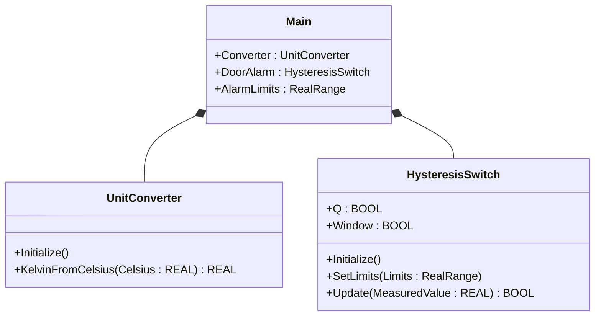
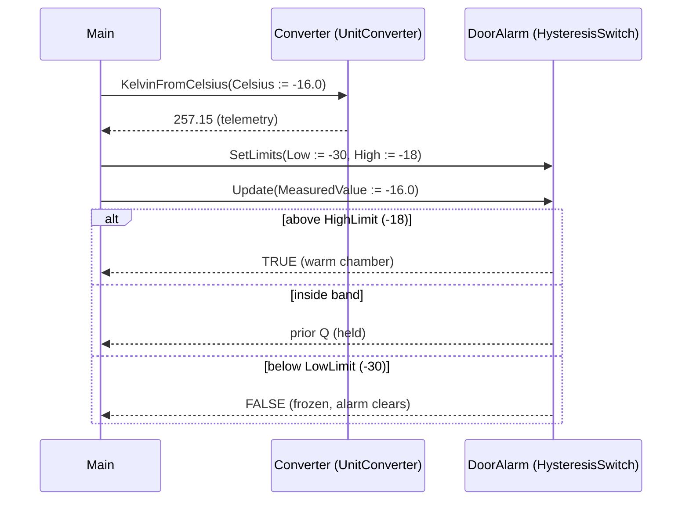

# Cold Storage Alarm — Showcase

A pharmaceutical cold-storage chamber must alarm when temperature drifts
above −18°C and clear only after dropping below −30°C — a deadband
prevents the alarm from chattering during defrost cycles. This showcase
wires `UnitConverter` and `HysteresisSwitch` from the OSCAT OOP library
directly in `Main` — no custom function blocks, just the call sequence
the ST tests verify.

## When classic is the right answer

The procedural version is `non-oop/src/Main.st` (18 lines). Use it when:

- One chamber, one threshold pair.
- The Kelvin reading is for telemetry only and lives next to the alarm
  call.
- You will never reuse the conversion + deadband pattern on another tag
  (no second chamber, no door alarm, no defrost-mode override).
- Limits are constants in source.

The OOP version uses the OSCAT library FBs without adding custom types
of its own. It earns its cost on the first reuse — when a second chamber
needs the same conversion + deadband pattern, you instantiate two of
each FB instead of duplicating the body.

## Where classic strains

`non-oop/src/Main.st` (18 lines) inlines the conversion and deadband
logic into a straight-line program. Adding a high-temperature trip means
new positional arguments to `HYST(...)`, a second alarm code, and extra
conditions on the same call. Adding a second chamber doubles the
declarations and the body. By the second tag the program reads more
like a transcribed schematic than a reusable block.

## Structure



`UnitConverter`, `HysteresisSwitch`, and `RealRange` come from the OSCAT
OOP library. This example defines no FBs of its own — it shows the call
sequence and how the two FBs compose.

## What happens at runtime



## The keystone

```st
(* Convert for telemetry, latch the deadband for HMI alarming. *)
ChamberKelvin := Converter.KelvinFromCelsius(Celsius := ChamberCelsius);

AlarmLimits.Low := REAL#0.0 - REAL#30.0;
AlarmLimits.High := REAL#0.0 - REAL#18.0;
DoorAlarm.SetLimits(Limits := AlarmLimits);
AlarmActive := DoorAlarm.Update(MeasuredValue := ChamberCelsius);
```

`HysteresisSwitch.Update` returns `Q`: TRUE once the chamber rises
above −18°C and held until it drops below −30°C. The Kelvin conversion
runs alongside as a separate component — its result is consumed for
telemetry but does not feed the alarm decision (the alarm reads
Celsius directly to keep the threshold values readable).

## Patterns used

- [Composition (the underlying mechanism)](../../../docs/guides/oop-concepts-in-st.md#composition)

ST mechanics used:

- [Composition](../../../docs/guides/oop-concepts-in-st.md#composition)

## What this demo doesn't show

- **Multiple chambers.** One chamber, one alarm. A second chamber would
  need two more FB instances and a second `RealRange`.
- **Defrost-mode mute.** Real cold storage mutes the warm-side alarm
  during scheduled defrost. Adding that means a second component
  (timer or scheduler) that overrides the `Update` result.
- **Alarm queue / FIFO.** This demo just exposes the boolean. A
  production install would push an alarm code to a `DwordFifo16` for
  HMI consumption (see `boiler_feedwater_alarm/oop` for the queue
  pattern).
- **Sensor health.** The chamber-temperature reading is taken at face
  value. A real install would include broken-sensor / out-of-range
  detection before feeding the deadband.
- **Acknowledgment.** No latching, no acknowledgement, no operator
  reset path.

## When NOT to use this

- One chamber with one fixed threshold and no need for hysteresis — a
  single `IF/ELSIF` is shorter than `HysteresisSwitch.Update`.
- Pure telemetry: if you only display Kelvin and never alarm, the
  alarm FB is dead weight.
- Plant has its own alarm bus library you must use; bringing
  `HysteresisSwitch` would duplicate plumbing.

## Why this is a showcase

The compact showcase is intentionally minimal. There is no second
chamber, no defrost coordination, no alarm queue, no HMI sink. Process
values are local literals so the ST tests exercise the deadband
behaviour without external devices.

For composition combined with patterns inside a real-world plant, see
`boiler_room_heating_plant/oop` (full alarm-bus model) or
`cold_storage_plant/oop` (multi-room composite tree with maintenance +
MQTT subscribers).

## Run

```bash
trust-runtime test --project examples/OSCAT/cold_storage_alarm/non-oop
trust-runtime test --project examples/OSCAT/cold_storage_alarm/oop
```

---

## Folder Layout

This paired example contains:

- `non-oop/` — the classic Structured Text project.
- `oop/` — the OSCAT OOP Structured Text project.

## What This Example Teaches

OOP pattern: Composition (compact showcase). The OOP version moves
decisions behind named function-block instances and a clean call
sequence; the non-oop version inlines those decisions in procedural ST.

## How The Pair Teaches OOP

The teaching content above walks through the same machine in both
projects: where classic strains, the structural diagram of the OOP
version, the keystone snippet, and the call sequence. Run the pair
side-by-side and read `non-oop/src/Main.st` first.
