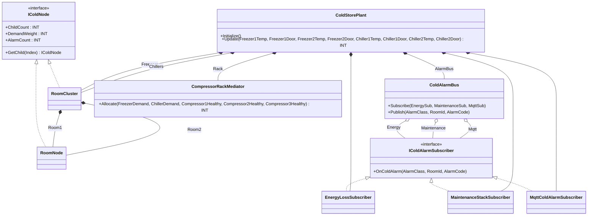
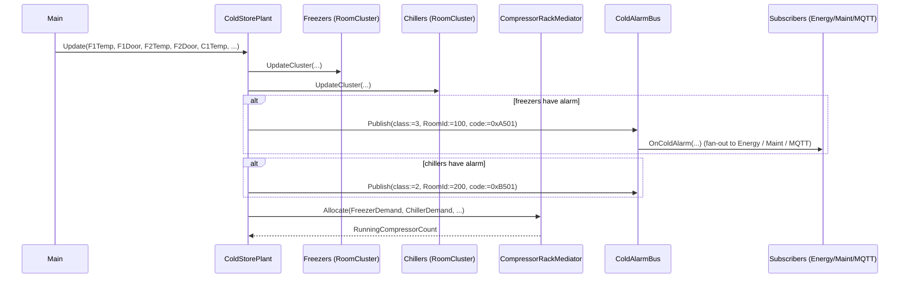

# Cold Storage Plant — Composite + Observer + Mediator

A cold-storage warehouse runs two freezer rooms (-25 °C) and two
chiller rooms (+2 °C). Each room has a temperature setpoint and a door
contact. The plant must (1) compute total cooling demand from a tree
of rooms, (2) prioritize freezer demand over chiller demand on the
compressor rack, and (3) fan alarms (door open, over-temperature) to
an energy-loss tracker, a maintenance work-stack, and an MQTT
publisher. The OOP version models rooms as a `IColdNode` composite
tree, the rack arbitration as a `CompressorRackMediator`, and the
alarm fan-out as a bus + subscribers.

## When classic is the right answer

The procedural version is `non-oop/src/Main.st` (152 lines). Use it when:

- One or two rooms only — no demand aggregation, no priority arbitration.
- Single alarm sink — no fan-out to multiple subscribers.
- Greenfield with a fixed BMS that already owns the room hierarchy.

The OOP version costs about 3× the lines. It earns that cost when
rooms are added/removed across sites, when alarms must reach multiple
consumers without each polling, and when freezer-vs-chiller priorities
change between sites.

## Where classic strains

`non-oop/src/Main.st` (152 lines) inlines all four rooms' demand
calculations and alarm publishes into one `Update` body: every room
needs its own filter, its own demand check, its own door alarm. Adding
a fifth room means duplicating the whole block. Adding a maintenance
sink means threading a new write through every alarm branch. Changing
freezer priority for one site means rewriting the rack arbitration
inline.

## Structure



`Pt1Filter`, `DwordCounter`, `DwordStack32`, and the `IComponent`
contract come from the OSCAT OOP library. The two interfaces, the
node + cluster, the three subscribers, the bus, the mediator, and
`ColdStorePlant` are defined in this example.

## What happens at runtime



## The keystone

```st
(* Each room reports its own demand & alarm; the bus fans out;
   the mediator arbitrates. *)
Freezers.UpdateCluster(Temp1 := Freezer1Temp, Door1 := Freezer1Door,
                       Temp2 := Freezer2Temp, Door2 := Freezer2Door);
Chillers.UpdateCluster(Temp1 := Chiller1Temp, Door1 := Chiller1Door,
                       Temp2 := Chiller2Temp, Door2 := Chiller2Door);
IF Freezers.AlarmCount > INT#0 THEN
    AlarmBus.Publish(AlarmClass := BYTE#3, RoomId := INT#100,
                     AlarmCode := WORD#16#A501);
END_IF;
IF Chillers.AlarmCount > INT#0 THEN
    AlarmBus.Publish(AlarmClass := BYTE#2, RoomId := INT#200,
                     AlarmCode := WORD#16#B501);
END_IF;
RunningCompressorCountValue := Rack.Allocate(
    FreezerDemand := Freezers.DemandWeight,
    ChillerDemand := Chillers.DemandWeight,
    Compressor1Healthy := TRUE, Compressor2Healthy := TRUE,
    Compressor3Healthy := TRUE);
```

A new room cluster (e.g. an ante-room) is a new `RoomCluster` member
of `ColdStorePlant`. A new alarm sink (e.g. a SCADA tag) is a new FB
implementing `IColdAlarmSubscriber` and one extra `Subscribe` call.
The compressor priority is one mediator line — change there, not in
the room logic.

## Patterns used

- [Composite](../../../docs/guides/oop-concepts-in-st.md#composite)
- [Observer](../../../docs/guides/oop-concepts-in-st.md#observer)
- [Mediator](../../../docs/guides/oop-concepts-in-st.md#mediator)

ST mechanics used:

- [Interface](../../../docs/guides/oop-concepts-in-st.md#interface) and
  [IMPLEMENTS](../../../docs/guides/oop-concepts-in-st.md#implements)
- [Polymorphism](../../../docs/guides/oop-concepts-in-st.md#polymorphism)
- [Composition](../../../docs/guides/oop-concepts-in-st.md#composition)

## What this demo doesn't show

- **Variable subscriber list.** The bus is wired for three fixed
  subscribers in `Subscribe`. A real plant would use a dynamic list.
- **Demand-response curtailment.** The mediator does not honor a
  utility curtailment signal that may cap total compressor count.
- **Defrost cycle.** Freezer rooms in production cycle through defrost;
  this demo omits the defrost state machine.
- **Cascade refrigeration.** A real plant has separate low-temp /
  medium-temp circuits. The demo collapses them into one rack.

## When NOT to use this

- One room cluster, one alarm sink — composite + observer overhead is
  not earned.
- Demand priority is fixed by physics (e.g. all rooms identical) — the
  mediator buys nothing if there is no priority decision.
- The PLC's BMS already owns the room tree and the alarm bus —
  duplicating the structure here is plumbing tax.

## Integration map

| Tag | Address | Direction |
| --- | --- | --- |
| `Plant.Freezer1TempRaw` | `%IW0` | IN |
| `Plant.Freezer1Door` | `%IX0.0` | IN |
| `Plant.Freezer2TempRaw` | `%IW2` | IN |
| `Plant.Freezer2Door` | `%IX0.1` | IN |
| `Plant.Chiller1TempRaw` | `%IW4` | IN |
| `Plant.Chiller1Door` | `%IX0.2` | IN |
| `Plant.Chiller2TempRaw` | `%IW6` | IN |
| `Plant.Chiller2Door` | `%IX0.3` | IN |
| `Plant.CompressorEnableOut` | `%QX0.0` | OUT |

Comms (from `oop/io.toml`): `mqtt` to publish door alarms and
maintenance work-items to the SCADA bus. Safe-state forces compressor
enable OFF on driver fault.

OPC UA exposed records (from `oop/runtime.toml`):
`Plant.FreezerDemand`, `Plant.ChillerDemand`, `Plant.AlarmCount`,
`Plant.MaintenanceWorkItems`, `Plant.RunningCompressorCount`.

## Run

```bash
trust-runtime test --project examples/OSCAT/cold_storage_plant/non-oop
trust-runtime test --project examples/OSCAT/cold_storage_plant/oop
```

---

## Folder Layout

This paired example contains:

- `non-oop/` — the classic Structured Text project.
- `oop/` — the OSCAT OOP Structured Text project.

## What This Example Teaches

OOP pattern: Composite + Observer + Mediator. The OOP version moves
decisions behind named function-block instances and an interface
contract; the non-oop version inlines those decisions in procedural ST.

## How The Pair Teaches OOP

The teaching content above walks through the same machine in both
projects: where classic strains, the structural diagram of the OOP
version, the keystone snippet, and the integration map. Run the pair
side-by-side and read `non-oop/src/Main.st` first.
