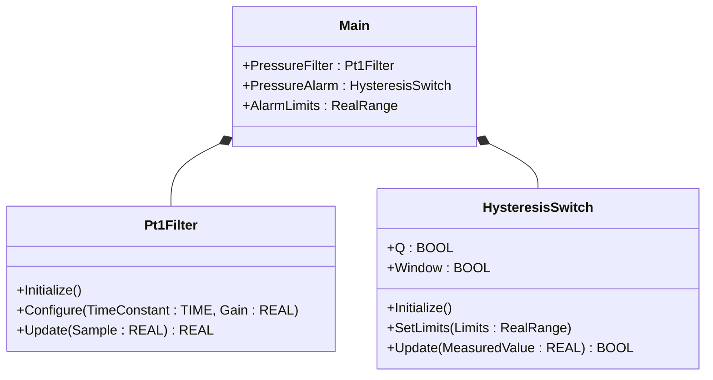
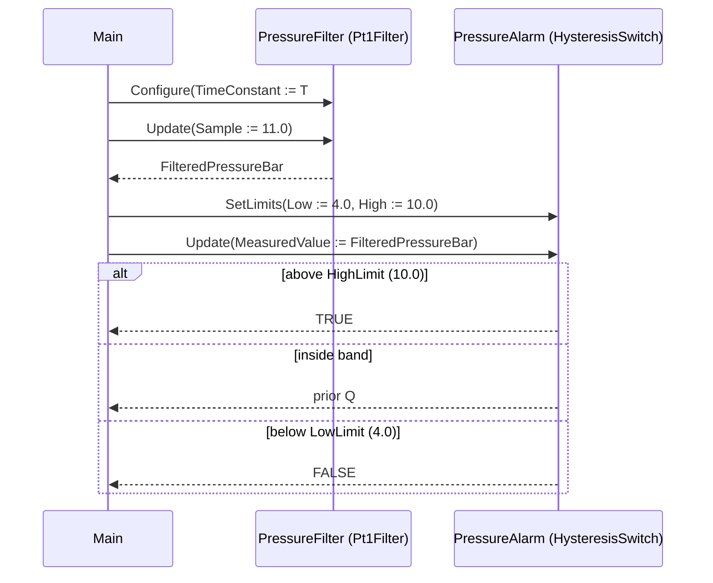

# Compressor Pressure Filter — Showcase

A reciprocating air compressor produces a pulsing discharge pressure
that needs first-order low-pass filtering before any alarm decision —
otherwise the deadband would chatter on every piston stroke. This
showcase chains `Pt1Filter` (configured first-order lag) into
`HysteresisSwitch` (deadband alarm) directly in `Main` — no custom
function blocks, just the call sequence the ST tests verify.

## When classic is the right answer

The procedural version is `non-oop/src/Main.st` (14 lines). Use it when:

- One compressor, one pressure tap, one filter time constant.
- The filtered value is consumed by exactly one alarm threshold pair.
- Filter time constant and alarm limits are constants in source.
- You will never reuse the filter+alarm pair on a second tag (no
  vibration channel, no flow channel, no second compressor).

The OOP version uses the OSCAT library FBs without adding custom types
of its own. It earns its cost on the first reuse — when a second tag
needs the same filter + deadband pattern, you instantiate two of each
FB instead of duplicating the `FT_PT1(...)` and `HYST(...)` call body.

## Where classic strains

`non-oop/src/Main.st` (14 lines) inlines the filter and the alarm into
a straight-line program. Adding a second compressor doubles the
declarations and the body. Adding a vibration channel that uses a
different filter time constant means two more variables, two more
positional-style call sites, and any future change to the alarm shape
must be applied in two places. By the second tag the program reads
more like a transcribed schematic than a reusable block.

## Structure



`Pt1Filter`, `HysteresisSwitch`, and `RealRange` come from the OSCAT
OOP library. This example defines no FBs of its own — it shows the call
sequence and how the two FBs compose.

## What happens at runtime



## The keystone

```st
(* Smooth the pulsing pressure first; alarm on the smoothed value. *)
PressureFilter.Configure(TimeConstant := T#1s, Gain := REAL#1.0);
FilteredPressureBar := PressureFilter.Update(Sample := RawPressureBar);

AlarmLimits.Low := REAL#4.0;
AlarmLimits.High := REAL#10.0;
PressureAlarm.SetLimits(Limits := AlarmLimits);
AlarmActive := PressureAlarm.Update(MeasuredValue := FilteredPressureBar);
```

The filter and the alarm have separate concerns and separate
state. Configuration runs once at startup; both `Update` calls run
every scan with the live samples. The hysteresis band on the alarm
prevents the filtered value from chattering between TRUE and FALSE
when it sits right around the trip line.

## Patterns used

- [Composition (the underlying mechanism)](../../../docs/guides/oop-concepts-in-st.md#composition)

ST mechanics used:

- [Composition](../../../docs/guides/oop-concepts-in-st.md#composition)

## What this demo doesn't show

- **Filter time-constant tuning at runtime.** `Configure` is called
  once with `T#1s`. Real plants tune time constants from HMI based on
  duty (idle vs. loaded compressor).
- **Filter wall-clock dependency.** `Pt1Filter` reads system time to
  compute its delta. Tests that try to drive the filter through a
  multi-step sample sequence quickly see jitter; the existing tests
  bypass the filter in subsequent assertions and feed the alarm
  directly.
- **Multiple compressors.** One filter + one alarm. The shape composes
  cleanly to N compressors but the demo does not exercise it.
- **Alarm queue.** Just a boolean. A production install would push an
  alarm code to a `DwordFifo16` for HMI consumption (see
  `boiler_feedwater_alarm/oop`).
- **Sensor health / range.** No broken-sensor detection upstream of
  the filter.

## When NOT to use this

- One compressor without pulsation — the filter is dead weight, a raw
  `IF/ELSIF` is shorter.
- A two-step alarm without hysteresis — the deadband is the only
  reason `HysteresisSwitch` exists.
- Plant has its own alarm bus library you must use; bringing
  `HysteresisSwitch` would duplicate plumbing.

## Why this is a showcase

The compact showcase is intentionally minimal. There is no second
compressor, no vibration tap, no alarm queue, no HMI sink. Process
values are local literals so the ST tests exercise the filter +
deadband composition without external devices.

For composition combined with patterns inside a real-world plant, see
`boiler_room_heating_plant/oop` (full alarm-bus model) or
`cold_storage_plant/oop` (multi-room composite tree with maintenance +
MQTT subscribers).

## Run

```bash
trust-runtime test --project examples/OSCAT/compressor_pressure_filter/non-oop
trust-runtime test --project examples/OSCAT/compressor_pressure_filter/oop
```

---

## Folder Layout

This paired example contains:

- `non-oop/` — the classic Structured Text project.
- `oop/` — the OSCAT OOP Structured Text project.

## What This Example Teaches

OOP pattern: Composition (compact showcase). The OOP version moves
decisions behind named function-block instances and a clean call
sequence; the non-oop version inlines those decisions in procedural ST.

## How The Pair Teaches OOP

The teaching content above walks through the same machine in both
projects: where classic strains, the structural diagram of the OOP
version, the keystone snippet, and the call sequence. Run the pair
side-by-side and read `non-oop/src/Main.st` first.
