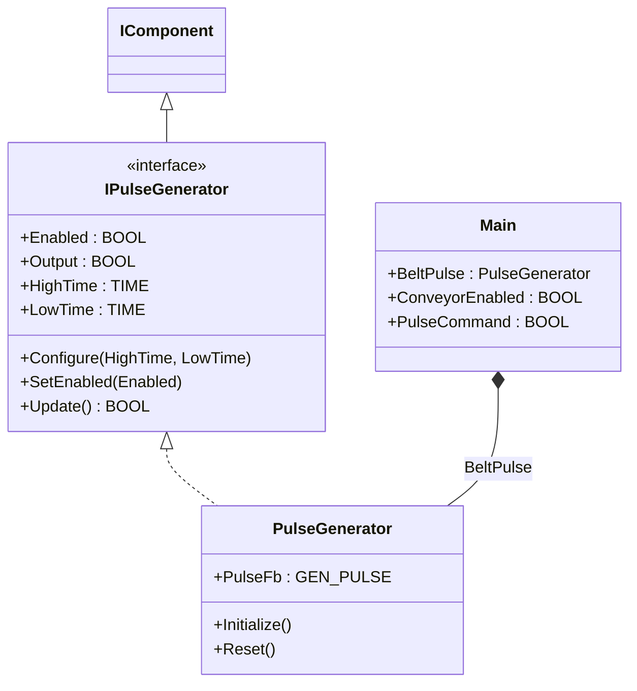
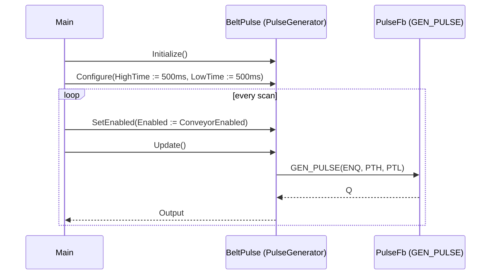

# Conveyor Pulse — Component Composition

A conveyor cell pulses an actuator on a fixed period — a paint-marker
trigger, a tally light on a sortation lane, a periodic stamper. The job
needs configurable on/off times and a single enable input that can be
driven from the parent machine. The OOP version wraps the OSCAT
`GEN_PULSE` timer behind a `PulseGenerator` component with named
configuration and lifecycle methods.

## When classic is the right answer

The procedural version is `non-oop/src/Main.st` (10 lines). Use it when:

- Exactly one pulse rung exists in the program and timing never changes.
- The enable wire is a direct PLC input you want visible at the call site.
- No future need to swap pulse for ramp, square, or random signal.

The OOP version costs about 1.4× the lines for this single rung. It
earns that cost when several actuator-timing channels exist
(stamper/marker/buzzer), when timing must be reconfigurable from HMI,
or when the same callsite must accept different generator types behind
an interface.

## Where classic strains

`Main` (lines 1-10 of `non-oop/src/Main.st`) inlines the `GEN_PULSE`
call with `ENQ`, `PTH`, and `PTL` arguments at every invocation. Adding
a second pulse channel duplicates the entire FB declaration and the
call statement — the per-channel timing literals (`T#500ms`) live next
to the scan-time logic. Adding HMI-driven timing means lifting `PTH`
and `PTL` to module variables and remembering to wire them through
every call. Switching to a square-wave generator means rewriting every
call site because `GEN_SQR` has different inputs (`PT/AM/OS/DC/DL`)
than `GEN_PULSE` (`ENQ/PTH/PTL`). The procedural rung freezes the
generator choice into the call shape.

## Structure



`PulseGenerator`, `IPulseGenerator`, `IComponent`, and the underlying
`GEN_PULSE` timer come from the OSCAT OOP library. The `Main` program
is defined in this example.

## What happens at runtime



## The keystone

```st
(* Configure once, drive every scan with the enable line *)
BeltPulse.Initialize();
BeltPulse.Configure(HighTime := T#500ms, LowTime := T#500ms);
BeltPulse.SetEnabled(Enabled := ConveyorEnabled);
PulseCommand := BeltPulse.Update();
```

The four-line scan body separates configuration (one-shot) from
enable-driven activation (cyclic). Swapping `PulseGenerator` for
`SquareSignalGenerator` (different waveform, same component contract)
is a one-line type change in the VAR block. Adding a second channel is
one extra `VAR` declaration plus four lines, not a re-derivation of the
GEN_PULSE call shape.

## Patterns used

- [Component Composition](../../../docs/guides/oop-concepts-in-st.md#composition)

ST mechanics used:

- [Interface](../../../docs/guides/oop-concepts-in-st.md#interface) and
  [IMPLEMENTS](../../../docs/guides/oop-concepts-in-st.md#implements)
- [Polymorphism](../../../docs/guides/oop-concepts-in-st.md#polymorphism)
- [Composition](../../../docs/guides/oop-concepts-in-st.md#composition)

## What this demo doesn't show

- **Multiple channels.** Real conveyor cells have several timing
  outputs (stamper, marker, audible). This demo wires one. The shape
  scales by adding more `PulseGenerator` instances, but that is not
  exercised here.
- **HMI-driven retiming.** `Configure` is called once at startup with
  literal times. A real cell would expose `HighTime`/`LowTime` as
  HMI-writable records and call `Configure` whenever the operator
  edits them. The component supports this; the demo doesn't.
- **Generator polymorphism through `IPulseGenerator`.** `BeltPulse` is
  declared with the concrete type `PulseGenerator`, not
  `IPulseGenerator`. Holding it through the interface would unlock
  swapping for a future `BurstPulseGenerator` without editing `Main`,
  but the current demo binds the concrete type.
- **Error recovery and `Reset()`.** The component exposes
  `ClearError()` and `Reset()` lifecycle hooks; `Main` never invokes
  them. Production code would call `Reset` on safe-state entry.

## When NOT to use this

- A single fixed-period rung that never changes.
- A program that already has dozens of `GEN_PULSE` calls and adding the
  component layer would only complicate review.
- Embedded skids without HMI where literal times in the FB call are
  the most readable form.

## Integration map

This compact showcase has no fieldbus driver. `BeltPulse.Output` is a
local-variable PLC flag exposed to the test harness only.

| Tag | Address | Direction |
| --- | --- | --- |
| `Conveyor.Enabled` | local | IN |
| `Conveyor.PulseCommand` | local | OUT |

Comms (from `oop/runtime.toml`): runtime control endpoint
`tcp://127.0.0.1:0`, log level `info`. No Modbus, MQTT, or OPC UA
driver is configured for this showcase.

OPC UA exposed records: none. Process values stay in `Main` locals so
the ST tests can drive the component directly.

## Run

```bash
trust-runtime test --project examples/OSCAT/conveyor_pulse/non-oop
trust-runtime test --project examples/OSCAT/conveyor_pulse/oop
```

---

## Folder Layout

This paired example contains:

- `non-oop/` — the classic Structured Text project.
- `oop/` — the OSCAT OOP Structured Text project.

## What This Example Teaches

OOP pattern: Component Composition. The OOP version moves decisions
behind named function-block instances and an interface contract; the
non-oop version inlines those decisions in procedural ST.

## How The Pair Teaches OOP

The teaching content above walks through the same machine in both
projects: where classic strains, the structural diagram of the OOP
version, the keystone snippet, and the integration map. Run the pair
side-by-side and read `non-oop/src/Main.st` first.
