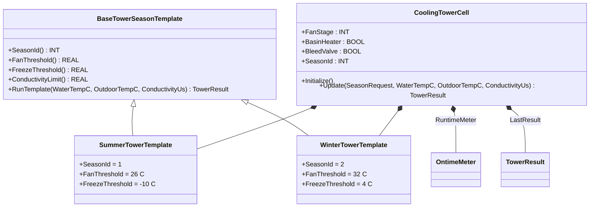
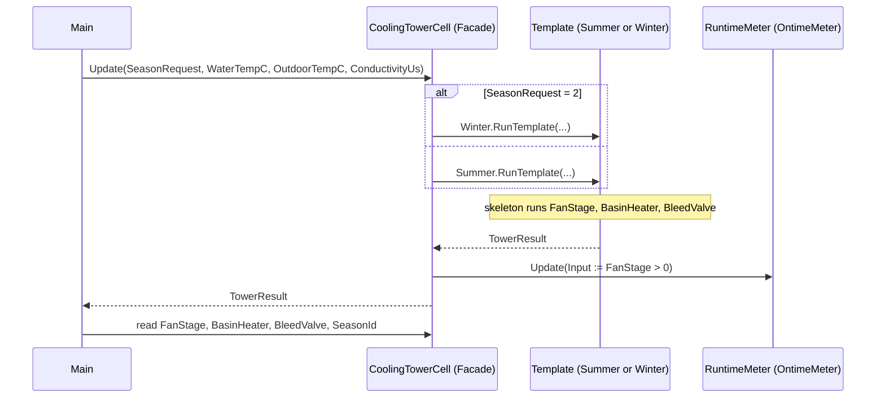

# Cooling Tower Cell — Facade + Template Method

A utility cooling tower rejects condenser heat through a multi-stage
fan, a basin heater (winter freeze protection), and a conductivity
bleed valve (water-treatment hygiene). Operators see one tower cell on
SCADA, but the same hardware runs differently in summer
(heat-rejection priority, low fan threshold, no freeze protection) and
winter (freeze priority, high fan threshold, basin heater armed).
The OOP version uses **Facade** so the rest of the plant talks to one
`CoolingTowerCell`, and **Template Method** so summer and winter share
one fan/bleed/heater sequence with per-season hook overrides.

## When classic is the right answer

The procedural version is `non-oop/src/Main.st` (49 lines). Use it when:

- The plant operates one season and freeze protection is never needed.
- SCADA only reads fan stage and ignores basin and bleed.
- No future seasonal variants (no shoulder season, no de-rated mode).

The OOP version costs about 2.8× the lines. It earns that cost when
multiple seasons share the same `WaterTempC > FanThreshold + 5` shape
but disagree on the constants — and when SCADA wants one stable cell
object that hides the season-switch internals.

## Where classic strains

`ClassicCoolingTower.Update` (lines 7-36 of `non-oop/src/Main.st`)
inlines the season selection inside one `IF/ELSIF`: each branch sets
`SeasonIdValue`, `FanThreshold`, and `FreezeThreshold` from literals.
Adding a shoulder season means a third arm, a third copy of the
threshold-assignment block, and remembering to keep the bleed limit
in sync. Adding a per-season override of the `FanStage` ladder (e.g.,
de-rated tower runs only stage 1 in summer) means duplicating the
fan-stage IF inside the season arm — the previously-unified fan
sequence splits per season. By the third seasonal variant the central
`Update` is a long branchy block that is the most-edited file every
spring and autumn.

## Structure



`OntimeMeter` comes from the OSCAT OOP library. `BaseTowerSeasonTemplate`,
the two season templates, the `TowerResult` record, and `CoolingTowerCell`
are defined in this example.

## What happens at runtime



## The keystone

```st
(* BaseTowerSeasonTemplate.RunTemplate — the fixed skeleton *)
Result.SeasonId := SeasonId();
IF WaterTempC > (FanThreshold() + REAL#5.0) THEN
    Result.FanStage := INT#2;
ELSIF WaterTempC > FanThreshold() THEN
    Result.FanStage := INT#1;
ELSE
    Result.FanStage := INT#0;
END_IF;
Result.BasinHeater := OutdoorTempC < FreezeThreshold();
Result.BleedValve := ConductivityUs > ConductivityLimit();
```

The fan/heater/bleed sequence is written once. Each season overrides
only the threshold methods (`FanThreshold`, `FreezeThreshold`).
Adding a shoulder season is a new `ShoulderTowerTemplate EXTENDS
BaseTowerSeasonTemplate` plus three method overrides — no edit to the
RunTemplate skeleton. SCADA still calls the same `Tower.Update` and
reads the same four facade properties.

## Patterns used

- [Facade](../../../docs/guides/oop-concepts-in-st.md#facade)
- [Template Method](../../../docs/guides/oop-concepts-in-st.md#template-method)

ST mechanics used:

- [Inheritance](../../../docs/guides/oop-concepts-in-st.md#inheritance)
  (used here so each season template overrides only the differing
  hooks while reusing the base RunTemplate)
- [Polymorphism](../../../docs/guides/oop-concepts-in-st.md#polymorphism)
- [Composition](../../../docs/guides/oop-concepts-in-st.md#composition)

## What this demo doesn't show

- **Per-stage fan ramping.** `RunTemplate` returns one of three
  discrete fan stages (0/1/2). Real towers ramp through stage
  transitions to avoid mechanical shock; the demo flips stages
  instantaneously.
- **Bleed-valve flow control.** `BleedValve` is a single BOOL: open
  when conductivity > 1800. A real tower modulates the bleed via a
  PID against a target conductivity. The shape supports a per-season
  `BleedSetpoint` override hook; the demo doesn't add one.
- **Multiple cells per tower bank.** Real cooling-tower banks have
  several cells with bank-level lead/lag and equal-runtime
  rebalancing. This demo is one cell. `RuntimeMeter` accumulates fan
  on-time but no bank-level coordinator reads it.
- **Alarm classes.** No alarms are raised on
  high-conductivity-during-bleed-failure or freeze-stat-tripped. The
  facade currently exposes only the four control records.

## When NOT to use this

- A single-season, single-mode tower with no freeze risk
  (process-cooling skid in a heated indoor cell).
- A site where SCADA already reads every internal signal and a single
  facade record set adds no value.
- A tower whose seasonal differences are a single setpoint — pass it
  as a parameter and skip the template hierarchy.

## Integration map

| Tag | Address | Direction |
| --- | --- | --- |
| `Tower.SeasonRequest` | `%IW0` | IN |
| `Tower.WaterTempRaw` | `%IW2` | IN |
| `Tower.OutdoorTempRaw` | `%IW4` | IN |
| `Tower.ConductivityRaw` | `%IW6` | IN |
| `Tower.FanStageRaw` | `%QW0` | OUT |
| `Tower.BasinHeaterOut` | `%QX0.0` | OUT |
| `Tower.BleedValveOut` | `%QX0.1` | OUT |

Comms (from `oop/io.toml`): `modbus-tcp` (slave 170 on
`127.0.0.1:1512`, 500 ms timeout), `mqtt` (broker
`127.0.0.1:1883`, topics `utility/coolingtower/01/cmd` in,
`utility/coolingtower/01/snapshot` out).

OPC UA exposed records (from `oop/runtime.toml`, namespace
`urn:trust:examples:cooling-tower-facade-template`): `Tower.FanStage`,
`Tower.BasinHeater`, `Tower.BleedValve`, `Tower.SeasonId`.

## Run

```bash
trust-runtime test --project examples/OSCAT/cooling_tower_facade_template/non-oop
trust-runtime test --project examples/OSCAT/cooling_tower_facade_template/oop
```

---

## Folder Layout

This paired example contains:

- `non-oop/` — the classic Structured Text project.
- `oop/` — the OSCAT OOP Structured Text project.

## What This Example Teaches

OOP pattern: Facade + Template Method. The OOP version moves decisions
behind named function-block instances and an interface contract; the
non-oop version inlines those decisions in procedural ST.

## How The Pair Teaches OOP

The teaching content above walks through the same machine in both
projects: where classic strains, the structural diagram of the OOP
version, the keystone snippet, and the integration map. Run the pair
side-by-side and read `non-oop/src/Main.st` first.
