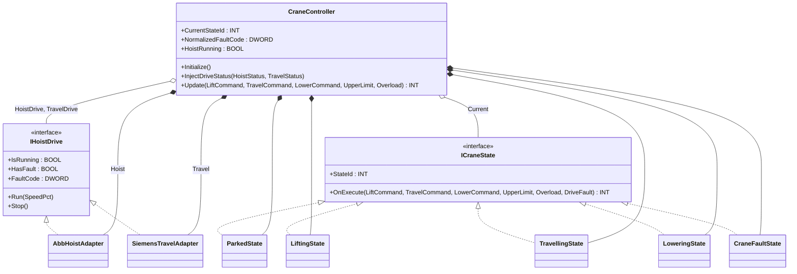
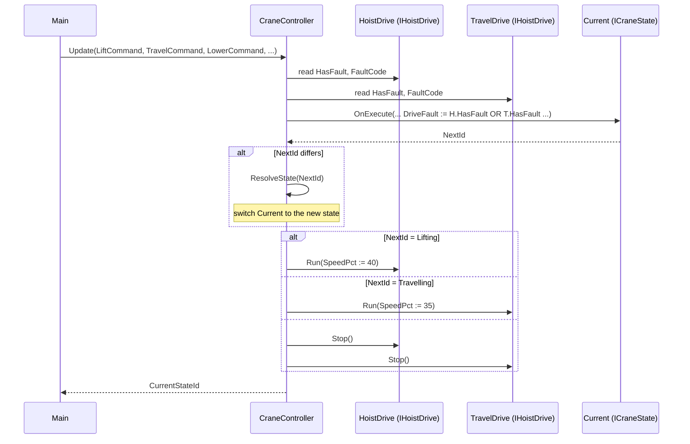

# Crane Hoist Cell — Adapter + State

An overhead-bridge crane runs two motion drives — an ABB hoist and a
Siemens travel — that share one operator pendant (lift / travel /
lower buttons), one upper-limit switch, and one overload sensor. Each
vendor's status word encodes "running" and "faulted" at different bit
positions, and each fault code lives in a different namespace. The
operator workflow is itself a small state machine: Parked → Lifting,
Travelling, Lowering — and any drive fault or overload forces Fault.
The OOP version uses **Adapter** so the controller talks one
`IHoistDrive` interface against both vendors, and **State** so each
motion phase decides its own exit transitions.

## When classic is the right answer

The procedural version is `non-oop/src/Main.st` (50 lines). Use it
when:

- One drive vendor for the lifetime of the bridge.
- The motion menu is tiny: lift-or-stop, no travel, no lower.
- No need to normalize fault codes across drives.

The OOP version costs about 8.5× the lines. It earns that cost when
the bridge mixes vendors (typical refurbishment of older cranes), when
the motion menu has more than two states, and when SCADA wants one
fault-code namespace regardless of which drive faulted.

## Where classic strains

`ClassicCraneController.Update` (lines 8-35 of `non-oop/src/Main.st`)
inlines vendor bit decoding (`AND DWORD#16#0008` for ABB fault) into
the same method that handles the motion state machine. The controller
hardcodes `DWORD#16#A0000044` for ABB fault — there is no Siemens
fault path. Adding a lower state means another `ELSIF StateValue =
INT#0 AND LowerCommand` arm and a new explicit transition out of it.
Adding the Siemens travel decode means duplicating the bit-mask
expressions for the second status word, and remembering to compose
fault flags from both. By the third drive vendor or the third motion
state the procedural cell is unmaintainable.

## Structure



The `IHoistDrive` interface, both adapters, the `ICraneState`
interface, the five state FBs, and `CraneController` are all defined
in this example. The OSCAT library is not directly composed here — the
example builds its own minimal contracts.

State id numbering: `0=Parked, 10=Lifting, 20=Travelling, 30=Lowering,
90=Fault`.

## What happens at runtime



## The keystone

```st
(* CraneController.Update — vendor-neutral and state-driven *)
DriveFault := HoistDrive.HasFault OR TravelDrive.HasFault;
IF HoistDrive.HasFault THEN
    NormalizedFaultCodeValue := HoistDrive.FaultCode;
ELSIF TravelDrive.HasFault THEN
    NormalizedFaultCodeValue := TravelDrive.FaultCode;
END_IF;
NextId := Current.OnExecute(LiftCommand := LiftCommand, TravelCommand := TravelCommand,
    LowerCommand := LowerCommand, UpperLimit := UpperLimit, Overload := Overload, DriveFault := DriveFault);
IF NextId <> CurrentStateIdValue THEN
    Current := ResolveState(StateId := NextId);
END_IF;
```

Vendor bit-decoding lives only in each adapter's `ConfigureRaw`. Each
state decides its own exits (lift released → forward to travel-or-lower
in one scan, see `LiftingState.OnExecute`). Adding a Hold state at
`INT#40` is a new FB and one more `ResolveState` arm; no edit to the
existing states. Replacing the Siemens travel with a Schneider drive is
a new `SchneiderTravelAdapter IMPLEMENTS IHoistDrive` and one
assignment in `Initialize` — no change to the state machine or the
controller.

## Patterns used

- [Adapter](../../../docs/guides/oop-concepts-in-st.md#adapter)
- [State](../../../docs/guides/oop-concepts-in-st.md#state)

ST mechanics used:

- [Interface](../../../docs/guides/oop-concepts-in-st.md#interface) and
  [IMPLEMENTS](../../../docs/guides/oop-concepts-in-st.md#implements)
- [Polymorphism](../../../docs/guides/oop-concepts-in-st.md#polymorphism)
- [Composition](../../../docs/guides/oop-concepts-in-st.md#composition)

## What this demo doesn't show

- **Real drive polling.** `InjectDriveStatus` feeds the two status
  words synthetically so tests can drive faults deterministically.
  Production code would bind the ABB hoist and Siemens travel registers
  through `io.toml` and `Configuration.st` instead.
- **Speed ramping.** The lifting state issues `Run(SpeedPct := 40)`
  and the travelling state `Run(SpeedPct := 35)` as fixed values. Real
  cranes ramp speed against an operator-pendant analog input.
- **Fault-code translation tables.** Each adapter prefixes the raw
  word with a vendor namespace nibble (`0xA000_____` for ABB,
  `0x5000_____` for Siemens). Real systems map these to a normalized
  application code via lookup; this demo passes the raw word through.
- **Per-motion safety chains.** The state machine treats `UpperLimit`
  as a fault out of `LiftingState` only. A real crane has lower-limit,
  end-of-travel, and slack-cable detection per motion, each with its
  own fault routing.

## When NOT to use this

- Single-vendor crane with one motion (hoist only) and no future drive
  swaps.
- A bridge that already runs two-state IF-only logic (idle/lifting)
  with a single fault flag — the procedural version is shorter.
- Greenfield cell where the BOM is fixed and SCADA does not need a
  unified fault namespace.

## Integration map

| Tag | Address | Direction |
| --- | --- | --- |
| `Crane.LiftCommand` | `%IX0.0` | IN |
| `Crane.TravelCommand` | `%IX0.1` | IN |
| `Crane.LowerCommand` | `%IX0.2` | IN |
| `Crane.UpperLimit` | `%IX0.3` | IN |
| `Crane.Overload` | `%IX0.4` | IN |
| `Crane.HoistEnableOut` | `%QX0.0` | OUT |
| `Crane.TravelEnableOut` | `%QX0.1` | OUT |
| `Crane.AlarmOut` | `%QX0.2` | OUT |

Comms (from `oop/io.toml`): `modbus-rtu` (slave 111 on
`loop://crane-hoist-drive`, 19200/even, 250 ms timeout) and
`ethercat` (simulated master, 1000 µs cycle). Safe-state forces
`Crane.HoistEnableOut := FALSE` on driver fault.

OPC UA exposed records (from `oop/runtime.toml`, namespace
`urn:trust:examples:crane-hoist-adapter-state`): `Crane.CurrentStateId`,
`Crane.NormalizedFaultCode`, `Crane.HoistRunning`.

## Run

```bash
trust-runtime test --project examples/OSCAT/crane_hoist_adapter_state/non-oop
trust-runtime test --project examples/OSCAT/crane_hoist_adapter_state/oop
```

---

## Folder Layout

This paired example contains:

- `non-oop/` — the classic Structured Text project.
- `oop/` — the OSCAT OOP Structured Text project.

## What This Example Teaches

OOP pattern: Adapter + State. The OOP version moves decisions behind
named function-block instances and an interface contract; the non-oop
version inlines those decisions in procedural ST.

## How The Pair Teaches OOP

The teaching content above walks through the same machine in both
projects: where classic strains, the structural diagram of the OOP
version, the keystone snippet, and the integration map. Run the pair
side-by-side and read `non-oop/src/Main.st` first.
