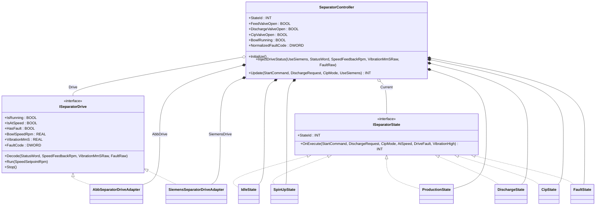

# Dairy Separator — Adapter + State

A dairy cream separator runs a high-speed bowl (6000+ RPM) through a
multi-phase production cycle: idle → spin-up → production →
intermittent discharge → optional CIP wash → fault recovery.
Vibration and drive status come from one of two VFD families (ABB or
Siemens), each with its own status-word bit layout and fault-code
namespace. The OOP version uses **Adapter** so the controller talks
one `ISeparatorDrive` interface regardless of vendor, and **State** so
each phase owns its own transition rules.

## When classic is the right answer

The procedural version is `non-oop/src/Main.st` (127 lines). Use it
when:

- One drive vendor is locked in for the lifetime of the skid.
- The phase set is small and never changes (idle/spinning/done).
- No CIP integration needed (clean-out is manual).

The OOP version costs about 4.4× the lines. It earns that cost when
two or more drive vendors must be supported, when CIP is intertwined
with production, when vibration trip logic is shared across phases,
and when SCADA wants one fault-code namespace.

## Where classic strains

`ClassicDairySeparator.Update` (lines 11-86 of `non-oop/src/Main.st`)
mixes vendor decoding (`UseSiemens` IF picks bit 0x0400 vs 0x0004,
fault prefix `0x5000_____` vs `0xD000_____`) with the phase state
machine (one `ELSIF StateValue = N` per phase) inside one method.
Adding a third vendor means another `IF UseSiemens` arm and a
duplicated decode block; adding a Cooldown phase means another `ELSIF
StateValue = INT#50` arm and re-checking that the fault transition
list still includes it. Vibration trip logic is duplicated at the top
of each state arm. By the third commissioning revision the procedural
method is long, branchy, and the most-edited file in the project.

## Structure



The two interfaces, both adapter FBs, the six state FBs, and
`SeparatorController` are all defined in this example. The OSCAT
library is not directly composed here.

State id numbering: `0=Idle, 10=SpinUp, 20=Production, 30=Discharge,
40=Cip, 90=Fault`.

## What happens at runtime

```mermaid
sequenceDiagram
    participant Main
    participant C as SeparatorController
    participant D as Drive (ISeparatorDrive)
    participant S as Current (ISeparatorState)
    Main->>C: InjectDriveStatus(UseSiemens, StatusWord, SpeedFeedbackRpm, VibrationMmSRaw, FaultRaw)
    C->>D: Decode(...)
    Main->>C: Update(StartCommand, DischargeRequest, CipMode, UseSiemens)
    C->>C: SelectDrive (ABB or Siemens)
    C->>S: OnExecute(... AtSpeed := D.IsAtSpeed, DriveFault := D.HasFault, VibrationHigh := D.VibrationMmS > 8.0 ...)
    S-->>C: NextStateId
    alt NextStateId differs from Current.StateId
        C->>C: ResolveState(NextStateId)
        Note over C: switch Current
    end
    alt SpinUp
        C->>D: Run(SpeedSetpointRpm := 6500)
    else Production
        C->>D: Run(SpeedSetpointRpm := 6500); FeedValveOpen := TRUE
    else Discharge
        C->>D: Run(SpeedSetpointRpm := 6200); DischargeValveOpen := TRUE
    else CIP
        C->>D: Stop(); CipValveOpen := TRUE
    end
    C-->>Main: StateId
```

## The keystone

```st
(* SeparatorController.Update — vendor-neutral state dispatch *)
SelectDrive(UseSiemens := UseSiemens);
NextStateId := Current.OnExecute(StartCommand := StartCommand,
    DischargeRequest := DischargeRequest, CipMode := CipMode,
    AtSpeed := Drive.IsAtSpeed,
    DriveFault := Drive.HasFault,
    VibrationHigh := Drive.VibrationMmS > REAL#8.0);
IF NextStateId <> Current.StateId THEN
    Current := ResolveState(StateId := NextStateId);
END_IF;
```

Vendor decoding lives only inside each adapter's `Decode`. Each state
inspects `AtSpeed`, `DriveFault`, and `VibrationHigh` through the
interface. Adding a Cooldown phase is a new FB plus one
`ResolveState` arm — no edit to the existing five states. Replacing
the Siemens drive with a Schneider drive is a new
`SchneiderSeparatorDriveAdapter IMPLEMENTS ISeparatorDrive` and one
assignment in `SelectDrive`.

## Patterns used

- [Adapter](../../../docs/guides/oop-concepts-in-st.md#adapter)
- [State](../../../docs/guides/oop-concepts-in-st.md#state)

ST mechanics used:

- [Interface](../../../docs/guides/oop-concepts-in-st.md#interface) and
  [IMPLEMENTS](../../../docs/guides/oop-concepts-in-st.md#implements)
- [Polymorphism](../../../docs/guides/oop-concepts-in-st.md#polymorphism)
- [Composition](../../../docs/guides/oop-concepts-in-st.md#composition)

## What this demo doesn't show

- **Real drive polling.** `InjectDriveStatus` feeds the status word
  and speed feedback synthetically. Production code would bind the
  vendor's Modbus registers to each adapter through `io.toml` and
  `Configuration.st`.
- **Speed ramping.** `Run(SpeedSetpointRpm := 6500)` is a step
  command. Real separator drives ramp speed (5–10 minutes typical) to
  protect bowl mechanics; this demo's adapter simulates instant
  attainment by pinning `BowlSpeedRpmValue` to the setpoint.
- **CIP recipe.** `CipState` exists but its body is one transition
  rule (CIP off → Idle). A full CIP wash would chain pre-rinse →
  caustic → rinse → acid through internal substates; that is
  `cip_wash_state/oop`'s job.
- **Vibration trending.** The vibration trip is a single threshold
  (`> 8.0 mm/s`). A real skid uses RMS over a window plus a slower
  alarm threshold. The demo trips on the raw instantaneous reading.
- **Multi-bowl banks.** This demo wires one separator. A creamery
  typically runs two or three in parallel with rebalanced production
  load.

## When NOT to use this

- Single-vendor skid with one fixed phase sequence.
- A bowl that runs continuously without a discharge cycle (no
  intermittent solids ejection).
- Greenfield project where CIP is performed manually and not
  PLC-orchestrated.

## Integration map

| Tag | Address | Direction |
| --- | --- | --- |
| `Separator.StartCommand` | `%IX0.0` | IN |
| `Separator.DischargeRequest` | `%IX0.1` | IN |
| `Separator.CipMode` | `%IX0.2` | IN |
| `Separator.UseSiemensDrive` | `%IX0.3` | IN |
| `Separator.StatusWordRaw` | `%IW0` | IN |
| `Separator.SpeedFeedbackRaw` | `%IW2` | IN |
| `Separator.VibrationRaw` | `%IW4` | IN |
| `Separator.FaultRaw` | `%IW6` | IN |
| `Separator.FeedValveOut` | `%QX0.0` | OUT |
| `Separator.DischargeValveOut` | `%QX0.1` | OUT |
| `Separator.CipValveOut` | `%QX0.2` | OUT |

Comms (from `oop/io.toml`): `modbus-rtu` (slave 41 on `/dev/ttyUSB4`,
19200/even, 500 ms timeout), `mqtt` (broker `127.0.0.1:1883`,
topics `dairy/separator/01/cmd` in,
`dairy/separator/01/event` out).

OPC UA exposed records (from `oop/runtime.toml`, namespace
`urn:trust:examples:dairy-separator-adapter-state`):
`Separator.StateId`, `Separator.BowlRunning`,
`Separator.FeedValveOpen`, `Separator.NormalizedFaultCode`.

## Run

```bash
trust-runtime test --project examples/OSCAT/dairy_separator_adapter_state/non-oop
trust-runtime test --project examples/OSCAT/dairy_separator_adapter_state/oop
```

---

## Folder Layout

This paired example contains:

- `non-oop/` — the classic Structured Text project.
- `oop/` — the OSCAT OOP Structured Text project.

## What This Example Teaches

OOP pattern: Adapter + State. The OOP version moves decisions behind
named function-block instances and an interface contract; the non-oop
version inlines those decisions in procedural ST.

## How The Pair Teaches OOP

The teaching content above walks through the same machine in both
projects: where classic strains, the structural diagram of the OOP
version, the keystone snippet, and the integration map. Run the pair
side-by-side and read `non-oop/src/Main.st` first.
