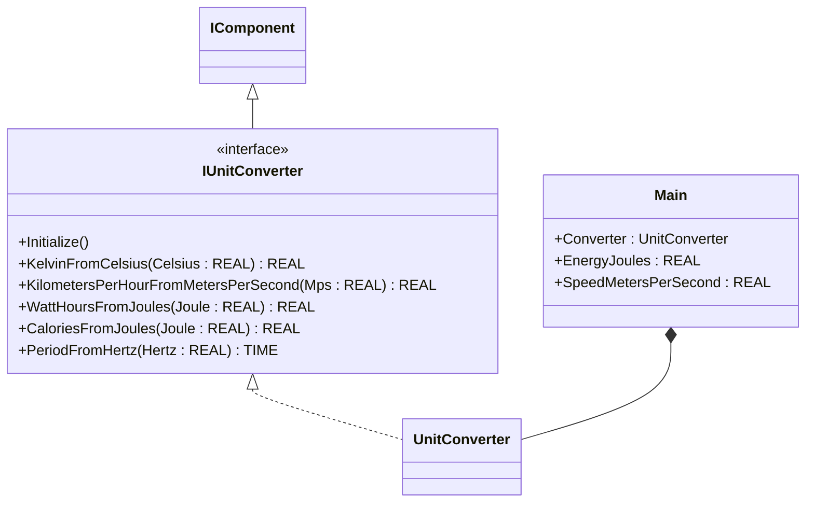

# Energy Normalization — Showcase

A site receives raw measurements in physical units (Joules of energy
delivered, m/s of wind speed) and needs to publish operator-facing
units (Watt-hours, km/h) for HMI and historian. This showcase wires a
single `UnitConverter` instance from the OSCAT OOP library and routes
multiple input channels through its method surface — no custom function
blocks, just the call sequence the ST tests verify.

## When classic is the right answer

The procedural version is `non-oop/src/Main.st` (15 lines). Use it when:

- One conversion direction per channel, called once per scan.
- The two FB instances (`ENERGY`, `SPEED`) are independent and never
  share configuration.
- You will never need a third unit family (no temperature, no frequency,
  no calories) — the `UnitConverter` advantage scales with the number
  of unit families you consolidate.
- Conversion outputs are consumed locally and never re-encoded into
  another unit.

The OOP version uses one `UnitConverter` for both channels — and could
absorb a dozen more without adding a single FB instance, just more
method calls. The OSCAT classic library has one FB per unit family
(`ENERGY`, `SPEED`, `TEMPERATURE`, ...); the OOP `UnitConverter`
collapses all of them into one stateless service.

## Where classic strains

`non-oop/src/Main.st` (15 lines) declares one classic FB per unit
family (`ENERGY`, `SPEED`) and reads the converted value from a named
output (`YWh`, `Ykmh`). Adding a temperature channel adds a third FB
(`TEMPERATURE`), more state, and a third call site with a different
input/output convention. Reading a different output of the same family
(e.g., calories from the energy FB) means a new instance even though
the math is in the same library FB. By the third unit family, the
program declares more FB instances than it has actual signal sources.

## Structure



`UnitConverter` and the `IComponent` lifecycle contract come from the
OSCAT OOP library. This example defines no FBs of its own — it shows
the call sequence and how a single converter instance handles
heterogeneous unit families.

## What happens at runtime

```mermaid
sequenceDiagram
    participant Main
    participant U as Converter (UnitConverter)
    Main->>U: Initialize()
    Main->>U: WattHoursFromJoules(Joule := 3600.0)
    U-->>Main: 1.0 Wh
    Main->>U: KilometersPerHourFromMetersPerSecond(Mps := 10.0)
    U-->>Main: 36.0 km/h
    Note over Main: Converter is stateless across calls;<br/>same instance handles every unit family
```

## The keystone

```st
(* One converter instance, two unit families, no shared state. *)
Converter.Initialize();
EnergyWattHours := Converter.WattHoursFromJoules(Joule := EnergyJoules);
SpeedKilometersPerHour := Converter.KilometersPerHourFromMetersPerSecond(Mps := SpeedMetersPerSecond);
```

The conversions are method calls on a single object. Adding a
temperature channel is one more `Converter.KelvinFromCelsius(...)` call;
adding a calorie reading is `Converter.CaloriesFromJoules(...)`. No new
FB instance, no new declaration, no new initialization. The OSCAT
classic library has one FB per family; the OOP version has one
`UnitConverter` for everything.

## Patterns used

- [Composition (the underlying mechanism)](../../../docs/guides/oop-concepts-in-st.md#composition)

ST mechanics used:

- [Composition](../../../docs/guides/oop-concepts-in-st.md#composition)

## What this demo doesn't show

- **More than two unit families.** `UnitConverter` exposes Kelvin,
  Fahrenheit, Beaufort, frequency, period, calorie methods too — the
  demo only exercises Wh and km/h. The advantage compounds as the
  number of channels grows.
- **Reverse direction.** `JoulesFromWattHours` exists; the demo only
  uses the forward direction.
- **Channel-specific scaling or offset.** Conversions are pure
  multiplications. A real plant has zero-trim and span-trim per
  channel, which would live in another component upstream of the
  converter.
- **Range / sanity checks.** A value of `REAL#-1.0` Joules would be
  silently converted to `REAL#-0.000277...` Wh. Real plants reject
  out-of-range inputs at the proxy or sensor layer.
- **Persistence.** No counters, no integrators. The converter is a
  pure function-style component.

## When NOT to use this

- One channel, one direction, one unit family — `J / 3600.0` inline is
  shorter than a method call.
- A plant where every channel has its own scaling/offset that sits
  inside the conversion math — the methods would have too many
  parameters and a per-channel FB would be clearer.
- Existing code already uses the OSCAT classic FBs and consolidating
  them is not on the work order.

## Why this is a showcase

The compact showcase is intentionally minimal. There is no second
converter, no historian fan-out, no telemetry pipeline, no proxy
layer. Process values are local literals so the ST tests exercise the
multi-method conversion contract without external devices.

For component composition combined with patterns inside a real-world
plant, see `boiler_room_heating_plant/oop` (alarm bus, multi-family
conversions on a real plant) or `pharma_filling_builder_state/oop`
(recipe-driven multi-step machine).

## Run

```bash
trust-runtime test --project examples/OSCAT/energy_normalization/non-oop
trust-runtime test --project examples/OSCAT/energy_normalization/oop
```

---

## Folder Layout

This paired example contains:

- `non-oop/` — the classic Structured Text project.
- `oop/` — the OSCAT OOP Structured Text project.

## What This Example Teaches

OOP pattern: Composition (compact showcase). The OOP version moves
decisions behind named function-block instances and a clean call
sequence; the non-oop version inlines those decisions in procedural ST.

## How The Pair Teaches OOP

The teaching content above walks through the same machine in both
projects: where classic strains, the structural diagram of the OOP
version, the keystone snippet, and the call sequence. Run the pair
side-by-side and read `non-oop/src/Main.st` first.
