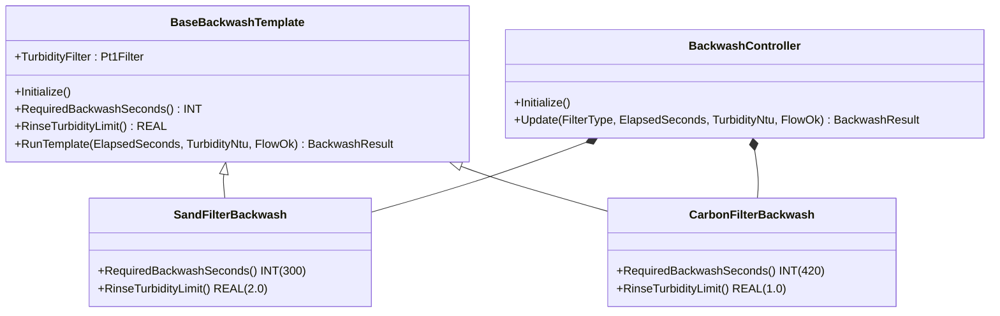
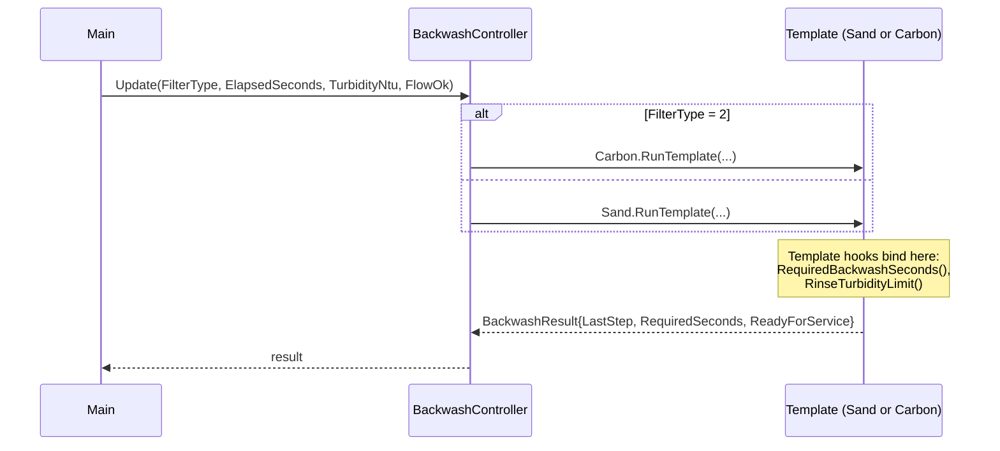

# Filter Backwash — Template Method

A water-treatment filter backwash sequence is the same shape for every
media type — drain, backwash, rinse, return-to-service — but the
duration and rinse-turbidity threshold are media-specific (sand vs.
activated carbon). The OOP version puts the sequence skeleton in a
`BaseBackwashTemplate` and lets each media subclass override the two
hook methods (`RequiredBackwashSeconds` and `RinseTurbidityLimit`)
without rewriting the step logic.

## When classic is the right answer

The procedural version is `non-oop/src/Main.st` (40 lines). Use it when:

- One filter media; the duration and threshold are constants.
- A second media is hypothetical, not on the road map.
- The sequence skeleton itself (drain → backwash → rinse) is allowed to
  vary per media — i.e. you do not actually have a "same shape" claim
  to make.
- Every step is a pass-through with no per-media instrumentation.

The OOP version costs about 4× the lines. It earns that cost when a
second media appears, when a third media has the same sequence with
yet another duration/threshold pair, or when the rinse-completion
criterion needs additional inputs (oxygen breakthrough, particle count)
in some media but not others.

## Where classic strains

`ClassicBackwashController.Update` (lines 13-30 of `non-oop/src/Main.st`)
inlines an `IF FilterType = INT#2 THEN ... ELSE ...` block at the top
to pick the duration and threshold, then runs the same step ladder.
Adding a third media (e.g., GAC, with required 360 s and 0.5 NTU rinse)
means a third arm in that initial IF — and any future change to the
ladder must be checked against three fork points instead of being
local to one method.

## Structure



`Pt1Filter` and the `BackwashResult` record come from this example
(record) and the OSCAT OOP library (filter). The two media subclasses
and the `BackwashController` are defined in this example.

`Pt1Filter` is wired in for telemetry/snapshot only — see "What this
demo doesn't show" for the wall-clock caveat.

## What happens at runtime



## The keystone

```st
(* Skeleton stays in the base; hooks vary per media. *)
LastResult.RequiredSeconds := RequiredBackwashSeconds();
FilteredTurbidity := TurbidityFilter.Update(Sample := TurbidityNtu);
IF NOT FlowOk THEN
    LastResult.LastStep := INT#90;  (* alarm *)
ELSIF ElapsedSeconds < INT#60 THEN
    LastResult.LastStep := INT#10;  (* drain *)
ELSIF ElapsedSeconds < RequiredBackwashSeconds() THEN
    LastResult.LastStep := INT#20;  (* backwash *)
ELSIF TurbidityNtu > RinseTurbidityLimit() THEN
    LastResult.LastStep := INT#30;  (* rinse *)
ELSE
    LastResult.LastStep := INT#100; (* ready *)
END_IF;
```

The two hook calls (`RequiredBackwashSeconds()` and
`RinseTurbidityLimit()`) bind to the override defined in the running
subclass. Adding a third media is one new FB extending
`BaseBackwashTemplate` plus one ELSIF arm in `BackwashController.Update`.
The step ladder itself never changes.

## Patterns used

- [Template Method](../../../docs/guides/oop-concepts-in-st.md#template-method)

ST mechanics used:

- [Inheritance](../../../docs/guides/oop-concepts-in-st.md#inheritance) (EXTENDS)
- [Polymorphism](../../../docs/guides/oop-concepts-in-st.md#polymorphism)
- [Composition](../../../docs/guides/oop-concepts-in-st.md#composition)

## What this demo doesn't show

- **Filtered turbidity for the rinse decision.** `TurbidityFilter` is
  updated every scan but the rinse-limit check uses the raw
  `TurbidityNtu` value. `Pt1Filter` reads system time to integrate; in
  microsecond test cycles the filter cannot follow input changes, so
  using the filtered value for the decision would mask fresh "high
  turbidity" samples behind stale filter state. The filter exists for
  HMI/telemetry smoothing only.
- **Drain / settle / refill phases.** The skeleton has four steps
  (Drain `10`, Backwash `20`, Rinse `30`, Ready `100`) plus alarm `90`.
  A real plant has 6-9 phases including settle and air-scour.
- **Per-media instrumentation hooks.** Carbon filters typically have
  oxygen-saturation checks; sand filters do not. The template has two
  hook methods; a third hook (`AdditionalRinseCheck`) would be the
  natural extension.
- **Backwash-flow alarms.** `FlowOk` is a single boolean. A real
  install also alarms on under-flow, over-flow, and pressure-drop.
- **Cycle counter.** Backwash cycles per day are not tracked; a real
  install would count them via `DwordCounter`.

## When NOT to use this

- A single media that will never grow — the classic IF/ELSIF block is
  shorter than three FBs.
- Two media where only the duration differs and you are happy passing
  it as a parameter — Template Method is over-engineering for one
  knob.
- A sequence that genuinely differs by media (different number of
  steps, different order) — Template Method demands a shared skeleton.
  See `pharma_filling_builder_state/oop` for recipe-driven sequencing.

## Integration map

| Tag | Address | Direction |
| --- | --- | --- |
| `Backwash.FilterType` | `%IW0` | IN |
| `Backwash.ElapsedSecondsRaw` | `%IW2` | IN |
| `Backwash.TurbidityRaw` | `%IW4` | IN |
| `Backwash.BackwashValveOut` | `%QX0.0` | OUT |
| `Backwash.RinseValveOut` | `%QX0.1` | OUT |

Comms (from `oop/io.toml`): `modbus-rtu` (slave 121 on
`loop://filter-flow-pressure`, 19200/even), `mqtt` (broker
`127.0.0.1:1883`, topics `water/filter/01/cmd` in,
`water/filter/01/backwash` out).

OPC UA exposed records (from `oop/runtime.toml`, namespace
`urn:trust:examples:filter-backwash-template`): `Backwash.LastStep`,
`Backwash.LastRequiredSeconds`, `Backwash.ReadyForService`.

## Run

```bash
trust-runtime test --project examples/OSCAT/filter_backwash_template/non-oop
trust-runtime test --project examples/OSCAT/filter_backwash_template/oop
```

---

## Folder Layout

This paired example contains:

- `non-oop/` — the classic Structured Text project.
- `oop/` — the OSCAT OOP Structured Text project.

## What This Example Teaches

OOP pattern: Template Method. The OOP version moves decisions behind
named function-block instances and an interface contract; the non-oop
version inlines those decisions in procedural ST.

## How The Pair Teaches OOP

The teaching content above walks through the same machine in both
projects: where classic strains, the structural diagram of the OOP
version, the keystone snippet, and the integration map. Run the pair
side-by-side and read `non-oop/src/Main.st` first.
