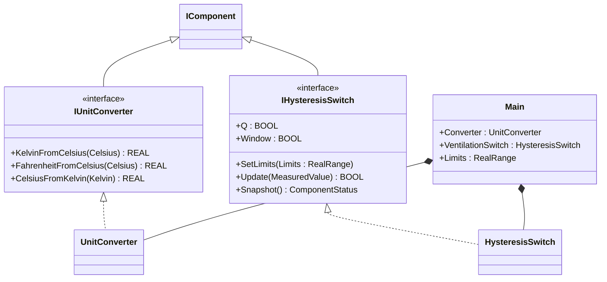
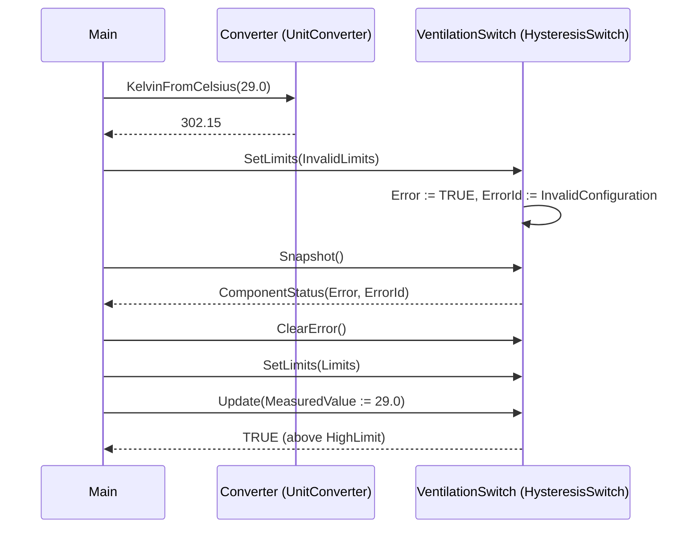

# Greenhouse Temperature — Component Composition

A greenhouse zone needs ventilation when air temperature crosses an upper
band, with hysteresis so the vents do not chatter, and the same scan
must publish the temperature in Kelvin for telemetry. The OOP version
splits the two responsibilities: `UnitConverter` handles unit math and
`HysteresisSwitch` owns the deadband state. This is a compact showcase
that wires two OSCAT OOP components without adding any custom function
blocks of its own.

## When classic is the right answer

The procedural version is `non-oop/src/Main.st` (16 lines). Use it when:

- The greenhouse has one zone with one fixed temperature band.
- Telemetry never needs to expose Fahrenheit or Kelvin alongside Celsius.
- No invalid-configuration handling is required (you trust the
  hard-coded thresholds).
- Only one switching policy lives in the program — no second deadband
  for humidity, no rate-limit on the same channel.

The OOP version uses two OSCAT library FBs and a `RealRange` config
struct. It earns that cost on the first reuse — when a second zone or a
second deadband (humidity, soil moisture, root-zone temperature) needs
the same trip plumbing, you instantiate one switch per channel instead
of duplicating the body.

## Where classic strains

`non-oop/src/Main.st` (16 lines) calls `TEMPERATURE` and `HYST` directly,
threading the limits as positional arguments on every scan. There is no
configuration validation: passing a high limit below the low limit
silently produces nonsense outputs. Adding a second zone means a second
`HYST` instance plus a duplicated `TemperatureConversion` call site,
because the classic FB does not separate "what unit conversion is
available" from "what threshold am I tripping on". Adding error
handling (rejecting a bad band, reporting it on the HMI) means
re-checking the limits inline before every call. By the third zone the
program is mostly a transcribed wiring diagram with no place to attach
diagnostics.

## Structure



`UnitConverter`, `HysteresisSwitch`, `RealRange`, and the `IComponent`
lifecycle contract come from the OSCAT OOP library. This example
defines no FBs of its own — the lesson is the call sequence and the
configuration-validation handshake.

## What happens at runtime



## The keystone

```st
(* Configuration is an explicit handshake: bad limits are reported, not silently ignored *)
VentilationSwitch.SetLimits(Limits := InvalidLimits);
SwitchStatus := VentilationSwitch.Snapshot();
ConfigurationRejected := SwitchStatus.Error
    AND SwitchStatus.ErrorId = ComponentErrorInvalidConfiguration;
VentilationSwitch.ClearError();
VentilationSwitch.SetLimits(Limits := Limits);
VentilationRequest := VentilationSwitch.Update(MeasuredValue := TemperatureCelsius);
```

`HysteresisSwitch.SetLimits` returns nothing but raises an error code in
the component's status snapshot when `High < Low`. The switch refuses
to act on the bad configuration, the operator clears the error, and a
correct `RealRange` is applied before `Update` is called. The classic
version has no equivalent of that handshake — bad limits become bad
output silently.

## Patterns used

- [Composition (the underlying mechanism)](../../../docs/guides/oop-concepts-in-st.md#composition)

ST mechanics used:

- [Interface](../../../docs/guides/oop-concepts-in-st.md#interface) and
  [IMPLEMENTS](../../../docs/guides/oop-concepts-in-st.md#implements)
- [Composition](../../../docs/guides/oop-concepts-in-st.md#composition)

## What this demo doesn't show

- **Multiple zones.** This showcase has one band and one switch. A
  multi-zone greenhouse would instantiate one `HysteresisSwitch` per
  zone with shared `UnitConverter`.
- **Telemetry publication.** The Kelvin reading is computed but not
  routed to MQTT, OPC UA, or a historian. Real deployments would expose
  it through a snapshot or driver binding.
- **Vent actuator drive.** `VentilationRequest` is the boolean demand;
  there is no analog vent-position controller, no end-switch feedback,
  no fault classification on vent-stuck-open.
- **Configurable bands per recipe.** Limits are local literals. A real
  greenhouse would load them from a recipe table or from BMS schedule.
- **Filtered measurement input.** The switch consumes raw Celsius. A
  real installation would feed it through a `Pt1Filter` or
  `MovingAverage` to reject sensor noise.

## When NOT to use this

- A single zone with one fixed band that has not changed in years —
  classic `HYST` and `TEMPERATURE` are shorter.
- A program that only converts units and does not switch on them —
  `UnitConverter` alone offers little over the classic `TEMPERATURE`.
- A mission where invalid limits are physically impossible because they
  come from a typed UI; the snapshot/clear-error handshake is overhead.

## Why this is a showcase

The compact showcase is intentionally minimal. There is no second zone,
no schedule, no fault routing, no actuator feedback. Process values are
local literals so the ST tests exercise the deadband, conversion, and
configuration-validation handshake without external devices.

For composition combined with control patterns inside a real-world
plant, see `boiler_room_heating_plant/oop` (full alarm-bus model with
classes A/B/C) or `cold_storage_plant/oop` (multi-room composite tree
with maintenance subscribers).

## Run

```bash
trust-runtime test --project examples/OSCAT/greenhouse_temperature/non-oop
trust-runtime test --project examples/OSCAT/greenhouse_temperature/oop
```

---

## Folder Layout

This paired example contains:

- `non-oop/` — the classic Structured Text project.
- `oop/` — the OSCAT OOP Structured Text project.

## What This Example Teaches

OOP pattern: Component Composition (compact showcase). The OOP version
moves decisions behind named function-block instances and adds an
explicit configuration-validation handshake; the non-oop version
inlines those decisions in procedural ST.

## How The Pair Teaches OOP

The teaching content above walks through the same machine in both
projects: where classic strains, the structural diagram of the OOP
version, the keystone snippet, and the call sequence. Run the pair
side-by-side and read `non-oop/src/Main.st` first.
