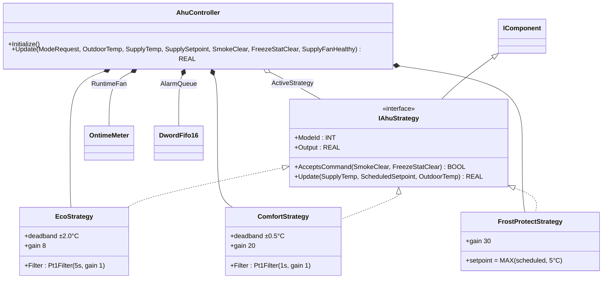
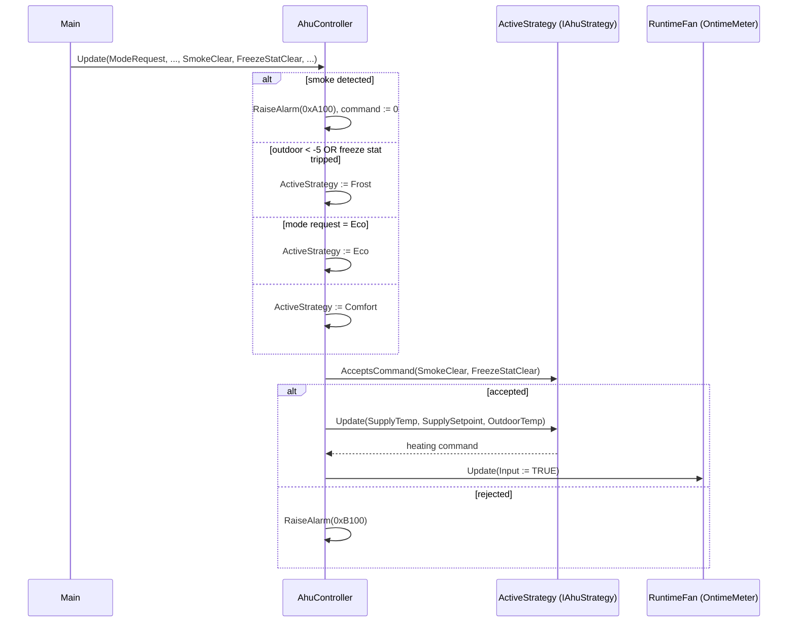

# HVAC Air Handling Unit — Strategy

A penthouse AHU heats and cools an office floor with three operating
modes: Eco (energy-priority, wide deadband), Comfort (tight setpoint,
fast response), and FrostProtect (overrides the schedule to keep supply
≥ 5°C). The OOP version separates "what does this mode do" (per-strategy
tuning, deadband, override behavior) from "how does the AHU run" (smoke
and freeze safety, permissives, mode arbitration, alarm handling).

## When classic is the right answer

The procedural version is `non-oop/src/Main.st` (87 lines). Use it when:

- The AHU has one fixed operating mode that never changes.
- Two modes that differ only by setpoint or single-parameter tuning — use
  a parameter, not a strategy.
- No future overlay modes (no boost, no demand-response, no
  night-purge planned).

The OOP version costs about 5× the lines. It earns that cost when modes
genuinely differ in behavior (filter time constant, deadband, gain,
override authority) and when adding a new mode must not require rewiring
the safety chain.

## Where classic strains

`AhuClassic.Update` (lines 20-65 of `non-oop/src/Main.st`) inlines all
three modes inside one `IF/ELSIF` ladder: each mode owns a `Pt1Filter`
field declared at FB scope (`EcoFilter`, `ComfortFilter`), and each
branch sets `ActiveModeValue`, computes `Filtered`, computes `Error`, and
applies its own deadband and gain. Adding a Boost mode for meeting rooms
means adding another filter field, another `ELSIF`, and another
deadband/gain block in line with the existing ones. Adding
demand-response capping means editing every `ELSIF` to clamp the output.
By the third or fourth mode the central `Update` is the longest method
in the project and every safety change touches every mode.

## Structure



`Pt1Filter`, `OntimeMeter`, `DwordFifo16`, and the `IComponent` lifecycle
contract come from the OSCAT OOP library. The three strategies and
`AhuController` are defined in this example.

## What happens at runtime



## The keystone

```st
(* Smoke is the hard-stop and short-circuits before strategy selection *)
IF NOT SmokeClear THEN
    RaiseAlarm(Code := DWORD#16#A100);
    HeatingCommandValue := REAL#0.0;
ELSE
    (* Selection: cold weather forces Frost; otherwise mode request picks *)
    IF (OutdoorTemp < REAL#-5.0) OR NOT FreezeStatClear THEN
        ActiveStrategy := Frost;
    ELSIF ModeRequest = INT#1 THEN
        ActiveStrategy := Eco;
    ELSE
        ActiveStrategy := Comfort;
    END_IF;
    (* One unified call site through the interface *)
    ActiveModeValue := ActiveStrategy.ModeId;
    HeatingCommandValue := ActiveStrategy.Update(SupplyTemp := SupplyTemp,
        ScheduledSetpoint := SupplySetpoint, OutdoorTemp := OutdoorTemp);
END_IF;
```

The selection IF is one screen tall and only picks. Each strategy owns
its own filter, deadband, gain, and override rules. Adding a Boost mode
is a new FB implementing `IAhuStrategy` plus one new `ELSIF` arm. The
safety chain (smoke and freeze checks, fan-health permissive,
`AcceptsCommand` veto) is unchanged.

## Patterns used

- [Strategy](../../../docs/guides/oop-concepts-in-st.md#strategy)

ST mechanics used:

- [Interface](../../../docs/guides/oop-concepts-in-st.md#interface) and
  [IMPLEMENTS](../../../docs/guides/oop-concepts-in-st.md#implements)
- [Polymorphism](../../../docs/guides/oop-concepts-in-st.md#polymorphism)
- [Composition](../../../docs/guides/oop-concepts-in-st.md#composition)

## What this demo doesn't show

- **Filter ΔP, CO₂, and BMS schedule.** A real AHU has supply/exhaust
  filter pressure-drop alarms, CO₂ supervision, and BMS-driven schedule.
  This demo wires the smoke detector, freeze stat, and fan-health
  permissive only. There is no schedule strategy or holiday handling
  inside the AHU controller.
- **Cooling and damper outputs.** Only one analog output (`HeatingValveRaw`
  on `%QW0`) is bound. A complete AHU exposes cooling valve, mixing
  damper, and supply/exhaust VFD references.
- **Multiple alarm classes.** `AhuController.RaiseAlarm` pushes one alarm
  code into `AlarmQueue` and sets one `AlarmActive` flag. There is no
  Class A/B/C separation, no alarm acknowledgment, no escalation. For a
  full alarm-bus model see `boiler_room_heating_plant/oop`.
- **Mode-change rate limiting.** Real AHUs gate mode changes through a
  `CycleTimeMeter` to avoid actuator hunting. The library has
  `CycleTimeMeter` but this demo does not exercise it.

## When NOT to use this

- One AHU with one fixed operating mode for the lifetime of the building.
- Two modes that differ only in setpoint magnitude with identical
  dynamics — pass setpoint as a parameter.
- Greenfield BMS where every site is identical and modes are not
  expected to evolve.

## Integration map

| Tag | Address | Direction |
| --- | --- | --- |
| `Ahu.ModeRequest` | `%IW0` | IN |
| `Ahu.OutdoorTempRaw` | `%IW2` | IN |
| `Ahu.SupplyTempRaw` | `%IW4` | IN |
| `Ahu.SmokeClear` | `%IX0.0` | IN |
| `Ahu.FreezeStatClear` | `%IX0.1` | IN |
| `Ahu.SupplyFanHealthy` | `%IX0.2` | IN |
| `Ahu.HeatingValveRaw` | `%QW0` | OUT |
| `Ahu.SupplyFanEnable` | `%QX0.0` | OUT |
| `Ahu.FireAlarmRelay` | `%QX0.1` | OUT |

Comms (from `oop/io.toml`): `modbus-tcp` (slave 7 on `127.0.0.1:1503`),
`mqtt` (broker `127.0.0.1:1883`, topics `building/floor07/ahu/cmd` in,
`building/floor07/ahu/snapshot` out). Safe-state forces
`Ahu.SupplyFanEnable := FALSE` on driver fault.

OPC UA exposed records (from `oop/runtime.toml`, namespace
`urn:trust:examples:ahu`): `Ahu.State`, `Ahu.ActiveMode`,
`Ahu.HeatingCommand`, `Ahu.AlarmActive`.

## Run

```bash
trust-runtime test --project examples/OSCAT/hvac_air_handling_unit/non-oop
trust-runtime test --project examples/OSCAT/hvac_air_handling_unit/oop
```

---

## Folder Layout

This paired example contains:

- `non-oop/` — the classic Structured Text project.
- `oop/` — the OSCAT OOP Structured Text project.

## What This Example Teaches

OOP pattern: Strategy. The OOP version moves decisions behind named
function-block instances and an interface contract; the non-oop version
inlines those decisions in procedural ST.

## How The Pair Teaches OOP

The teaching content above walks through the same machine in both
projects: where classic strains, the structural diagram of the OOP
version, the keystone snippet, and the integration map. Run the pair
side-by-side and read `non-oop/src/Main.st` first.
