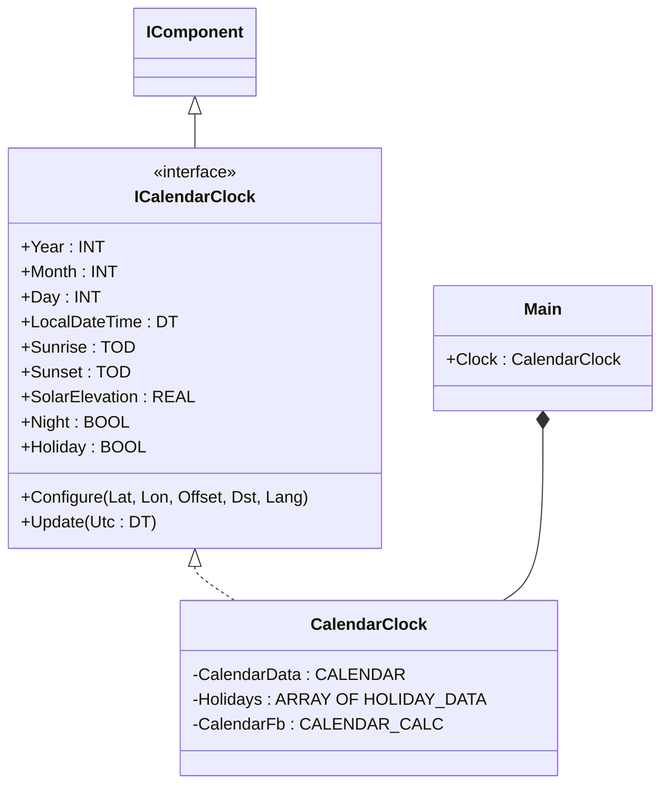
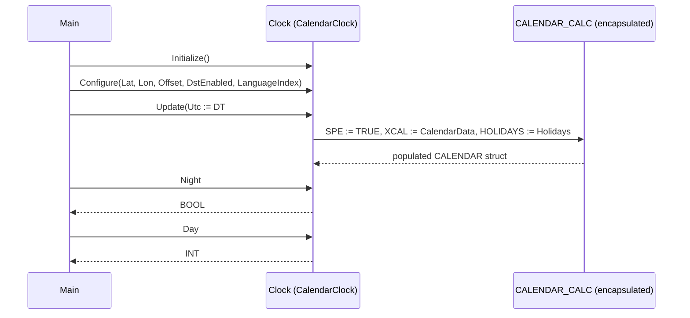

# Irrigation Sun Clock — Component Composition

A drip-irrigation system for a Stockholm rooftop garden waters only at
night, when evaporation losses are smallest. The scan must convert UTC
to local civil time (with DST), compute solar elevation for the
location, and decide whether the sun is below the horizon. The OOP
version wraps the OSCAT `CALENDAR_CALC` machinery in `CalendarClock`,
which exposes those derived quantities (`Night`, `LocalDateTime`,
`Sunrise`, `Sunset`, `SolarElevation`, …) as named properties instead
of leaving them inside an externally-mutated struct.

## When classic is the right answer

The procedural version is `non-oop/src/Main.st` (21 lines). Use it when:

- The plant has one fixed location (latitude/longitude/timezone never
  change) and one fixed schedule (always "water at night").
- The CALENDAR struct is local and never read from elsewhere — there
  is no HMI or telemetry consumer of `LocalDateTime` or `Sunrise`.
- Configuration is hard-coded in `Main` and never re-applied at
  runtime.
- No second clock instance is needed (no separate location for a
  rooftop and a courtyard plot).

The OOP version costs roughly 1× the lines but earns its cost as soon
as a second consumer of the same calendar data appears. The classic
struct-mutation pattern (`CalendarCalculator(... XCAL := CalendarData,
HOLIDAYS := Holidays)` and then read fields from `CalendarData`)
forces every consumer to reach into the struct, while the OOP version
exposes one named property per concern.

## Where classic strains

`non-oop/src/Main.st` (21 lines) declares `CalendarData : CALENDAR`,
`Holidays : ARRAY[0..29] OF HOLIDAY_DATA`, and `CalendarCalculator :
CALENDAR_CALC` at scope, then calls the FB by mutating
`CalendarData.UTC` before the call and reading the populated fields
afterwards. The pattern works but it relies on convention: callers
must know which fields are inputs (`UTC`, `LATITUDE`, `LONGITUDE`,
`OFFSET`, `DST_EN`, `LANGUAGE`) and which become outputs (`YEAR`,
`MONTH`, `DAY`, `LOCAL_DT`, `NIGHT`, …). Adding a second site means
duplicating the struct and the FB call. Adding telemetry that exposes
`Sunrise` to MQTT means a consumer reaches into `CalendarData` from
outside the call site. By the second site or the second consumer the
calendar struct has become a shared mutable state with no clear owner.

## Structure



`CalendarClock`, `CALENDAR`, `CALENDAR_CALC`, `HOLIDAY_DATA`, and the
`IComponent` lifecycle contract come from the OSCAT library. This
example defines no FBs of its own; it shows the call sequence and how
the wrapper hides the calendar struct.

## What happens at runtime



## The keystone

```st
(* Configure once, update every scan, read derived properties polymorphically *)
Clock.Initialize();
Clock.Configure(
    LocationLatitude := REAL#59.3293,
    LocationLongitude := REAL#18.0686,
    OffsetMinutes := INT#60,
    DstEnabled := TRUE,
    LanguageIndex := INT#1
);
Clock.Update(Utc := DT#2026-07-01-02:00:00);
WateringAllowed := Clock.Night;
LocalDay := Clock.Day;
```

The wrapper hides the `CALENDAR` struct, the `HOLIDAYS` array, and the
`SPE := TRUE` invocation contract of `CALENDAR_CALC`. Adding a second
site is one new `CalendarClock` instance with its own `Configure` —
not a duplicated struct.

## Patterns used

- [Composition (the underlying mechanism)](../../../docs/guides/oop-concepts-in-st.md#composition)

ST mechanics used:

- [Interface](../../../docs/guides/oop-concepts-in-st.md#interface) and
  [IMPLEMENTS](../../../docs/guides/oop-concepts-in-st.md#implements)
- [Composition](../../../docs/guides/oop-concepts-in-st.md#composition)
- [Properties](../../../docs/guides/oop-concepts-in-st.md#properties)

## What this demo doesn't show

- **Multiple sites.** This showcase has one Stockholm location. A
  multi-site irrigation network would instantiate one `CalendarClock`
  per location.
- **Holiday calendar.** The holiday array is empty. A real installation
  would load regional holidays so the schedule can pause on those days.
- **Watering schedule object.** `WateringAllowed` is `Clock.Night`
  directly — there is no `IrrigationSchedule` FB that combines night,
  holiday, and weather. Adding that wrapper is the natural next step.
- **Sun-driven shading or fertigation.** `Sunrise`, `Sunset`, and
  `SolarElevation` are computed but not consumed. A real garden may
  use them to drive shade nets or fertigation timers.
- **DST-edge regression.** The classic and OOP versions agree on the
  current sample but the demo does not exercise the DST changeover
  (last Sunday of March/October in CET).

## When NOT to use this

- A single-site, single-purpose timer where the schedule never reads
  solar geometry — a `TON` and a `TOD` literal are shorter.
- A controller that runs without DST or location data (a heating cycle
  on UTC time only) — the classic `CALENDAR_CALC` is overkill, the
  wrapper doubly so.
- A program in which holidays and sun geometry already live in an
  external scheduler service — the wrapper would duplicate state.

## Why this is a showcase

The compact showcase is intentionally minimal. There is no
multi-zone schedule, no weather override, no actuator drive, no MQTT
publication. Date-times are local literals so the ST tests exercise
the calendar wrapper without external time sources.

For composition combined with patterns inside a real-world plant, see
`boiler_room_heating_plant/oop` (full alarm-bus model) or
`cold_storage_plant/oop` (multi-room composite tree).

## Run

```bash
trust-runtime test --project examples/OSCAT/irrigation_sun_clock/non-oop
trust-runtime test --project examples/OSCAT/irrigation_sun_clock/oop
```

---

## Folder Layout

This paired example contains:

- `non-oop/` — the classic Structured Text project.
- `oop/` — the OSCAT OOP Structured Text project.

## What This Example Teaches

OOP pattern: Component Composition (compact showcase). The OOP version
moves decisions behind named function-block instances and exposes
derived values as properties; the non-oop version inlines those
decisions in procedural ST and shares a mutable `CALENDAR` struct.

## How The Pair Teaches OOP

The teaching content above walks through the same machine in both
projects: where classic strains, the structural diagram of the OOP
version, the keystone snippet, and the call sequence. Run the pair
side-by-side and read `non-oop/src/Main.st` first.
