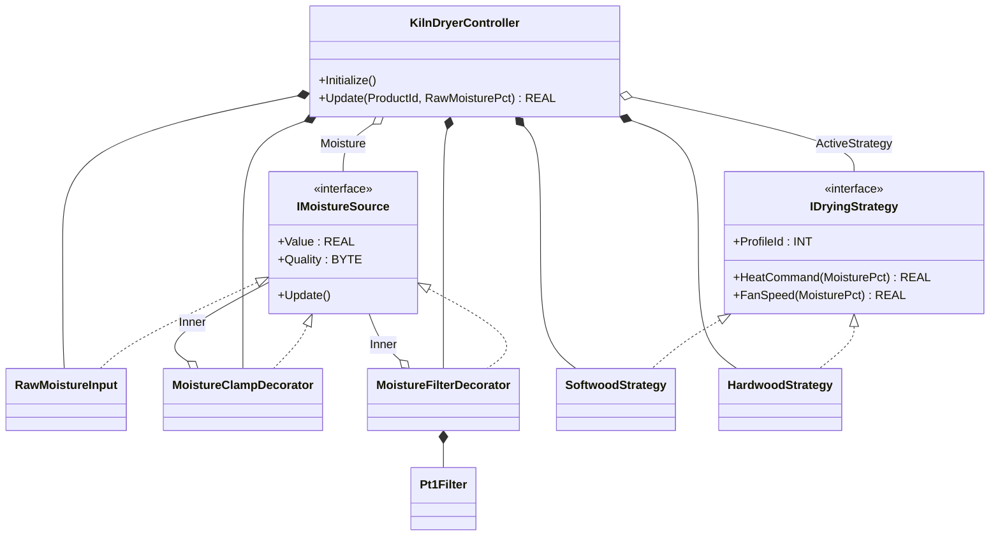
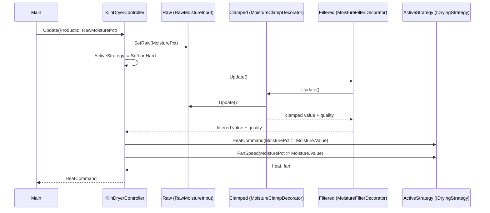

# Kiln Dryer — Decorator + Strategy

A wood kiln dries softwood and hardwood batches with two recipes that
differ in target moisture, heat curve, and fan setpoint. The moisture
sensor is noisy and occasionally reports out-of-range values that must
be clamped before the controller acts on them. The OOP version layers
two patterns: `Decorator` builds the moisture-conditioning pipeline as
named wrappers around a single `IMoistureSource`, and `Strategy` puts
each product recipe behind `IDryingStrategy`. The kiln controller
reads from one source and dispatches to one strategy; both can be
swapped without touching it.

## When classic is the right answer

The procedural version is `non-oop/src/Main.st` (52 lines). Use it when:

- The kiln dries one fixed product family (one heat curve, one fan
  setpoint) for the lifetime of the asset.
- The moisture sensor is trusted (calibrated, low-noise, no out-of-band
  reading is physically possible).
- No second consumer wants the conditioned moisture (no historian, no
  HMI trend, no alarm rule).
- Recipe variants are not expected — softwood and hardwood are not
  both produced on the same line.

The OOP version costs about 5× the lines. It earns that cost when
sensor conditioning is reused (PID, alarm, historian, SCADA all see
the same conditioned signal) and when product families differ in heat
curve, fan setpoint, or target moisture in a way that a plain
parameter cannot capture.

## Where classic strains

`ClassicKilnDryer.Update` (lines 7-34 of `non-oop/src/Main.st`) inlines
the clamp + quality flag and the per-product heat-curve formula in one
method. Adding PT1 filtering to reject sensor noise means a new
`Pt1Filter` field at FB scope and an `IF Quality = good` gate inside
`Update` — and remembering to do that on every consumer that reads
`Moisture`. Adding a third product (engineered panels) means a third
`ELSIF` arm with its own clamp curve, target moisture, and fan
setpoint. By the third recipe the central method has duplicated the
clamp logic and the per-product math.

## Structure



`Pt1Filter` comes from the OSCAT OOP library. The two interfaces, the
two decorators, the two strategies, and `KilnDryerController` are
defined in this example.

## What happens at runtime



## The keystone

```st
(* Decorators are wired once in Initialize; each Update walks the chain *)
Clamped.Wrap(Source := Raw);
Filtered.Wrap(Source := Clamped);
Moisture := Filtered;
ActiveStrategy := Softwood;
(* ... in Update ... *)
Raw.SetRaw(MoisturePct := RawMoisturePct);
IF ProductId = INT#2 THEN ActiveStrategy := Hardwood; ELSE ActiveStrategy := Softwood; END_IF;
Moisture.Update();
HeatCommandValue := ActiveStrategy.HeatCommand(MoisturePct := Moisture.Value);
FanSpeedValue := ActiveStrategy.FanSpeed(MoisturePct := Moisture.Value);
```

`Moisture.Update()` walks the chain: `Filtered` calls `Clamped` calls
`Raw`. Adding a third conditioning step (e.g., `MoistureSpikeReject`)
is a new FB implementing `IMoistureSource` plus one line in
`Initialize` to wrap it around the existing chain. Adding a third
product is a new FB implementing `IDryingStrategy` plus one new branch
in the strategy selection. The controller is unchanged either way.

## Patterns used

- [Decorator](../../../docs/guides/oop-concepts-in-st.md#decorator)
- [Strategy](../../../docs/guides/oop-concepts-in-st.md#strategy)

ST mechanics used:

- [Interface](../../../docs/guides/oop-concepts-in-st.md#interface) and
  [IMPLEMENTS](../../../docs/guides/oop-concepts-in-st.md#implements)
- [Polymorphism](../../../docs/guides/oop-concepts-in-st.md#polymorphism)
- [Composition](../../../docs/guides/oop-concepts-in-st.md#composition)

## What this demo doesn't show

- **Sensor diagnostics.** `Quality` is one of two values (good/bad);
  there is no per-decorator status code, no spike rejection counter,
  no calibration drift detection.
- **Product-specific timeouts.** Strategies decide the heat curve and
  fan speed; they do not own a "max dry time" before the batch fails.
- **Multi-zone kiln.** This demo treats the kiln as a single conditioned
  zone. A real kiln has supply, return, and ambient sensors with their
  own decorators.
- **Recipe loading.** Strategies are hard-coded; a production kiln
  loads heat curves from a recipe table or downloads them from MES.
- **Trim / boost overlays.** The strategy returns a single heat
  command. A real kiln may overlay a trim from a downstream PID or a
  demand-response cap.

## When NOT to use this

- One product, one trusted sensor, one fan speed for the lifetime of
  the asset — the procedural version is shorter.
- Sensor conditioning is owned by a separate signal-engineering
  service that already publishes filtered values — wrapping again
  duplicates work.
- A controller whose only product variation is a single setpoint —
  pass the setpoint as a parameter, do not introduce a strategy.

## Integration map

| Tag | Address | Direction |
| --- | --- | --- |
| `Dryer.ProductId` | `%IW0` | IN |
| `Dryer.MoistureRaw` | `%IW2` | IN |
| `Dryer.HeatCommandRaw` | `%QW0` | OUT |
| `Dryer.FanSpeedRaw` | `%QW2` | OUT |

Comms (from `oop/io.toml`): `modbus-tcp` (slave 180 on
`127.0.0.1:1513`, `timeout_ms = 500`), `mqtt` (broker
`127.0.0.1:1883`, topics `kiln/dryer/01/cmd` in,
`kiln/dryer/01/snapshot` out).

OPC UA exposed records (from `oop/runtime.toml`, namespace
`urn:trust:examples:kiln-dryer-decorator-strategy`):
`Dryer.ActiveProfileId`, `Dryer.HeatCommand`,
`Dryer.ConditionedMoisture`.

## Run

```bash
trust-runtime test --project examples/OSCAT/kiln_dryer_decorator_strategy/non-oop
trust-runtime test --project examples/OSCAT/kiln_dryer_decorator_strategy/oop
```

---

## Folder Layout

This paired example contains:

- `non-oop/` — the classic Structured Text project.
- `oop/` — the OSCAT OOP Structured Text project.

## What This Example Teaches

OOP pattern: Decorator + Strategy. The OOP version moves decisions
behind named function-block instances and an interface contract; the
non-oop version inlines those decisions in procedural ST.

## How The Pair Teaches OOP

The teaching content above walks through the same machine in both
projects: where classic strains, the structural diagram of the OOP
version, the keystone snippet, and the integration map. Run the pair
side-by-side and read `non-oop/src/Main.st` first.
