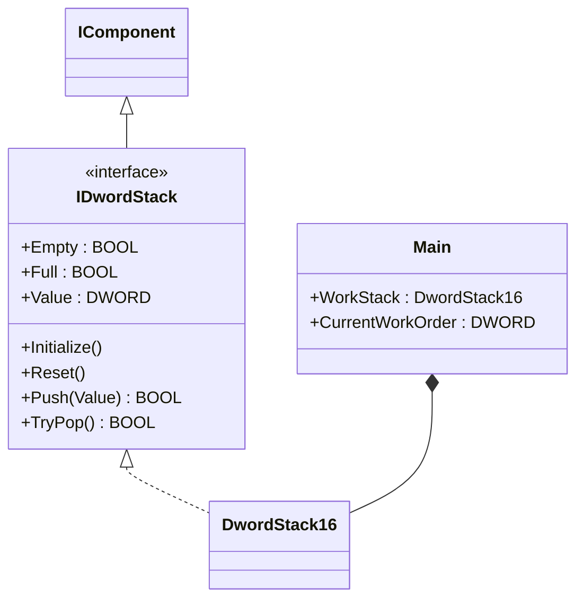
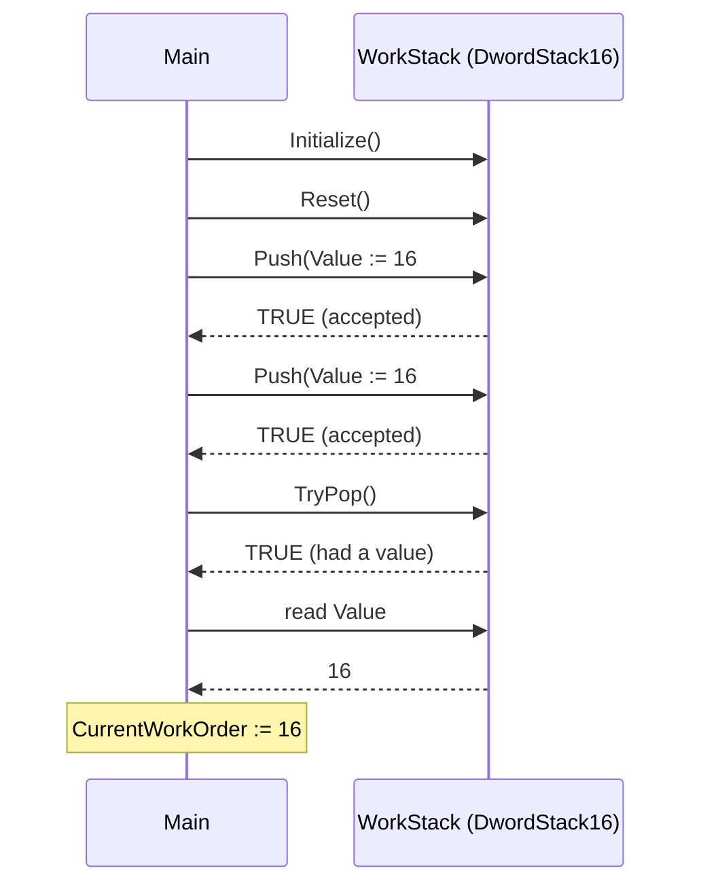

# Maintenance Work-Order Stack — Component Composition

A maintenance team logs work orders as they come in and services the most
recent open task first (LIFO). The OOP version uses an `IDwordStack`
interface backed by `DwordStack16`; application code talks to a small,
named component surface (`Push`, `TryPop`, `Empty`, `Value`) instead of
juggling pulse-style stack inputs.

## When classic is the right answer

The procedural version is `non-oop/src/Main.st` (12 lines). Use it when:

- The plant only has a single latched service flag (one work order at a
  time, never queued).
- The work-order list never grows past two or three items and the
  application never needs to ask "is the queue empty?".
- The maintenance step is a one-off — push, then immediately pop,
  inside the same procedural ladder.

The OOP version costs about 1.5× the lines. It earns that cost when work
orders start being inspected (`Empty`, `Value`) outside the original
ladder, when more than one stack is needed (per area, per shift), or
when the storage is later swapped for a FIFO without rewriting the
callers.

## Where classic strains

`non-oop/src/Main.st` (lines 7-9) drives the OSCAT `STACK_16` block by
toggling the four pulse-style inputs `DIN`, `E`, `RD`, `WD`, `RST` on
each invocation, then reads `DOUT` immediately afterward. Pushing two
work orders and popping one needs three FB calls, each with five named
arguments, before the application can even ask whether the stack still
has anything in it. Adding `Empty` or `Full` checks to the ladder means
threading more pulses through the same call site; reordering the push
and pop is a matter of editing the boolean inputs in the right
sequence. By the second or third revision the call site reads as
"toggle pulses and hope the order is right" rather than as "push then
pop".

## Structure



`IDwordStack` and `DwordStack16` come from the OSCAT OOP library
(`libraries/oscat/oop/src/memory.st`). The example itself contains only
the `Main` program that wires the component into a maintenance flow —
the teaching value lives in the call shape, not in any new FB.

## What happens at runtime



## The keystone

```st
(* Application code reads as named operations, not pulses *)
WorkStack.Initialize();
WorkStack.Reset();
IF WorkStack.Push(Value := DWORD#16#2001) THEN
END_IF;
IF WorkStack.Push(Value := DWORD#16#2002) THEN
END_IF;
IF WorkStack.TryPop() THEN
    CurrentWorkOrder := WorkStack.Value;
END_IF;
```

`Push` returns `BOOL` so a full stack is observable at the call site
instead of silently dropping the value. `TryPop` returns `BOOL` so an
empty stack does not mean "Value contains stale garbage" — the caller
gates the read. Swapping `DwordStack16` for a future `DwordFifo16`
means changing the variable type and one call (`TryPop` -> `TryPop`,
LIFO -> FIFO); the surrounding maintenance logic is unchanged.

## Patterns used

- [Component Composition](../../../docs/guides/oop-concepts-in-st.md#composition)

ST mechanics used:

- [Interface](../../../docs/guides/oop-concepts-in-st.md#interface) and
  [IMPLEMENTS](../../../docs/guides/oop-concepts-in-st.md#implements)
- [Polymorphism](../../../docs/guides/oop-concepts-in-st.md#polymorphism)
- [Composition](../../../docs/guides/oop-concepts-in-st.md#composition)

## What this demo doesn't show

- **Work-order metadata.** `DwordStack16` carries one DWORD per slot; a
  real CMMS system would carry asset id, severity, due date, and
  technician. The shape supports a sibling stack of indices into a
  parallel record array; this demo doesn't exercise it.
- **Persistence.** The stack is volatile RAM. A real maintenance queue
  must survive a controller restart. `runtime.toml` declares
  `retain.mode = "none"`; the contract for retain-bound queues is shown
  in `production_queue/oop`.
- **Multi-stack arbitration.** This demo has one `WorkStack`. A real
  plant has per-area, per-shift, or per-priority stacks and a small
  controller that picks which one to service first.
- **Push/pop logging.** Operations leave no audit trail. For audit
  patterns see `chemical_dosing_command/oop` (Command + audit FIFO).

## When NOT to use this

- A single latched maintenance flag (one work order, never queued) —
  a `BOOL` is shorter.
- Two known fixed work orders processed in a fixed order — write the
  two service calls inline, no stack needed.
- A FIFO model (oldest first) — pick `DwordFifo16` instead of
  `DwordStack16`; the stack shape is wrong for that use case.

## Integration map

This compact showcase has no `io.toml` — process values are local
variables in `src/Main.st`. There is no Modbus, MQTT, or OPC UA binding.

`oop/runtime.toml` configures the runtime control endpoint and log
level only: `cycle_interval_ms = 100`, `retain.mode = "none"`,
`watchdog.enabled = false`, `fault.policy = "halt"`.

## Run

```bash
trust-runtime test --project examples/OSCAT/maintenance_stack/non-oop
trust-runtime test --project examples/OSCAT/maintenance_stack/oop
```

---

## Folder Layout

This paired example contains:

- `non-oop/` — the classic Structured Text project.
- `oop/` — the OSCAT OOP Structured Text project.

## What This Example Teaches

OOP pattern: Component Composition. The OOP version moves decisions
behind named function-block instances and an interface contract; the
non-oop version inlines those decisions in procedural ST.

## How The Pair Teaches OOP

The teaching content above walks through the same machine in both
projects: where classic strains, the structural diagram of the OOP
version, the keystone snippet, and the integration map. Run the pair
side-by-side and read `non-oop/src/Main.st` first.
