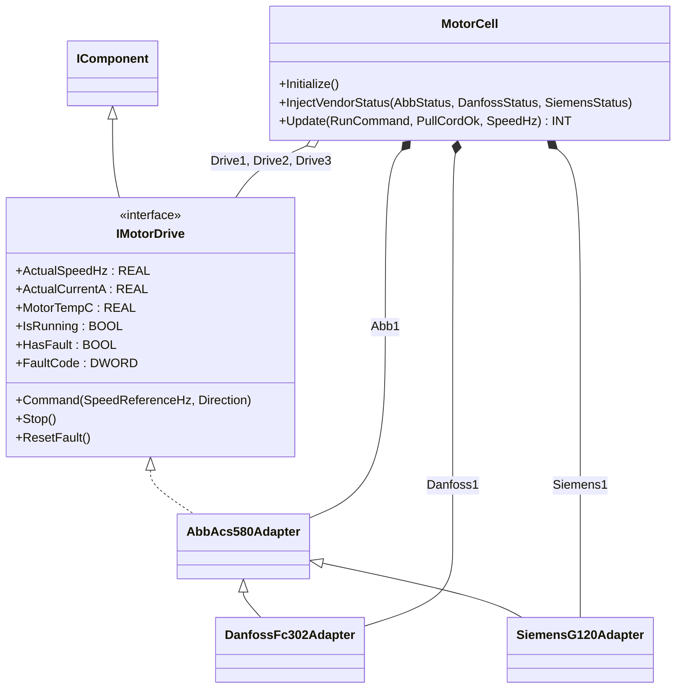
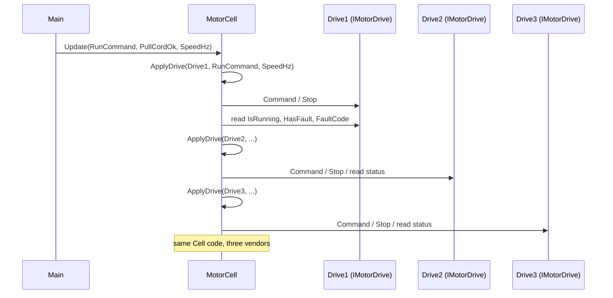

# Mixed-Vendor VFD Motor Cell — Adapter

A conveyor motor cell drives three motors from three different VFD
families: ABB ACS580, Danfoss FC-302, and Siemens G120. Each vendor's
Modbus status word uses different bits for "running" and "faulted" and
different fault-code numbering. The OOP version pushes all vendor
bit-decoding behind one interface; the application code never sees a
vendor name.

## When classic is the right answer

The procedural version is `non-oop/src/Main.st` (64 lines). Use it when:

- The plant standardizes on a single VFD family for the lifetime of the
  machine.
- Vendor replacement is not expected (small embedded skid, fixed BOM).
- Fault codes never need to be normalized across vendors.

The OOP version costs about 5× the lines. It earns that cost when a real
multi-vendor installed base or future drive replacement makes vendor
isolation worthwhile.

## Where classic strains

`ClassicMotorCell.Update` (lines 8-43 of `non-oop/src/Main.st`) decodes
all three vendors inline: six bit-AND tests with three different masks
(`0x0004` and `0x0008` for ABB, `0x0100` and `0x0002` for Danfoss,
`0x0400` and `0x0008` for Siemens), three different fault-code constants
(`0x10000011`, `0x20000022`, `0x30000033`). Replacing a Danfoss with a
fourth ABB means editing the application FB, deleting the Danfoss block,
and adjusting the constant table. Adding a fault-source supervisor
duplicates the bit decoding inside another FB. By the third or fourth
vendor change the procedural cell is unmaintainable; vendor knowledge has
leaked everywhere.

## Structure



`AbbAcs580Adapter` is the base. `DanfossFc302Adapter` and
`SiemensG120Adapter` extend it and override `ConfigureRaw` (different
status-word bit layout) and `FaultCode` (different fault-code namespace
prefix). All three implement `IMotorDrive` via the base class. `MotorCell`
holds three concrete adapter instances and assigns each into a
`Drive1`/`Drive2`/`Drive3` slot of type `IMotorDrive`.

## What happens at runtime



## The keystone

```st
(* MotorCell.ApplyDrive — vendor-neutral, called once per drive *)
IF RunCommand THEN
    Drive.Command(SpeedReferenceHz := SpeedHz, Direction := INT#1);
ELSE
    Drive.Stop();
END_IF;
IF Drive.IsRunning THEN
    RunningCountValue := RunningCountValue + INT#1;
END_IF;
IF Drive.HasFault THEN
    FaultCountValue := FaultCountValue + INT#1;
    LastFaultCodeValue := Drive.FaultCode;
END_IF;
```

`Drive` is `IMotorDrive`. The same nine lines run against the ABB, the
Danfoss, and the Siemens. The vendor bit-decoding lives only inside each
adapter's `ConfigureRaw`. Replacing a Danfoss with a fourth ABB means
swapping `Drive2 := Danfoss1;` for `Drive2 := AnotherAbb;` — no edit to
`ApplyDrive`, no edit to the application logic.

## Patterns used

- [Adapter](../../../docs/guides/oop-concepts-in-st.md#adapter)

ST mechanics used:

- [Interface](../../../docs/guides/oop-concepts-in-st.md#interface) and
  [IMPLEMENTS](../../../docs/guides/oop-concepts-in-st.md#implements)
- [Polymorphism](../../../docs/guides/oop-concepts-in-st.md#polymorphism)
- [Inheritance](../../../docs/guides/oop-concepts-in-st.md#inheritance)
  (used here so that `DanfossFc302Adapter` and `SiemensG120Adapter` can
  reuse the ABB base's IMotorDrive plumbing and override only what
  differs)
- [Composition](../../../docs/guides/oop-concepts-in-st.md#composition)

## What this demo doesn't show

- **Real Modbus polling.** The example uses `InjectVendorStatus` to feed
  the three status words synthetically for testing. Production code would
  bind each vendor's Modbus registers to the adapter's status word via
  `io.toml` and `Configuration.st` (the IO drivers are configured but the
  per-vendor status registers are not bound to the adapters in this
  demo).
- **Fault-code translation tables.** Each adapter's `FaultCode` getter
  prefixes the raw word with a vendor-namespace nibble
  (`0x1000_____`, `0x2000_____`, `0x3000_____`). Real adapters would map
  vendor codes to a normalized application code via a lookup table; this
  demo passes the raw word through.
- **Six motors, two segments.** The catalog claim mentions "six conveyor
  motors on two Modbus segments." This demo uses three motors (one per
  vendor) on a single cell. `io.toml` declares two Modbus RTU segments
  but only one is actively wired in the demo.

## When NOT to use this

- Single-vendor plant where the BOM is fixed for the machine's lifetime.
- Two motors that will never be swapped, with identical status-word
  semantics.
- Greenfield project where one VFD family covers all use cases — pick the
  vendor's native FB and skip the adapter layer.

## Integration map

| Tag | Address | Direction |
| --- | --- | --- |
| `Cell.RunCommand` | `%IX0.0` | IN |
| `Cell.PullCordOk` | `%IX0.1` | IN |
| `Cell.SpeedSetpointRaw` | `%IW0` | IN |
| `Cell.AnyFaultOut` | `%QX0.0` | OUT |

Comms (from `oop/io.toml`): two `modbus-rtu` segments
(`loop://mixed-vfd-segment-a` slave 61, `loop://mixed-vfd-segment-b`
slave 62, both 19200/even), `mqtt` (broker `127.0.0.1:1883`, topics
`conveyor/motorcell/cmd` in, `conveyor/motorcell/status` out).

OPC UA exposed records (from `oop/runtime.toml`, namespace
`urn:trust:examples:mixed-vendor-vfd-adapter`): `Cell.RunningCount`,
`Cell.FaultCount`, `Cell.LastFaultCode`.

## Run

```bash
trust-runtime test --project examples/OSCAT/mixed_vendor_vfd_adapter/non-oop
trust-runtime test --project examples/OSCAT/mixed_vendor_vfd_adapter/oop
```

---

## Folder Layout

This paired example contains:

- `non-oop/` — the classic Structured Text project.
- `oop/` — the OSCAT OOP Structured Text project.

## What This Example Teaches

OOP pattern: Adapter. The OOP version moves decisions behind named
function-block instances and an interface contract; the non-oop version
inlines those decisions in procedural ST.

## How The Pair Teaches OOP

The teaching content above walks through the same machine in both
projects: where classic strains, the structural diagram of the OOP
version, the keystone snippet, and the integration map. Run the pair
side-by-side and read `non-oop/src/Main.st` first.
