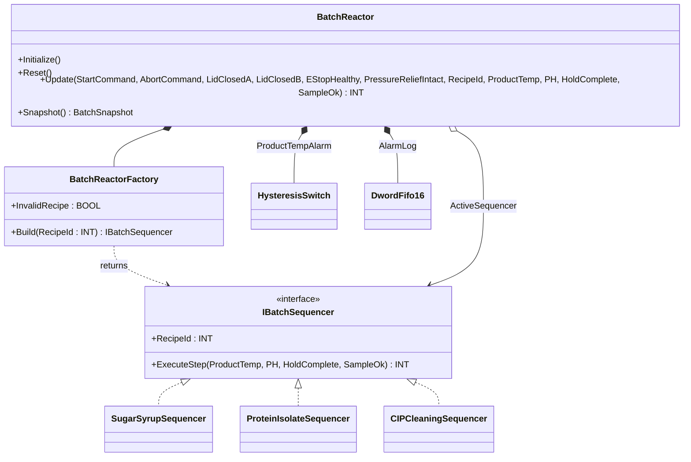
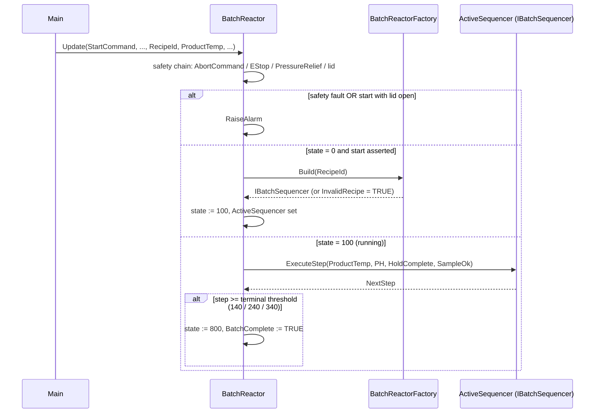

# Multi-Product Batch Reactor — Factory + Strategy

A small batch reactor produces three different products on the same
vessel: SugarSyrup, ProteinIsolate, and CIPCleaning. Each recipe has
its own preheat target, hold time, pH window, and sample acceptance
rule. The OOP version uses a `BatchReactorFactory` to pick the right
sequencer for the recipe id and runs that sequencer through a single
state machine. The reactor controller never knows which recipe is
active — it just calls `Build` and dispatches.

## When classic is the right answer

The procedural version is `non-oop/src/Main.st` (167 lines). Use it when:

- One product, one recipe — no need for a factory.
- Recipes are known at design time and never grow.
- All recipes share identical step transitions and only differ by
  setpoint magnitude (use a parameter, not a strategy).

The OOP version costs about 4× the lines. It earns that cost when
recipes truly differ in behavior (different state transitions, different
sample rules, different fault handling) and the recipe set is expected
to grow.

## Where classic strains

`non-oop/src/Main.st` (167 lines) interleaves the three recipes inside
one `CASE OF StateValue` body: every state has nested `IF
RecipeId = INT#1 THEN ... ELSIF RecipeId = INT#2 THEN ...`. Adding a
fourth product means inserting a new `ELSIF` arm in every state. Adding
a state-specific guard for one recipe (e.g. extra hold for cream)
means rewriting the same state for the others to make sure their guards
still work. By the third recipe the file reads more like a recipe
matrix than a state machine.

## Structure



`HysteresisSwitch`, `DwordFifo16`, and the `IComponent` lifecycle
contract come from the OSCAT OOP library. The interface, three
sequencers, factory, and reactor controller are defined in this example.

## What happens at runtime



## The keystone

```st
(* Safety + start permissive checked first; one factory call picks the recipe. *)
IF AbortCommand OR NOT EStopHealthy OR NOT PressureReliefIntact THEN
    RaiseAlarm(Code := DWORD#16#A001);
ELSIF NOT (LidClosedA AND LidClosedB) AND (StateValue <> INT#0 OR StartCommand) THEN
    RaiseAlarm(Code := DWORD#16#A002);
ELSE
    CASE StateValue OF
        INT#0:
            IF StartCommand AND LidClosedA AND LidClosedB AND EStopHealthy AND PressureReliefIntact THEN
                ActiveSequencer := Factory.Build(RecipeId := RecipeId);
                IF Factory.InvalidRecipe THEN
                    RaiseAlarm(Code := DWORD#16#B001);
                ELSE
                    RecipeIdValue := RecipeId;
                    StateValue := INT#100;
                END_IF;
            END_IF;
        INT#100:
            StepValue := ActiveSequencer.ExecuteStep(...);
            ...
```

Adding a fourth recipe is one new `FUNCTION_BLOCK
NewProductSequencer IMPLEMENTS IBatchSequencer` plus one factory arm
that returns it. The reactor's safety chain, lid interlock, alarm
codes, and snapshot data are unchanged.

## Patterns used

- [Factory](../../../docs/guides/oop-concepts-in-st.md#factory)
- [Strategy](../../../docs/guides/oop-concepts-in-st.md#strategy)

ST mechanics used:

- [Interface](../../../docs/guides/oop-concepts-in-st.md#interface) and
  [IMPLEMENTS](../../../docs/guides/oop-concepts-in-st.md#implements)
- [Polymorphism](../../../docs/guides/oop-concepts-in-st.md#polymorphism)
- [Composition](../../../docs/guides/oop-concepts-in-st.md#composition)

## What this demo doesn't show

- **Recipe persistence.** Recipes are hard-coded as concrete FBs.
  Production stores recipes in a database/file and loads parameters
  at startup; the factory shape supports it but the demo doesn't.
- **Bumpless recipe switch.** The reactor must transition through
  state 800 before another recipe can start. Some plants allow on-the-fly
  recipe overrides during a soak window.
- **Multiple parallel batches.** One reactor, one batch at a time.
  A real plant runs several reactors in parallel sharing one factory.
- **Per-step timer recording.** State transitions advance based on
  external `HoldComplete`/`SampleOk` flags. Production records elapsed
  time per step into the audit log.

## When NOT to use this

- Single product for the lifetime of the reactor — `IF Recipe = 1 THEN
  ...` is shorter than `Factory.Build`.
- Two recipes that differ only by setpoint magnitude — pass setpoint
  as a parameter, not as a strategy.
- The PLC vendor already provides a recipe manager (S88) you must use —
  reimplementing the Factory pattern would duplicate state.

## Integration map

| Tag | Address | Direction |
| --- | --- | --- |
| `Reactor.RecipeId` | `%IW0` | IN |
| `Reactor.ProductTempRaw` | `%IW2` | IN |
| `Reactor.PHRaw` | `%IW4` | IN |
| `Reactor.LidClosedA` | `%IX0.0` | IN |
| `Reactor.LidClosedB` | `%IX0.1` | IN |
| `Reactor.EStopHealthy` | `%IX0.2` | IN |
| `Reactor.PressureReliefIntact` | `%IX0.3` | IN |
| `Reactor.StartCommand` | `%IX0.4` | IN |
| `Reactor.AbortCommand` | `%IX0.5` | IN |
| `Reactor.HeaterOut` | `%QX0.0` | OUT |
| `Reactor.AgitatorOut` | `%QX0.1` | OUT |
| `Reactor.AlarmRelayOut` | `%QX0.2` | OUT |

Comms (from `oop/io.toml`): `modbus-tcp` for recipe-id and sample-ok
exchange; `mqtt` for batch-complete events. Safe-state forces all
reactor outputs OFF on driver fault.

OPC UA exposed records (from `oop/runtime.toml`):
`Reactor.RecipeId`, `Reactor.State`, `Reactor.SequenceStep`,
`Reactor.AlarmActive`, `Reactor.AlarmCode`, `Reactor.BatchComplete`.

## Run

```bash
trust-runtime test --project examples/OSCAT/multi_product_batch_reactor/non-oop
trust-runtime test --project examples/OSCAT/multi_product_batch_reactor/oop
```

---

## Folder Layout

This paired example contains:

- `non-oop/` — the classic Structured Text project.
- `oop/` — the OSCAT OOP Structured Text project.

## What This Example Teaches

OOP pattern: Factory + Strategy. The OOP version moves decisions
behind named function-block instances and an interface contract; the
non-oop version inlines those decisions in procedural ST.

## How The Pair Teaches OOP

The teaching content above walks through the same machine in both
projects: where classic strains, the structural diagram of the OOP
version, the keystone snippet, and the integration map. Run the pair
side-by-side and read `non-oop/src/Main.st` first.
